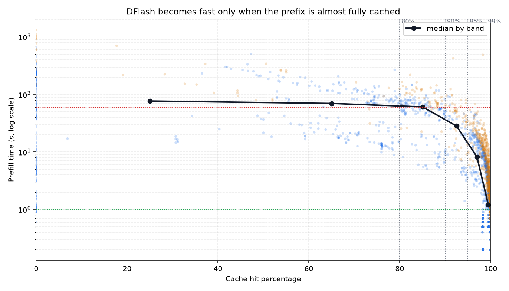
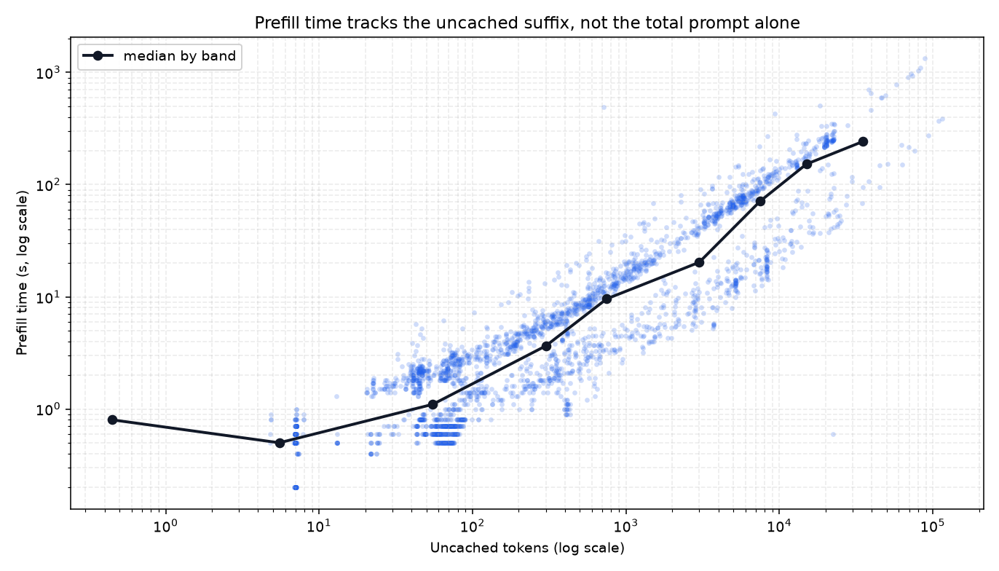
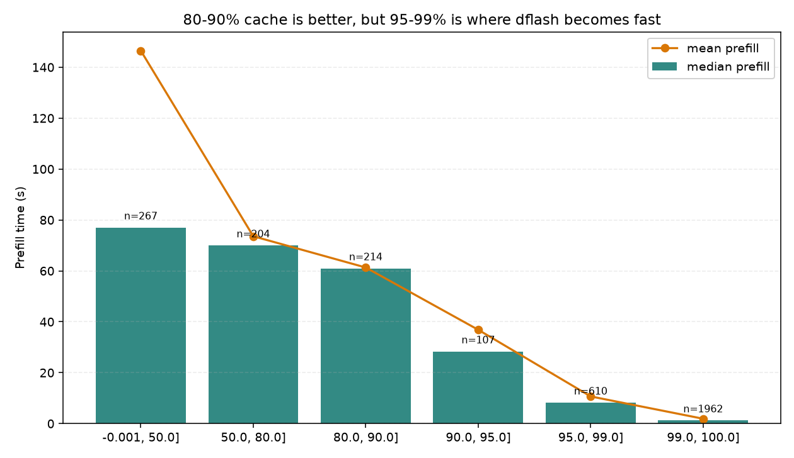
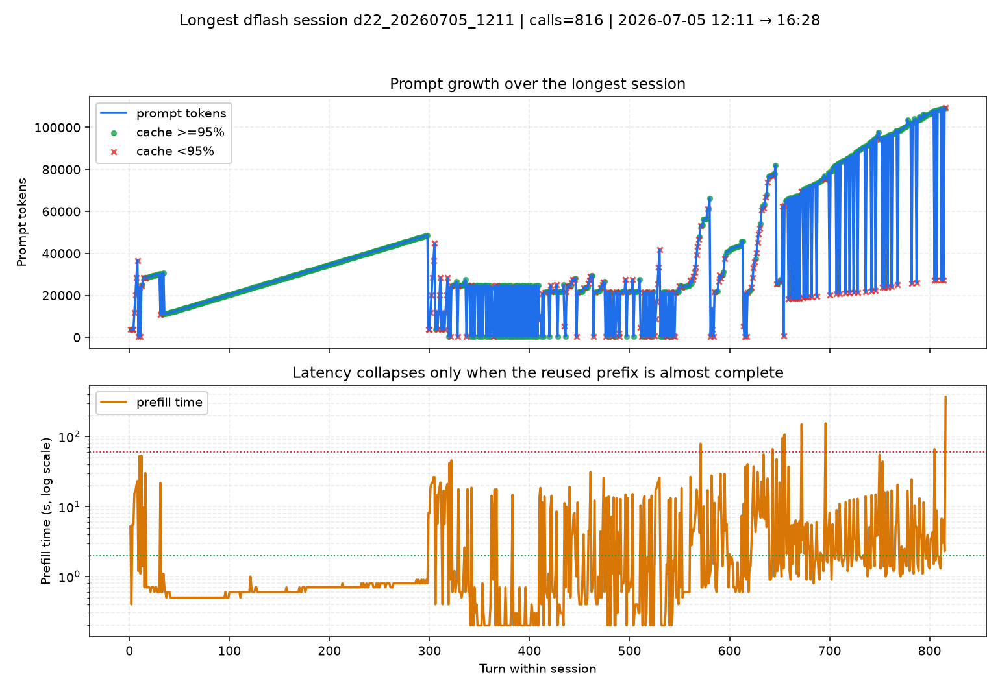

# DFLASH.md — Prefill Efficiency, Cache Reuse, and the Real Speedup Threshold

This document explains when DFlash is actually efficient and where the speedup comes from.
The short version is: DFlash is not “fast” because every request is fast. It is fast because
after the first expensive prefill, later requests often reuse nearly the entire prefix.

The analysis below uses `logs/dflash_timings.csv` and `logs/dflash_server.log`.

Important note: the raw `cache_hit_pct` field in the CSV has a few parser artifacts outside
the valid range. For this report, I use only the clean dflash rows where `0 <= cache_hit_pct <= 100`.

Clean sample used here:

```bash
cd ~/local-llm-workspace
env/bin/python llmstack/tools/dflash_metrics.py --update-dflash-md
```

<!-- DFLASH_CORE_TABLE_START -->

| Metric | Value |
|---|---:|
| dflash rows in CSV | 7,326 |
| clean dflash rows | 7,320 |
| parser outliers removed | 6 |
| sessions | 31 |

<!-- DFLASH_CORE_TABLE_END -->

---

## 1. What DFlash is doing

DFlash combines speculative decoding with a prefix cache. In practice, that means:

- The first time a large prompt appears, prefill can be very slow.
- Once the prefix is cached, repeated requests with the same or similar context become much faster.
- The real speedup is not linear. It jumps when the uncached suffix becomes tiny.

The key operational metric is the uncached suffix:

```text
uncached_tokens = prompt_tokens × (1 - cache_hit_pct / 100)
```

That is the part that still needs prefill work. The rest is reused.

### What the logs tell us

From the clean dflash sample:

<!-- DFLASH_LOGS_TABLE_START -->

| Metric | Value |
|---|---:|
| Cache-hit median | 99.80% |
| Cache-hit mean | 92.58% |
| Prefill median | 1.10 s |
| Prefill mean | 13.16 s |
| Prefill 90th percentile | 22.61 s |
| Prefill <= 2 s | 63.8% |
| Prefill <= 5 s | 76.6% |
| Requests with >= 95% cache | 82.9% |
| Requests with >= 99% cache | 71.3% |

<!-- DFLASH_LOGS_TABLE_END -->

That already tells the main truth:

1. DFlash is often extremely efficient.
2. The tail still exists and is expensive.
3. “80-90% cached” is better than cold start, but it is not yet the fast regime.

### The strongest evidence from the server log

The dflash server log shows a typical pattern:

- a first long prefill can take minutes,
- then a nearly identical follow-up prompt can hit almost the whole prefix,
- and prefill collapses to about 1 second.

In other words, the first expensive prefill is the investment; later requests harvest it.

---

## 2. Evidence in charts

### 2.1 Cache-hit cliff



This chart plots prefill time against cache-hit percentage.

What happened in aggregate:

1. Requests below 80% cache remain slow.
2. Requests in the 80-90% band still have long prefill times.
3. The big drop starts at 95-99%.
4. The fast regime is 99%+.

What the numbers tell us:

<!-- DFLASH_CACHE_BAND_BLOCK_START -->

```text
80-90%   n= 323 median_prefill= 45.80s
90-95%   n= 194 median_prefill= 12.10s
95-99%   n= 853 median_prefill=  4.80s
99-100%  n=5218 median_prefill=  0.90s
```

<!-- DFLASH_CACHE_BAND_BLOCK_END -->

So the true threshold for “fast” is not 80-90% reuse. It is much closer to 95-99%, with
99%+ being the clearest fast path.

### 2.2 Uncached suffix cliff



This chart plots prefill time against the number of uncached tokens.

What happened in aggregate:

1. A tiny uncached suffix gives near-instant prefill.
2. Once the uncached suffix reaches hundreds or thousands of tokens, latency rises fast.
3. The tail grows very quickly when thousands of uncached tokens remain.

What the numbers tell us:

<!-- DFLASH_UNCACHED_BAND_BLOCK_START -->

```text
<= 100    n=4378 median_prefill=  0.80s
<= 500    n=1165 median_prefill=  2.20s
<= 1000   n= 380 median_prefill=  5.20s
<= 5000   n= 686 median_prefill= 13.15s
<= 10000  n= 422 median_prefill= 24.60s
<= 20000  n= 141 median_prefill= 88.70s
```

<!-- DFLASH_UNCACHED_BAND_BLOCK_END -->

This is the clearest model in the whole dataset: prefill time tracks the uncached suffix,
not just the nominal cache-hit percentage.

### 2.3 Latency by cache band



What happened in aggregate:

1. The 0-80% cache bands are still in the slow regime.
2. 90-95% is better, but it is still not “fast”.
3. 95-99% is the turning point.
4. 99-100% is where DFlash becomes obviously worth it.

What the numbers tell us:

- 80-90% cache is an improvement, but not the end state.
- The speedup is nonlinear.
- The model only looks fast when the cache reuse is almost complete.

### 2.4 Longest session



This chart shows the longest run in the dataset.

What happened in this session:

1. The prompt grew over time.
2. Once the prompt stabilized, later turns reused most of the prefix.
3. Prefill then dropped from long, expensive runs to a few seconds.

What the numbers tell us:

- DFlash does not get faster because time passes.
- It gets faster because the prompt becomes reusable.
- The real gain appears after the first cold prefill has created a stable prefix.

### 2.5 Per-session views

Per-session composites live in `docs/img/dflash/sessions/`.
They show the same pattern at session level: prompt growth first, then latency collapse when
reuse becomes nearly complete.

The plotter renders 22 session images here because one very short session falls below the
minimum chart threshold.

Two useful examples:

- `dflash_session_d17_20260630_0038.png`
  - 12 calls.
  - Median cache hit: 86.1%.
  - Median prefill: 18.05 s.

- `dflash_session_d22_20260705_1211.png`
  - 816 calls.
  - Median cache hit: 99.7%.
  - Median prefill: 0.80 s.

The lesson is not that long sessions always help. The lesson is that long sessions tend to
help only when they keep reusing the same scaffold.

---

## 3. What is true, and what is not

### The truth

1. The first cold prefill is expensive.
2. After that, DFlash can make later requests dramatically faster.
3. The strongest gains appear when the uncached suffix shrinks to a few hundred tokens or less.
4. 99%+ cache reuse is the clearest “fast path”.

### The misconception to avoid

It is not accurate to say that “80-90% cache means fast”.

The data says:

- 80-90% cache is still typically tens of seconds.
- 90-95% cache is better, but still not the fast path.
- 95-99% cache is the point where latency drops sharply.
- 99-100% cache is where the request usually becomes obviously quick.

### A simple practical model

```text
if cache_hit_pct < 80:        DFlash is still in the slow regime
if 80-90:                     better, but not fast
if 90-95:                     useful improvement
if 95-99:                     strong speedup
if 99-100:                    fast path
```

Or, in uncached-token terms:

```text
if uncached_tokens <= 100:    near-instant
if 100-1000:                  fast to moderate
if 1000-5000:                 noticeable latency
if 5000+:                     slow again
```

### Target comparison note

The model split is useful for diagnostics, but should not be read as an intrinsic speed ranking.
Different targets often run under different workload mixes and scaffold reuse patterns.

<!-- DFLASH_MODEL_TABLE_START -->

| Target | Rows | Median prefill | p90 prefill | Median cache hit | Share >=99% cache |
|---|---:|---:|---:|---:|---:|
| `mlx-community/Ornith-1.0-35B-4bit` | 3,300 | 1.00 s | 6.00 s | 99.90% | 84.2% |
| `mlx-community/Qwen3.6-27B-4bit` | 2,094 | 3.60 s | 88.47 s | 99.50% | 57.7% |
| `mlx-community/Qwen3.6-35B-A3B-4bit` | 1,621 | 0.90 s | 14.70 s | 99.70% | 65.4% |
| `mlx-community/gemma-4-12B-4bit` | 113 | 2.10 s | 13.98 s | 99.50% | 65.5% |

<!-- DFLASH_MODEL_TABLE_END -->

This confirms that per-target medians differ in practice, but the same nonlinear cache-threshold
behavior still holds. The real driver remains how much of the prefix is reused and how large the
uncached suffix is.

---

## 4. Conclusions

1. DFlash gives the largest benefit after the first cold prefill has populated the prefix cache.
2. The real efficiency threshold is much higher than 80-90% reuse; it is closer to 95-99%.
3. 99%+ cache reuse is where DFlash becomes clearly fast.
4. The uncached suffix is the best predictor of prefill latency.
5. The model is simple: long reusable scaffolds pay off; short or highly variable requests do not.

In short: DFlash is not merely “better after the first prefill”. It becomes truly efficient when the same prefix is reused almost entirely.
