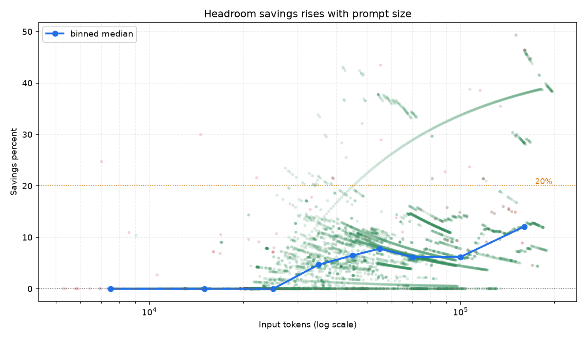
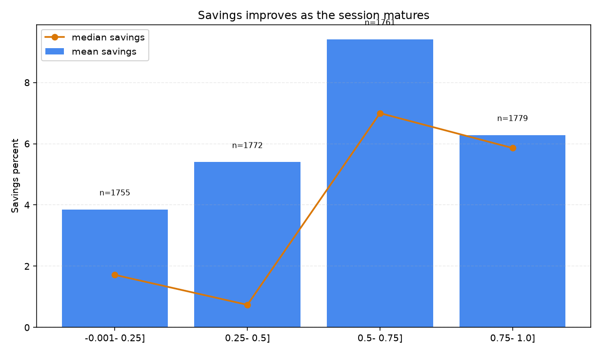
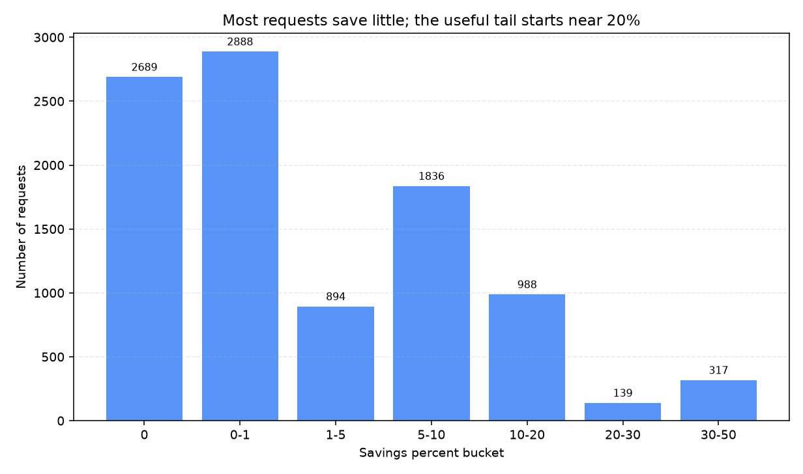
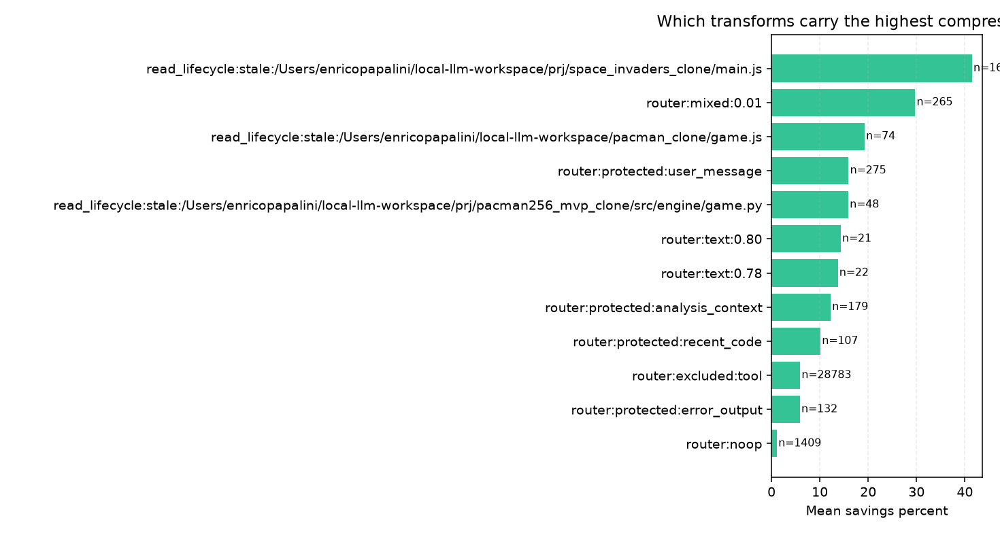
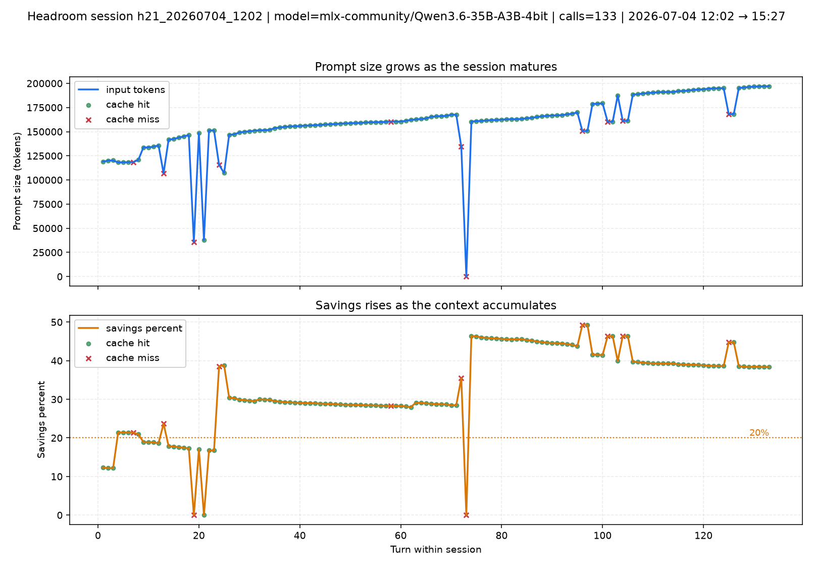
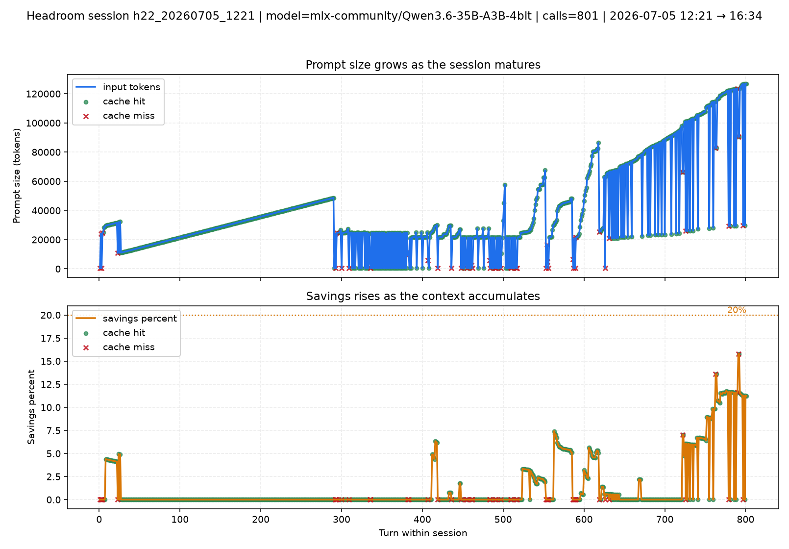

# HEADROOM.md — Context Compression Efficiency and Session-Scale Savings

This document explains when Headroom is effective, when it is not, and why the savings
increase sharply in long agentic sessions. The analysis uses real telemetry from
`logs/headroom_traffic.jsonl` and the same session-splitting rule used by the timing charts.

All numbers below come from 7,067 recorded Headroom requests across 33 work sessions.
The data spans 2026-06-21 → 2026-07-12 and reflects the current local stack behavior.

---

## 1. What Headroom is doing

Headroom sits in front of the inference backend and tries to reduce the amount of context
that reaches the model. The operational idea is simple:

- Direct mode has no useful redundancy to remove, so savings start at 0%.
- As the agent session grows, repeated lifecycle reads, tool traces, stale context, and
  repeated task scaffolding become more compressible.
- That is why Headroom becomes more useful later in a long session than at the beginning.

The key metric used here is:

```text
savings_percent = tokens_saved / input_tokens_original * 100
```

This is a compression metric, not a latency metric. A request can be fast but save little,
or save a lot but still cost time if the upstream request is large.

### What the logs tell us

From `logs/headroom_traffic.jsonl`:

```bash
cd ~/local-llm-workspace
env/bin/python llmstack/tools/headroom_metrics.py --update-headroom-md
```

<!-- HEADROOM_CORE_TABLE_START -->

| Metric | Value |
|---|---:|
| Requests | 7,067 |
| Sessions | 33 |
| Total original tokens | 390,402,708 |
| Total tokens saved | 38,031,819 |
| Weighted savings | 9.74% |
| Tokens retained after optimization | 90.26% |
| Mean savings per request | 6.24% |
| Median savings per request | 4.37% |
| 90th percentile savings | 13.56% |
| Max savings | 49.32% |
| Zero-savings share | 37.7% |
| Requests at 20%+ savings | 6.5% |

<!-- HEADROOM_CORE_TABLE_END -->

The distribution is skewed. Headroom is not uniformly beneficial; it is sharply beneficial in
the right conditions.

---

## 2. Evidence in charts

### 2.1 Savings vs prompt size



This chart is the main answer to the question "when is Headroom efficient?" It shows savings
percent against prompt size, with a binned median trend.

What happened in aggregate:

1. Short prompts mostly stayed at 0% savings.
2. Mid-sized prompts started to show modest compression.
3. Large prompts created the strong savings tail.

What the numbers tell us:

- Below 5k tokens, savings are effectively zero.
- 5k-20k tokens still rarely produce material savings.
- 30k-40k tokens move into the useful range.
- 40k-60k tokens produce a clear average gain.
- Above 60k tokens, 20%+ savings becomes common enough to matter.

### 2.2 Savings vs session progress



This chart groups each request by how far through the session it occurred.

What happened in aggregate:

1. Early requests had little redundancy to compress.
2. Mid-session requests began to reuse more structure.
3. Late-session requests were the most compressible.

What the numbers tell us:

- First 3 turns: mean savings 1.81%, median 0.0%.
- First 10 turns: mean savings 2.27%, median 0.0%.
- 11+ turns: mean savings 7.10%, median 5.09%.
- The effect is real, but it is weaker than prompt size alone.

### 2.3 Savings distribution



What happened in aggregate:

1. A large mass of requests saved nothing.
2. A second band saved a little.
3. A small tail saved a lot.

What the numbers tell us:

- 39.3% of requests are zero-savings requests.
- The useful tail begins around 20% savings.
- The tail is the reason the weighted savings is still meaningful even though the median is modest.

### 2.4 Transform impact



This chart shows which transform families carry the strongest average savings.

What happened in aggregate:

1. `router:excluded:tool` dominates the traffic volume.
2. `router:protected:user_message` and `router:protected:analysis_context` also contribute.
3. `router:noop` is the floor case, where Headroom has little or nothing to remove.

What the numbers tell us:

- The biggest gains come from repeated scaffolding and tool-heavy context.
- The weakest gains come from tiny or already-clean requests.
- That supports the conclusion that Headroom is a context-reuse optimizer, not a universal compressor.

### 2.5 Per-session composites

Per-session charts are written to `docs/img/headroom/sessions/`.
They show the same pattern at the session level: prompt size rises, then savings rise with it.

Two useful contrasts:

- 
   *2026-07-04 12:02, 133 calls.* This session reached a weighted savings of 34.20% and a mean
   savings of 32.86%.

- 
   *2026-07-05 12:21, 801 calls.* This session was much longer, but the mean savings was only
   1.32% and the weighted savings was 2.91%.

What happened:

1. The high-savings session had repeated structure that Headroom could remove aggressively.
2. The long session had a lot of traffic, but much of it was already clean or direct-mode-like.
3. Session length alone is not enough; compressible redundancy is the real driver.

What the numbers tell us:

- The efficiency curve is not strictly monotonic with session length.
- Long sessions help only when they accumulate repetitive scaffolding.
- A long, low-redundancy session can still stay near the efficiency floor.

The most important reading rule is simple:

1. Look at the prompt growth first.
2. Then look at the savings curve.
3. If both rise together, Headroom is doing real work.
4. If prompt size is still small, expect the efficiency floor near 0%.

---

## 3. A practical model

The data fits a threshold model better than a pure linear model.

### Piecewise model

<!-- HEADROOM_PIECEWISE_START -->

```text
0k-10k    n= 618 median= 0.00% mean= 0.07% share>=20%= 0.2%
10k-30k   n=1592 median= 0.00% mean= 0.97% share>=20%= 0.4%
30k-40k   n= 815 median= 4.69% mean= 5.44% share>=20%= 3.2%
40k-60k   n=1417 median= 7.46% mean= 7.51% share>=20%= 4.4%
60k+      n=2625 median= 6.74% mean=10.45% share>=20%=13.7%
```

<!-- HEADROOM_PIECEWISE_END -->

### Coarse regression model

<!-- HEADROOM_REGRESSION_START -->

```text
savings_percent ≈ -22.22 + 6.70*log10(prompt_tokens)
                 + 3.03*session_progress
                 - 3.48*cache_hit
                 - 2.28*noop
```

<!-- HEADROOM_REGRESSION_END -->

This linear model is only a rough guide. Its $R^2$ is about 0.20, so it is useful for
direction, not for precise forecasting. The piecewise model above is more actionable.

### 3.1 Per-model split: useful, but not causal

Adding model-level slicing is useful for diagnostics, but it should not be interpreted as
"model causes Headroom efficiency". Headroom savings is driven primarily by context redundancy,
agent/direct traffic mix, and session shape.

Current split (models with meaningful sample size):

<!-- HEADROOM_MODEL_TABLE_START -->

| Model | n | Mean savings | Median savings | p90 savings | Share >=20% |
|---|---:|---:|---:|---:|---:|
| `mlx-community/Ornith-1.0-35B-4bit` | 3,243 | 6.51% | 4.81% | 13.48% | 7.2% |
| `mlx-community/Qwen3.6-27B-4bit` | 1,665 | 6.70% | 5.55% | 11.58% | 5.9% |
| `mlx-community/Qwen3.6-35B-A3B-4bit` | 2,106 | 5.61% | 0.00% | 14.00% | 5.9% |

<!-- HEADROOM_MODEL_TABLE_END -->

How to read this:

1. 35B-A3B shows a lower median but a stronger high-savings tail, which suggests a more polarized
   traffic mix (many near-zero turns plus a subset of highly compressible turns).
2. 27B shows a higher center (median), indicating more consistently moderate compression.
3. These are workload-level observations, not an intrinsic model ranking. To isolate model effects,
   controlled A/B runs with identical prompts and mode mix are required.

### Interpretation

- Prompt size is the strongest driver.
- Session progression matters, but less than prompt size.
- Cache hit is not the main determinant of compression efficiency.
- The real win comes from accumulated repetition and stale scaffolding.

---

## 4. Conclusions

1. Headroom starts near 0% efficiency at the beginning of a session because the context is
   still small and there is little redundancy to remove.
2. Efficiency improves as sessions get longer because the context becomes more repetitive,
   especially after many tool calls, lifecycle reads, and regenerated files.
3. The practical break-even point is around 30k-40k tokens; the clearly useful zone is
   40k-60k tokens and beyond.
4. 20%+ savings is a late-session phenomenon, not the default outcome.
5. Headroom should be considered a late-stage context compression layer, not a universal
   always-on optimizer.

In short: Headroom becomes materially more efficient as the agentic session grows, and the effect is driven primarily by prompt size plus accumulated context repetition.
