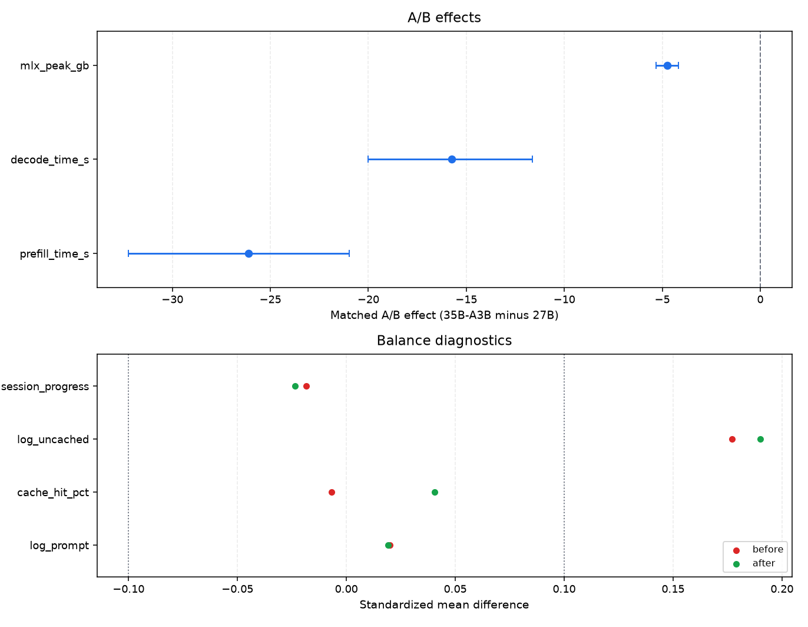
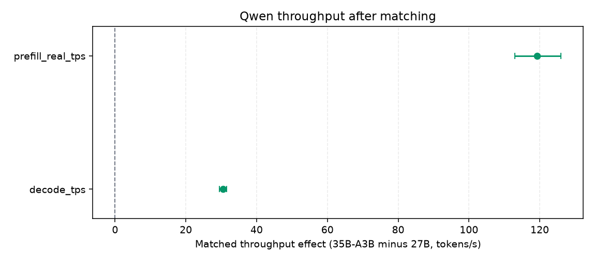
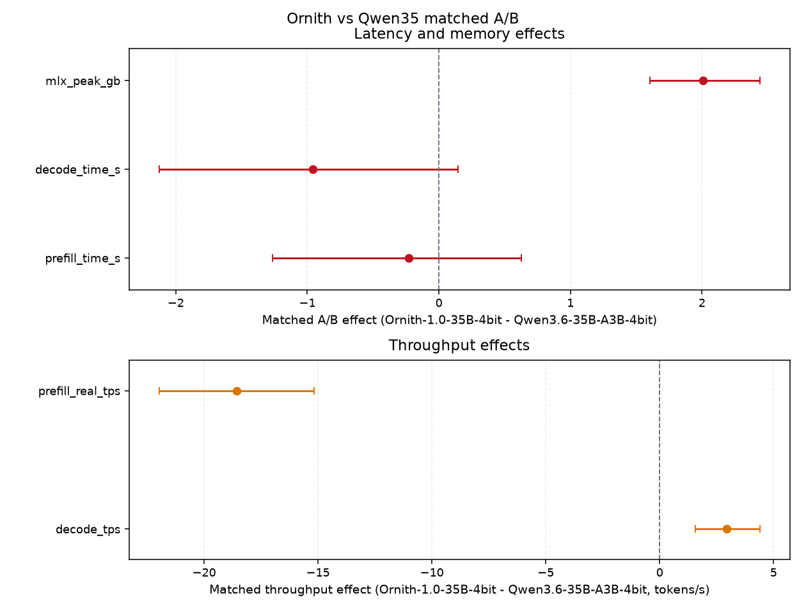
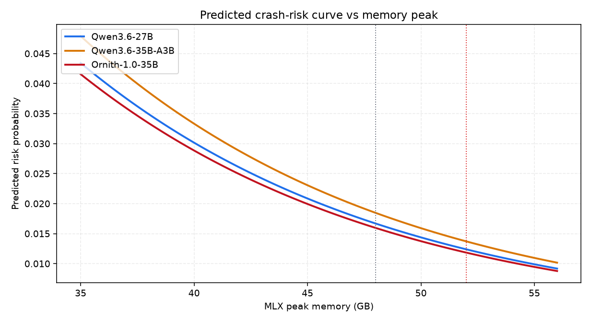

# LLM_COMPARISON.md — Qwen A/B and Crash-Risk Modeling

This report answers two practical questions on the real workload captured in the dflash telemetry: which Qwen model behaves better under matched comparison, and how Ornith-1.0-35B compares against Qwen3.6-35B-A3B on the same operational surface.

The comparison is between:

- `mlx-community/Qwen3.6-35B-A3B-4bit`
- `mlx-community/Qwen3.6-27B-4bit`
- `mlx-community/Ornith-1.0-35B-4bit` (additional matched A/B and crash-risk curve)

The data comes from `logs/dflash_timings.csv`, using only the cleaned dflash rows.

The report has three parts:

1. A matched A/B analysis that compares performance and memory after balancing the workload.
2. An additional matched A/B chapter that compares Ornith-1.0-35B and Qwen3.6-35B-A3B.
3. A crash-risk model that tries to estimate when the system is under dangerous memory pressure.

Run/update command:

```bash
cd ~/local-llm-workspace
env/bin/python llmstack/tools/llm_comparison_metrics.py --update-md
```

---

## 1. What this report is doing

The telemetry is not a controlled experiment. Requests are not randomly assigned to the two models, so the raw averages would be biased by workload mix. For example, one model might receive longer prompts, more cached sessions, or more advanced turns in the conversation.

To reduce that bias, the A/B part uses a standard observational strategy:

1. Split requests into comparable buckets by prompt size, cache hit rate, and session progress.
2. Pair similar requests from the two models inside each bucket.
3. Compare the paired outcomes instead of comparing all raw requests at once.

That approach does not turn the data into a randomized experiment, but it makes the comparison much fairer.

The three outcomes measured here are:

1. Prefill time, which is the time spent processing the prompt before generation starts.
2. Decode time, which is the time spent generating the answer.
3. Peak memory, which is the maximum MLX memory reached during the request.

For the crash-risk part, the report fits a logistic model. Logistic models are useful when the target is binary, such as “normal” versus “high-risk”. The model combines several inputs into a probability-like score. Here the inputs are:

1. Peak memory.
2. Prompt size.
3. Uncached tail size.
4. A prefill-tail indicator.
5. Which model was used.

Important caveat: the risk target may be either a direct near-crash window label or a fallback proxy, depending on label availability in the current dataset. Even when temporal validation looks usable, the output should still be treated as an operational warning score rather than a fully calibrated crash probability.

---

## 2. How to read the stacked A/B figure

The stacked figure combines the A/B views into one compact panel set. It is the easiest way to read the model comparison because it shows the result and the quality check together.

How to read the top panel:

1. Each dot is the estimated average difference for one outcome.
2. The horizontal line is the confidence interval.
3. The vertical zero line means “no difference”.
4. If the interval stays entirely on one side of zero, the effect is statistically clear in this telemetry slice.
5. Negative values mean Qwen 35B-A3B is lower than Qwen 27B for that metric.

For this report, negative is good for latency and memory, because lower prefill time, lower decode time, and lower peak memory are all improvements.

How to read the middle panel:

1. The red points are the raw unmatched differences between the two model populations.
2. The green points are the differences after matching.
3. Values closer to zero mean the two groups are more comparable.
4. If a covariate is still far from zero after matching, the A/B estimate is less trustworthy.

In short: the top panel tells you the latency and memory result, and the middle panel tells you whether the comparison was fair.

## 3. A/B results

The table below shows the matched difference between Qwen 35B-A3B and Qwen 27B after balancing requests by prompt size, cache hit rate, and session progress. Negative values are good for latency and memory, because they mean the 35B-A3B model is lower than the 27B model on that metric.

<!-- LLM_AB_TABLE_START -->

| Outcome | Matched effect (Qwen3.6-35B-A3B-4bit - Qwen3.6-27B-4bit) | 95% CI | Conclusive? |
|---|---:|---:|---:|
| prefill_time_s | -23.30 s | [-27.93, -19.43] s | yes |
| decode_time_s | -14.47 s | [-17.86, -11.52] s | yes |
| mlx_peak_gb | -4.62 GB | [-5.11, -4.15] GB | yes |
| Matched pairs | 1,126 | n/a | n/a |

<!-- LLM_AB_TABLE_END -->

### 3.1 Balance diagnostics

The balance table checks whether the matching step made the two groups comparable. Values closer to zero are better. Here the post-match differences are small overall, although one covariate remains slightly farther from zero than the others; that is acceptable for a descriptive observational comparison, but it is not perfect balance.

<!-- LLM_BALANCE_TABLE_START -->

| Covariate | SMD before matching | SMD after matching |
|---|---:|---:|
| log_prompt | -0.109 | -0.004 |
| cache_hit_pct | 0.038 | 0.044 |
| log_uncached | 0.073 | 0.185 |
| session_progress | -0.067 | -0.030 |

<!-- LLM_BALANCE_TABLE_END -->



The stacked figure combines the three A/B views in one compact panel set. Top: matched latency and memory effects. Middle: balance diagnostics, which check whether matching made the two groups comparable. Bottom: throughput effects, where positive values mean Qwen 35B-A3B is faster in tokens per second.

Reading the panels together helps with interpretation: the first and third panels tell you whether the model is better on latency, memory, and throughput; the middle panel tells you whether that comparison is fair.

---

## 4. Throughput / tokens per second

Throughput is the flip side of latency: higher tokens per second means the model processes or emits tokens faster. This section matters because latency tells you how long a request takes, while throughput tells you how much work the system can push through in a unit of time.

The raw numbers below are useful as a quick sanity check, but they can still be influenced by request mix. The matched effect is the more reliable comparison because it uses the same pairing logic as the latency section.

<!-- LLM_THROUGHPUT_TABLE_START -->

| Model | decode_tps median | decode_tps p90 | prefill_real_tps median | prefill_real_tps p90 |
|---|---:|---:|---:|---:|
| Qwen3.6-35B-A3B-4bit | 40.9 | 74.9 | 99.9 | 372.3 |
| Qwen3.6-27B-4bit | 13.3 | 18.0 | 35.4 | 77.4 |

| Throughput metric | Matched effect (Qwen3.6-35B-A3B-4bit - Qwen3.6-27B-4bit) | 95% CI | Better when |
|---|---:|---:|---|
| decode_tps | 29.95 tokens/s | [28.90, 30.98] tokens/s | higher |
| prefill_real_tps | 117.11 tokens/s | [110.81, 123.36] tokens/s | higher |
| Matched pairs | 1,126 | n/a | n/a |

<!-- LLM_THROUGHPUT_TABLE_END -->



This standalone throughput figure shows the same pairwise comparison in token/sec terms. It stays compact on the page, and positive values are good because they mean Qwen 35B-A3B is faster after balancing the workload.

## 4.1 Additional A/B: Ornith-1.0-35B vs Qwen3.6-35B-A3B

The Qwen-vs-Qwen comparison remains useful as a controlled within-family baseline, but it no longer covers the full production decision surface. Ornith-1.0-35B is now a major live route in the traffic mix, so we add a second matched A/B focused on the two 35B-class interactive options.

<!-- ORNITH_AB_SECTION_START -->

This additional matched A/B isolates the two 35B-class routes currently most relevant for interactive local traffic. Positive values are better for throughput; negative values are better for latency and memory.



| Outcome | Matched effect (Ornith-1.0-35B-4bit - Qwen3.6-35B-A3B-4bit) | 95% CI | Conclusive? |
|---|---:|---:|---:|
| prefill_time_s | -0.23 s | [-1.27, 0.63] s | no |
| decode_time_s | -0.96 s | [-2.13, 0.14] s | no |
| mlx_peak_gb | 2.01 GB | [1.61, 2.44] GB | yes |
| Matched pairs | 1,055 | n/a | n/a |

| Covariate | SMD before matching | SMD after matching |
|---|---:|---:|
| log_prompt | 0.550 | 0.016 |
| cache_hit_pct | 0.278 | 0.001 |
| log_uncached | -0.364 | -0.273 |
| session_progress | 0.056 | -0.052 |

| Model | decode_tps median | decode_tps p90 | prefill_real_tps median | prefill_real_tps p90 |
|---|---:|---:|---:|---:|
| Ornith-1.0-35B-4bit | 42.6 | 64.2 | 45.6 | 295.1 |
| Qwen3.6-35B-A3B-4bit | 40.9 | 74.9 | 99.9 | 372.3 |

| Throughput metric | Matched effect (Ornith-1.0-35B-4bit - Qwen3.6-35B-A3B-4bit) | 95% CI | Better when |
|---|---:|---:|---|
| decode_tps | 2.96 tokens/s | [1.57, 4.40] tokens/s | higher |
| prefill_real_tps | -18.58 tokens/s | [-21.98, -15.16] tokens/s | higher |
| Matched pairs | 1,055 | n/a | n/a |

The Ornith-vs-Qwen35 comparison is only partially conclusive in this matched slice.

<!-- ORNITH_AB_SECTION_END -->

---

## 5. Crash-risk model

This model asks a different question from the A/B section: not which model is faster, but which request patterns look dangerous for the system. The numbers below should be read as an operational risk signal, not as a calibrated crash probability.

The output is a risk curve. It does not measure speed. It estimates how risk changes as memory peak increases, while holding other inputs at representative values.

How to read the crash-risk chart:

1. The x-axis is peak memory in GB.
2. The y-axis is the model’s predicted risk score.
3. If a curve rises, higher memory pressure is associated with higher risk for that model profile.
4. The three lines compare the same memory range under the three model identities.
5. The absolute probability should not be treated as a final calibrated number, even when the label comes from direct near-crash windows rather than a fallback proxy.

The most important practical use of this chart is thresholding and alerting. It helps answer questions like: “At what memory level should we start warning the system?”

<!-- LLM_RISK_TABLE_START -->

| Item | Value |
|---|---:|
| Risk label used | near-crash-window |
| Positive events | 219 |
| Positive prevalence | 3.08% |
| Temporal split cutoff | 2026-07-12 07:27:18 UTC |
| Temporal train rows | 5,693 |
| Temporal test rows | 1,424 |
| Temporal train prevalence | 3.28% |
| Temporal test prevalence | 2.25% |
| Temporal train AUC | 0.349 |
| Temporal test AUC | 0.931 |
| Temporal train Brier | 0.0329 |
| Temporal test Brier | 0.0209 |
| Temporal reliability | acceptable |
| Coef: mlx_peak_gb | -0.076 |
| Coef: log_prompt | -0.108 |
| Coef: log_uncached | 0.059 |
| Coef: prefill_tail | -0.014 |
| Coef: model_is_qwen35 | 0.107 |
| Coef: model_is_ornith35 | 0.001 |

<!-- LLM_RISK_TABLE_END -->



This plot shows how the risk score changes as peak memory increases for Qwen3.6-27B, Qwen3.6-35B-A3B, and Ornith-1.0-35B. The useful signal is the relative shape of the three curves and the threshold region around 48-52 GB, not the exact probability value.

---

## 6. Conclusion status

<!-- LLM_MODEL_NOTE_START -->

Matched A/B effects are statistically conclusive for all tracked outcomes under this observational design. Crash-risk temporal validation is acceptable for monitoring use in the current three-model sample.

<!-- LLM_MODEL_NOTE_END -->

Interpretation rule:

1. If CI crosses zero, the A/B effect is non-conclusive for that outcome.
2. If all outcomes cross zero, overall A/B conclusion is non-conclusive.
3. Crash-risk model coefficients are directional under observational data and should not be interpreted as causal effects.

## 7. Model recommendation (which LLM for what)

Recommended default model for most interactive traffic:

1. Qwen3.6-35B-A3B-4bit.

Why:

1. Better latency in matched A/B (prefill + decode).
2. Lower memory peak in matched A/B.
3. More favorable behavior under cache-heavy workloads.

How the Ornith update changes this reading:

1. The additional Ornith-vs-Qwen35 chapter is only partially conclusive overall.
2. Ornith is slightly better on matched decode throughput, but it is worse on matched prefill throughput.
3. Ornith also carries a clearly higher matched memory peak (`+2.00 GB` in this slice).
4. The crash-risk curve now includes Ornith directly, which makes the memory tradeoff visible in the same threshold frame as the two Qwen routes.
5. So the new evidence still does not displace Qwen3.6-35B-A3B as the safest default in this specific report; instead, it defines Ornith as a strong alternate route with different tradeoffs.

When to prefer Qwen3.6-27B-4bit:

1. You need a conservative fallback path for compatibility checks or regression baselines.
2. You are running controlled experiments where architectural simplicity is preferred over best observed latency.

When to prefer Ornith-1.0-35B-4bit:

1. You want a 35B-class alternate path with slightly stronger matched decode throughput.
2. You can accept higher peak memory and weaker matched prefill throughput than Qwen3.6-35B-A3B.
3. You are validating whether real interactive quality or agent behavior offsets the memory cost in your own workload.

Coding-quality disclaimer:

1. In qualitative coding sessions, Qwen3.6-27B-4bit sometimes appears more consistent on the first attempt (for example, fewer re-prompts or rewrites needed).
2. This observation is currently anecdotal and not yet supported by quantitative coding-quality benchmarks.
3. No pass@k, unit-test pass-rate, or task-level acceptance benchmark was run in this report, so no conclusive coding-quality ranking is claimed.

Suggested usage policy:

1. Route normal coding-agent and long-context iterative sessions to 35B-A3B.
2. Use Ornith as an alternate 35B-class route when decode throughput matters more than prefill efficiency and memory headroom is available.
3. Keep 27B as backup/canary and as a comparison baseline.
4. Trigger soft alerts when peak memory approaches 48 GB, and stronger alerts near 52 GB.
5. Use the current crash-risk curve for monitoring and ranking, not hard policy enforcement.
6. Re-train after collecting more balanced recent crash events and re-check temporal stability before promoting it beyond monitoring use.

## 8. What would make the risk model reliable

To promote the risk model from monitoring-grade to decision-grade:

1. Capture a larger and more balanced set of recent crash/near-crash events.
2. Add explicit restart/crash event IDs aligned to request timestamps (instead of proxy labels).
3. Re-run rolling temporal validation (for example weekly windows) and require stable test AUC before enforcing hard policy.
