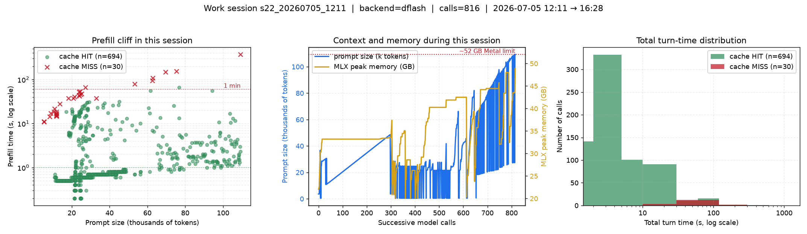
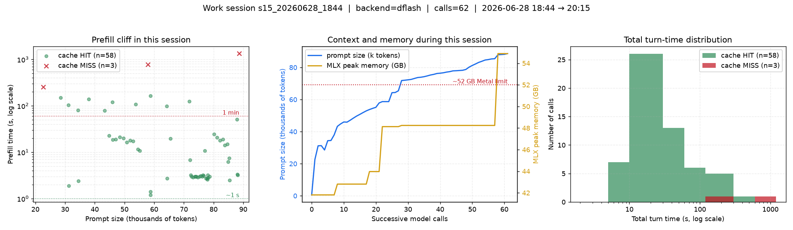

# MEMORY.md — GPU Memory Behavior and RAM-Tier Configurations

This document explains how the Kowalski/llmstack inference stack consumes unified memory on
Apple Silicon, what the crash signature looks like in the logs, what the timing charts tell us,
and how to configure `llmstack_config.json` for Macs with 16 GB, 24 GB, 36 GB, 48 GB, and 64 GB
of RAM.

All numbers below come from real telemetry collected in `logs/dflash_timings.csv`
(3,397 logged calls across 23 work sessions, 2026-06-20 → 2026-07-05) and from the server logs
(`logs/dflash_server.log`).

---

## 1. What actually happens in memory

Apple Silicon uses **unified memory**: CPU and GPU share the same physical RAM. Metal caps the
amount a GPU process can keep *wired* (page-locked). When an inference process approaches that
cap, macOS does not OOM-kill it gracefully — the Metal command buffer aborts and the process
terminates. This is the exact signature seen repeatedly in our logs:

```text
2026-06-28 20:23:41 [dflash] prefill: 83968/85437 tokens | 519.6s
libc++abi: terminating due to uncaught exception of type std::runtime_error:
[METAL] Command buffer execution failed: Impacting Interactivity
(0000000e:kIOGPUCommandBufferCallbackErrorImpactingInteractivity)
```

Key observations from the logs:

1. **Crashes happen during prefill, not decode.** Both recorded Metal crashes occurred while
   processing huge prompts (73,764/76,718 tokens on 2026-06-27; 83,968/85,437 tokens on
   2026-06-28). Prefill materializes the whole KV cache for the prompt at once — this is the
   memory spike.
2. **The observed ceiling on this 64 GB machine is ~52 GB.** `mlx_peak_gb` reached 54.89 GB
   shortly before the second crash; sustained operation above ~52 GB is where instability
   begins. This is an *empirical* threshold, not an official constant — it corresponds
   roughly to macOS's default GPU wired limit (~75–80 % of RAM) plus driver slack.
3. **Crashes cascade.** After a Metal abort, the watchdog hard-restarts the server; racing
   restarts occasionally hit `OSError: [Errno 48] Address already in use` on port 8787 until
   the stale process is reaped. The restart loop is a *symptom*, not the cause.
4. **Memory pressure builds slowly across a session.** Whole-file regeneration inflates the
   prompt turn after turn (up to 109k tokens in the longest session), and `mlx_peak_gb` creeps
   up monotonically because the prefix cache and snapshot buffers accumulate.

### What the memory is spent on

| Component | Typical size | Notes |
|---|---|---|
| Model weights (4-bit) | 27B ≈ 15–16 GB, 35B-A3B ≈ 19–21 GB, 12B ≈ 7 GB | Fixed once loaded |
| DFlash draft model | 1–2 GB | DFlash only |
| KV cache for active request | grows with prompt length | The prefill spike |
| Prefix cache (L1) | up to `cache_max_bytes` (default 12 GB) | Biggest tunable |
| Prompt snapshots | scales with `max_snapshot_tokens` | Second biggest tunable |
| MLX runtime + fragmentation | 2–4 GB | Fixed overhead |

### 1.1 Clarification: 27B vs 35B-A3B (MoE)

To avoid ambiguity: **27B is not bigger than 35B-A3B in total model size**.
What changes in practice is the *active* compute path and the request context, not the
fact that 35B-A3B has a larger total parameter budget.

Evidence collected on this machine (2026-07-05):

| Artifact | Measured size |
|---|---:|
| `mlx-community/Qwen3.6-27B-4bit` snapshot | 14.98 GB |
| `mlx-community/Qwen3.6-35B-A3B-4bit` snapshot | 19.03 GB |
| `mlx-community/Qwen3.6-35B-A3B-OptiQ-4bit` snapshot | 23.00 GB |
| `manjunathshiva/Qwen3.6-35B-A3B-tq3-g32` snapshot | 15.78 GB |

This confirms the baseline relation (same family/quantization style):
**35B-A3B footprint > 27B footprint**. Some custom quantized variants can compress further,
which is why a specific 35B-A3B build may approach 27B-class disk size.

Runtime evidence from `logs/dflash_timings.csv` (grouped by `served_target`) shows why
"which one uses more RAM" can flip across sessions:

- `mlx-community/Qwen3.6-27B-4bit`: n=2097, median `mlx_peak_gb`=42.78, p95=49.23, max=54.89
- `mlx-community/Qwen3.6-35B-A3B-4bit`: n=1080, median `mlx_peak_gb`=34.94, p95=47.98, max=51.29

These runtime numbers do **not** imply lighter 27B weights; they reflect different prompt
lengths, cache-hit patterns, and session trajectories.

Useful formulas:

1. Approximate weight memory at 4-bit:

```text
weights_GB ≈ params_B * 0.5 + quantization_overhead
```

Where `params_B` is in billions and the overhead is implementation-dependent (often ~5-15%).

2. Practical peak memory model used in this document:

```text
peak ≈ weights + draft + prefix_cache(cache_max_bytes)
  + prompt_KV(max_snapshot_tokens, actual prompt)
  + decode_buffer(max_tokens) + ~3 GB runtime
```

So the statement to keep in mind is:
**total parameter size and runtime peak are related but not equivalent metrics**.

---

## 2. The evidence in charts

### 2.1 The prefix-cache cliff (aggregate)


This chart plots prefill time vs prompt size, colored by cache hit/miss.

What happened in aggregate:

1. Most large requests were cache hits (sub-second to low-second behavior).
2. A smaller group of cache misses required full prefill recomputation.
3. Those misses created the long-latency tail and the highest memory pressure moments.

What the numbers tell us:

- On cache **hit** (>=50% prefix reuse), time-to-first-token stays around ~1 s even at 80k+ tokens.
- On cache **miss**, median prefill is 207.8 s and worst case is 1,332 s (22 minutes).
- Misses are only ~6% of big calls (187 of 3,141) but dominate wall-clock cost.

### 2.2 Context growth and memory creep (longest session)


This chart shows one multi-hour run: prompt size (blue, left axis) and memory peak
`mlx_peak_gb` (gold, right axis).

What happened in this session:

1. Prompt size grew step-by-step as the agent kept carrying forward larger context.
2. Each large prefill pushed memory peak higher than the previous cycle.
3. The run stayed below the empirical danger threshold (~52 GB), so it remained stable.

What the numbers tell us:

- Growth in prompt tokens and growth in `mlx_peak_gb` are tightly coupled.
- The risk zone is not triggered by decode length alone; it is triggered by prefill + cache state.
- Operationally, crossing ~48 GB repeatedly is an early warning that the next large miss can fail.

### 2.3 Hit/miss wall-clock distribution (aggregate)


What happened in aggregate:

1. The distribution is strongly bimodal.
2. Most calls cluster in the fast band (cache hits).
3. A thin tail extends to multi-minute latencies (cache misses).

What the numbers tell us:

- Day-to-day responsiveness is driven by hit-heavy traffic.
- Perceived "random slowness" is usually a miss event, not general degradation.
- Reducing miss frequency yields the biggest stability and UX gain per tuning effort.

### 2.4 Per-session views

Per-session composites live in `docs/img/sessions/` (one PNG per work session, 23 total).
Two instructive examples:

- 
  *2026-07-05, 816 calls, DFlash 35B-A3B.* Prompts reached 109k tokens; memory peak reached
  48.9 GB.

  What happened:
  The session repeatedly hit very large contexts but avoided catastrophic misses near the end.

  What the numbers tell us:
  48.9 GB is high but still below the observed failure band; with `balanced` plus snapshot/token
  caps, this workload stayed on the safe side of the threshold.

- 
  *2026-06-28 evening, the crash day.* During an 85k-token prefill, memory peak reached
  54.9 GB; the session ended with a server crash mid-run (truncated tail and a 1,331 s miss).

  What happened:
  A long cache-miss prefill pushed memory past the practical limit and triggered the Metal
  command-buffer failure.

  What the numbers tell us:
  The failure occurred above the empirical ~52 GB threshold, confirming that very large prefill
  misses are the dominant crash mechanism on this machine.

Reading rule for all session charts:

1. Track prompt growth first (left axis).
2. Track `mlx_peak_gb` second (right axis).
3. If peaks drift toward 48+ GB, proactively reduce context/caches before the next big miss.
4. If a long miss appears together with 52+ GB peaks, treat it as imminent crash territory.

---

## 3. Sizing rule of thumb

Empirically, on this machine (64 GB): stability ends near **~80 % of RAM** used as GPU wired
memory. Applying the same heuristic with a safety margin (target ≤ **65–70 % of RAM** at peak):

| RAM | Danger zone (observed/extrapolated) | Recommended peak target | Feasible model class (4-bit) |
|---|---|---|---|
| 16 GB | ~11–13 GB | ≤ 9–10 GB | 4B–8B (12B is borderline) |
| 24 GB | ~17–19 GB | ≤ 14–15 GB | 12B comfortable, 27B not advised |
| 36 GB | ~26–29 GB | ≤ 22–24 GB | 27B with care |
| 48 GB | ~35–38 GB | ≤ 30–32 GB | 27B comfortable, 35B-A3B with care |
| 64 GB | ~52 GB (observed) | ≤ 44–46 GB | 35B-A3B comfortable |

### 3.1 Quick decision table (quality vs stability)

Use this as an operational shortcut. It intentionally separates model quality preference
from memory-risk preference.

| RAM tier | Quality-first default | Stability-first default | Start profile | Downgrade trigger |
|---|---|---|---|---|
| 16 GB | 8B 4-bit | 4B 4-bit | `safest` | `mlx_peak_gb` >= 9 or repeated long prefill misses |
| 24 GB | 12B 4-bit | 8B 4-bit | `safest` | `mlx_peak_gb` >= 14 or frequent cache-miss minutes |
| 36 GB | 27B 4-bit | 12B 4-bit | `stable` | `mlx_peak_gb` >= 23 or instability during 40k+ prompts |
| 48 GB | 35B-A3B 4-bit (capped) | 27B 4-bit | `stable` | `mlx_peak_gb` >= 30 sustained |
| 64 GB | 35B-A3B 4-bit | 27B 4-bit | `balanced` | `mlx_peak_gb` >= 48 sustained, hard limit near 52 |

Recommended fallback order when a trigger fires:

1. Reduce `max_snapshot_tokens`.
2. Reduce `cache_max_bytes`.
3. Move `backend_stability_profile` one step safer.
4. Downgrade model class.

The budget you control directly in Kowalski is roughly:

```
peak ≈ weights + draft + prefix_cache(cache_max_bytes)
       + prompt_KV(max_snapshot_tokens, actual prompt)
       + decode_buffer(max_tokens) + ~3 GB runtime
```

So the three levers that matter most, in order: **model choice**, **`cache_max_bytes`**,
**`max_snapshot_tokens`**.

---

## 4. Ready-to-use configurations per RAM tier

All snippets go into `llmstack_config.json`. They use the single-knob
`backend_stability_profile` plus explicit `backend_stability_overrides` (which win over the
profile). Restart the inference server after changing them
(`python -m llmstack.cli model preset <profile> --restart`, or restart the loop).

### 4.1 — 16 GB Mac (survival mode)

Small models only. The OS itself needs 5–6 GB; treat ~10 GB as your hard ceiling.

```json
{
  "backend_stability_profile": "safest",
  "backend_stability_overrides": {
    "max_tokens": 2048,
    "max_snapshot_tokens": 5000,
    "cache_max_entries": 16,
    "cache_max_bytes": "2GB"
  },
  "max_turns": 80,
  "max_retries": 2,
  "agent_format_retries": 1,
  "size_threshold_bytes": 8000
}
```

- Model: 4B–8B 4-bit (e.g. a Qwen 4B/8B class model). A 12B 4-bit (~7 GB weights) leaves
  almost no headroom for KV — only for short prompts.
- Keep plans direct-heavy with small single-file tasks; avoid whole-project agent reviews.
- Expect to stay under ~20k-token prompts.

### 4.2 — 24 GB Mac (light agent work)

```json
{
  "backend_stability_profile": "safest",
  "backend_stability_overrides": {
    "max_tokens": 3072,
    "max_snapshot_tokens": 8000,
    "cache_max_entries": 24,
    "cache_max_bytes": "4GB"
  },
  "max_turns": 120,
  "max_retries": 2,
  "agent_format_retries": 1
}
```

- Model: 12B 4-bit comfortable (~7 GB weights + caches fits in ~14 GB peak).
- Prompts up to ~30k tokens are workable on cache hits; avoid repeated cold misses.

### 4.3 — 36 GB Mac (27B territory)

```json
{
  "backend_stability_profile": "stable",
  "backend_stability_overrides": {
    "max_tokens": 4096,
    "max_snapshot_tokens": 10000,
    "cache_max_entries": 32,
    "cache_max_bytes": "6GB"
  },
  "max_turns": 150,
  "max_retries": 3
}
```

- Model: 27B 4-bit (≈ 15–16 GB weights) is the sweet spot; target peak ≤ 23 GB.
- 35B-A3B is *not* recommended: weights alone (~20 GB) leave too little for prefill spikes.

### 4.4 — 48 GB Mac (27B comfortable, 35B with care)

```json
{
  "backend_stability_profile": "stable",
  "backend_stability_overrides": {
    "max_tokens": 6144,
    "max_snapshot_tokens": 12000,
    "cache_max_entries": 48,
    "cache_max_bytes": "8GB"
  },
  "max_turns": 200,
  "max_retries": 3
}
```

- Model: 27B 4-bit runs with wide margins; 35B-A3B 4-bit works if you keep
  `max_snapshot_tokens` ≤ 12000 and watch `mlx_peak_gb` in the dashboard (alarm at ~30 GB).

### 4.5 — 64 GB Mac (this machine)

This is essentially the configuration currently in use, with one adjustment: after the
2026-06-28 crash analysis, `max_snapshot_tokens` at 32000 pushed peaks to ~55 GB. For long
unattended runs, 24000 is the better trade-off; keep 32000 only for attended sessions where
you can watch the dashboard.

```json
{
  "backend_stability_profile": "balanced",
  "backend_stability_overrides": {
    "max_tokens": 12288,
    "max_snapshot_tokens": 24000,
    "cache_max_entries": 64,
    "cache_max_bytes": "12GB"
  },
  "max_turns": 250,
  "max_retries": 3,
  "agent_format_retries": 2
}
```

- Model: 35B-A3B 4-bit (MoE, ~3B active) is the daily driver; 27B dense also fine.
- Danger threshold: `mlx_peak_gb` ≥ 52. The dashboard shows this live; if you see 48+ sustained,
  finish the task and restart the server before starting the next big one.
- For mission-critical overnight runs, drop to `"stable"` profile — the observed cost is
  modest (max_tokens 4096 still completes file-sized outputs via continuation) and the crash
  probability drops sharply.

---

## 5. Operational guardrails (all tiers)

1. **One backend at a time.** All backends bind the same `inference_port` (default 8787).
   Concurrent starts cause `Address already in use` and dirty restart loops.
2. **Prefer cache hits.** A stable prompt prefix (same system prompt, same context files in
   the same order) keeps prefill at ~1 s. Any change that invalidates the prefix costs
   minutes *and* produces the memory spike. This is why plans should keep `context` lists
   stable across retries.
3. **Split wide-context tasks.** A "review the whole codebase" agent task at 16–36 GB *will*
   hit the ceiling. Generate an intermediate summary artifact first, then work against it.
4. **Watch the dashboard.** `bin/launch_dashboard.bash` shows `mlx_peak_gb` per request —
   the single most predictive metric for an imminent Metal crash.
5. **Regenerate these charts anytime** with:
   `env/bin/python llmstack/tools/plot_timings.py`
   (aggregates in `docs/img/`, per-session composites in `docs/img/sessions/`).
