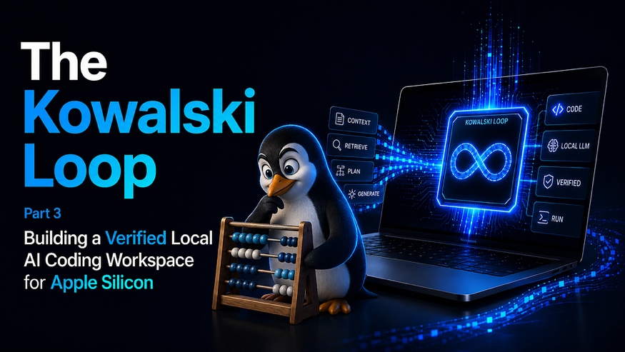

# Kowalski Loop

A local stack for running a quantized LLM (Qwen3-27B, Qwen3-35B or Gemma4-12B) on Apple Silicon via **DFlash/TurboQuant/MLX** inference backend, with a compression proxy (**Headroom**), a Claude Code router (**ccr**), and an unattended supervisor (**Kowalski**) driving **Claude Code** agent.



## 🚀 Quick Start

Practical recipes first — every step is explained in depth later in this document.
Before using the framework, follow the installation guide: [INSTALL.md](INSTALL.md).
Default installation folder in examples: `~/local-llm-workspace` (folder name only; project name is **Kowalski Loop**).

### 1. Interactive mode in 60 seconds (attended)

Manual coding with Claude Code running on your local model.

```bash
# Terminal 1 — start the stack (wrapper scripts, recommended)
bash bin/start_dflash_server.bash     # inference watchdog on :8787
# (or: bash bin/start_mlx_server.bash / bash bin/start_turboquant_server.bash)
bash bin/start_headroom_server.bash   # compression proxy on :8789
bash bin/launch_ccr.bash              # interactive Claude Code session

# Terminal 2 — optional live monitoring
bash bin/launch_dashboard.bash
```

Equivalent direct CLI (same flow, explicit parameters):

```bash
python -m llmstack.cli serve dflash-qwen35b-moe --watchdog
python -m llmstack.cli proxy
python -m llmstack.cli interactive
```

→ Full walkthrough: [Mode 1: Standalone Interactive](#mode-1-standalone-interactive-development)

### 2. Autonomous mode in 5 minutes (Kowalski loop, unattended)

Write a plan; Kowalski decomposes, executes, verifies, and commits.

```bash
# 1. Prepare your project
cd ~/local-llm-workspace
mkdir -p prj/my_project
cd prj/my_project
git init

# 2. Create a task plan
mkdir -p .claude/plans
cat > .claude/plans/plan.json <<'EOF'
{
  "tasks": [
    {
      "id": "task_01",
      "prompt": "Create index.html with a button that says 'Click me'",
      "file": "index.html",
      "expect": ["Click me"]
    },
    {
      "id": "task_02",
      "prompt": "Add JavaScript to log 'Button clicked' when clicked",
      "file": "script.js",
      "context": ["index.html"],
      "verify": "node --check script.js"
    }
  ]
}
EOF

# 3. Update llmstack_config.json (required)
cd ~/local-llm-workspace
env/bin/python - <<'PY'
import json
from pathlib import Path

cfg_path = Path("llmstack_config.json")
cfg = json.loads(cfg_path.read_text())
cfg["dev_root"] = "./prj/my_project"
cfg["plan_file"] = "./prj/my_project/.claude/plans/plan.json"
cfg.setdefault("active_model", "dflash-qwen27b")
cfg_path.write_text(json.dumps(cfg, indent=2) + "\n")
print("Updated", cfg_path)
PY

# 4. Run Kowalski
bash bin/launch_kowalski.bash

# Terminal 2 — optional live monitoring
bash bin/launch_dashboard.bash
```

→ Full walkthrough: [Mode 2: Autonomous Orchestration (Kowalski Loop)](#mode-2-autonomous-orchestration-kowalski-loop)

### 3. Bootstrap a new workspace (wizard)

Use the interactive wizard when you want a minimal starter config and an optional first plan:

```bash
python -m llmstack.cli init
```

The wizard asks for:
- `dev_root`
- project type
- goal
- model/backend preference
- whether to generate a starter plan immediately

It writes a compact `llmstack_config.json` with stable keys only, derives a starter plan path under `./.claude/plans/`, and optionally calls `build_plan.py` for the provided goal. The generated config records `project_type`, a `project_template` block (`name`, `language`, `description`, `starter_layout`, `plan_name`), and the chosen `project_goal` alongside the usual `dev_root`, `active_model`, `plan_file`, `loop_mode`, `permission_mode`, `thinking_mode`, and `verification_plugins` keys.

Useful flag:
- `--force` overwrites an existing `llmstack_config.json`. It works both interactively and combined with the scriptable flags (e.g. `llmstack init --force --non-interactive ...`).

Scriptable mode:
- `--non-interactive` skips prompts and uses defaults or the values you pass.
- `--dev-root`, `--project-type`, `--goal`, and `--model` let you pin the generated config.
- `--bootstrap-plan` or `--no-bootstrap-plan` control whether a starter plan is generated.

Supported starter templates:
- `python` creates a Python-oriented config with `pyproject.toml`, `src/`, and `tests/` in the template metadata.
- `js` creates a JavaScript-oriented config with `package.json`, `src/`, and `tests/`.
- `generic` keeps the template language-agnostic.

### Which mode do I need?

| Need | Mode | Entry points |
|------|------|---------|
| Explore and debug interactively | **Interactive (attended)** | `bin/launch_ccr.bash` or `python -m llmstack.cli interactive` |
| Automate a build plan with verification | **Kowalski (unattended)** | `bin/launch_kowalski.bash` or `python -m llmstack.cli run` |

To monitor real-time metrics, run `bin/launch_dashboard.bash` or `python -m llmstack.cli dashboard` in another terminal.

### Reading path (progressively deeper)

1. [Quick Start](#-quick-start) — you are here.
2. [Operating the Stack](#operating-the-stack) — wrappers vs direct CLI, stability levels.
3. [How to Run](#how-to-run) — step-by-step walkthroughs for both modes.
4. [Model Configuration](#model-configuration) — model/backend switching and stability presets in depth.
5. [MEMORY.md](MEMORY.md) — RAM-tier sizing, model trade-offs, and stability guardrails.
6. [HEADROOM.md](HEADROOM.md) — context compression efficiency, savings thresholds, and session-scale analysis.
7. [DFLASH.md](DFLASH.md) — speculative decoding efficiency, cache thresholds, and prefill gain analysis.
8. [SAVINGS.md](SAVINGS.md) — cross-layer synthesis of memory pressure, prompt compression, and cache reuse.
9. Advanced references — [Kowalski Configuration](#advanced-reference-kowalski-configuration-llmstack_configjson), [Task Schema](#advanced-reference-task-schema-plan-json), [Executor Selection](#advanced-reference-executor-selection), [Loop Modes](#loop-modes).

---

## Operating the Stack

### 1) Wrapper-first workflow (recommended)

Start with wrapper scripts in `bin/`:

- `start_*_server.bash` wrappers run inference through a watchdog (`llmstack.cli serve --watchdog`) and keep one backend on `:8787` alive.
- `start_headroom_server.bash` is resilient (health-first/idempotent start, anti-concurrent lock, stale cleanup, retry with backoff).
- `launch_ccr.bash`, `launch_kowalski.bash`, and `launch_dashboard.bash` provide the standard attended/unattended workflows.

This is the default path for interactive development and predictable operations.

### 2) Direct CLI workflow (explicit parameters)

When you need full control, run the CLI directly, for example:

- `python -m llmstack.cli serve [model_name] --watchdog`
- `python -m llmstack.cli proxy`
- `python -m llmstack.cli interactive`
- `python -m llmstack.cli run`
- `python -m llmstack.cli model use <name>`
- `python -m llmstack.cli model preset <performance|balanced|stable|safest> [--restart] [--keep-backend-overrides]`

Precedence rule:

- If you pass an option explicitly on the CLI, that explicit option wins for that command.
- If you do not pass an override on the CLI, global values from `llmstack_config.json` are used.

### 3) Stability levels at a glance

Use one global knob (`backend_stability_profile`) unless you explicitly need per-backend differences.

| Level | Best for | Trade-off | Typical outcome |
|---|---|---|---|
| `performance` | Maximum throughput, short prompts, benchmarking | Highest GPU pressure | Fastest responses, higher crash risk on large contexts |
| `balanced` | Daily use with mixed workloads | Moderate limits | Good speed with decent stability |
| `stable` | Long coding sessions and large contexts | Slightly reduced peak throughput | Better resilience on Apple GPU under load |
| `safest` | Critical reliability sessions, very large prompts | Stronger throttling and caps | Lowest crash probability, slowest peak throughput |

Recommended progression:
1. Start with `balanced`.
2. Move to `stable` if you observe runtime instability.
3. Use `safest` for mission-critical unattended runs.
4. Return to `performance` only when prompt sizes are controlled.

Quick commands:

```bash
# Global one-knob preset for all backends
python -m llmstack.cli model preset stable

# Apply preset and restart the running inference service immediately
python -m llmstack.cli model preset safest --restart
```

Full details: [Backend stability presets (all backends)](#backend-stability-presets-all-backends).

### Runtime reliability notes (2026-07)

The following behaviors are now documented and expected when operating long unattended runs.

#### 1) Module entrypoint support

You can now invoke `llmstack` directly as a Python module:

```bash
python -m llmstack --help
python -m llmstack model preset balanced --restart
```

Important: use the project virtual environment interpreter when available (for example `env/bin/python3`) to avoid missing dependency errors from a global Python.

#### 2) Safe preset application while a loop is running

`llmstack model preset <preset> --restart` applies the preset immediately only when it is safe.

- If no active watchdog-owned loop is running, it restarts inference live.
- If a watchdog-owned loop is running, live restart is intentionally skipped and a warning is shown.

This avoids backend restart races and port rebind conflicts during active generation. In this case, restart the loop process to apply the new preset safely.

#### 3) Direct-mode degeneration guardrail

Direct generation now includes a conservative anti-degeneration guard before file write.

If extreme output corruption is detected, the write is skipped and the task is retried through normal verification feedback instead of committing unusable output.

Current hardcoded thresholds (conservative):

- Guardrail evaluates only for outputs >= 12000 chars
- Repeated single-character run threshold: >= 512
- Repeated long identifier threshold: >= 140 occurrences
- Low-diversity check applies when extracted tokens >= 200
- Low-diversity trigger: unique token ratio < 0.06

These thresholds are intentionally strict to reduce false positives on valid large files.

#### 4) Direct traffic now goes through Headroom

Direct generation is now routed through the configured Headroom OpenAI-compatible endpoint instead of hitting the inference backend directly.

- This makes direct-mode requests visible in `logs/headroom_traffic.jsonl` and in the dashboard request panels.
- The actual URLs are derived from `llmstack_config.json` (`local_host`, `inference_port`, `headroom_port`) rather than hardcoded in the Python runtime.

#### 5) Agent format fallback writes only the target file

If an agent task uses `"on_format_error": "direct_context_fallback"`, Kowalski now regenerates only the task's declared `file`.

- Context files are still read and injected as references.
- Context files are no longer rewritten during fallback.

---

## Architecture

```
Claude Code  →  ccr (Claude Code Router)  →  Headroom proxy :headroom_port  →  Inference server :inference_port (DFlash/MLX/TurboQuant)  →  Apple GPU
```

| Component | Port | Description |
|---|---|---|
| Kowalski Supervisor (opt) | — | Python orchestrator that starts the servers, warms the cache, and runs tasks in a loop inside Claude Code |
| Claude Code | - | Anthropic agentic coding assistant |
| Claude Code Router (ccr) | — | Routes Claude Code requests to Headroom instead of Anthropic cloud |
| Headroom proxy | `headroom_port` (default `8789`) | Proxy that compresses context in a code-aware manner before sending to the local inference backend |
| Inference server (DFlash/MLX/TurboQuant) | `inference_port` (default `8787`) | OpenAI-compatible local inference endpoint selected from model registry |

---

## Prerequisites

- macOS with Apple Silicon (MLX requires Metal)
- [Claude Code](https://docs.anthropic.com/claude-code) (`claude`) installed globally via npm (Node.js 22+)
- [Claude Code Router](https://github.com/musistudio/claude-code-router) (`ccr`) installed globally via npm
- [Headroom](https://github.com/chopratejas/headroom) installed in `~/headroom-env/`
- Python virtualenv in `./env/` with `dflash-mlx` and dependencies (already included)

### Model Artifacts (Required)

No model weights are distributed with this repository.

- `llmstack` can provide a default in-code registry when `models` is omitted, but it still points to remote Hugging Face repos.
- The first serve run downloads target weights automatically if missing.
- DFlash setups also require the matching draft model (`draft`), which may be gated.

Recommended before first run:

1. Authenticate to Hugging Face (`hf auth login`) with a token that can access the required repos.
2. Pre-download gated drafts to avoid startup timeout on first serve (example: `hf download z-lab/Qwen3.6-27B-DFlash`).
3. Ensure every configured `target` (and `draft` for DFlash) exists and is accessible.

`hf` can come either from the Homebrew package `hf` or from `pip install -U huggingface_hub`; [INSTALL.md](INSTALL.md) documents both paths.

Reference walkthrough (installation article): [docs/medium_article_01_install.md](docs/medium_article_01_install.md).

---

## File Structure

| File | Description |
|---|---|
| **Standalone Launchers** | |
| `bin/start_dflash_server.bash` | Starts the inference watchdog in background for DFlash (`python -m llmstack.cli serve --watchdog`). Default model = active DFlash model unless overridden with first arg. Watchdog logs: `logs/dflash_watchdog.log`; server logs: `logs/dflash_server.log`. |
| `bin/start_mlx_server.bash` | Starts the same inference watchdog in background for MLX (default model: `mlx-gemma4-12b`, override with first arg). Same configured `inference_port` endpoint and log paths as above. |
| `bin/start_turboquant_server.bash` | Starts the same inference watchdog in background for TurboQuant (default model: `turboquant-qwen35b-moe`, override with first arg). Same configured `inference_port` endpoint and log paths as above. |
| `bin/start_headroom_server.bash` | Starts only the Headroom proxy on `local_host:headroom_port` (default `127.0.0.1:8789`, upstream `inference_port`, logs to `logs/headroom_traffic.jsonl`). Resilient launcher: health-first/idempotent start, anti-concurrent lock, stale-process cleanup, and retry with backoff (`HEADROOM_START_RETRIES`, default `3`). |
| `bin/stop_dflash_server.bash` | Stops the inference watchdog (if running) and then stops whichever inference process is bound to the configured `inference_port` (graceful stop with force-kill fallback). |
| `bin/stop_mlx_server.bash` | Stops the inference watchdog (if running) and then stops whichever inference process is bound to the configured `inference_port` (graceful stop with force-kill fallback). |
| `bin/stop_turboquant_server.bash` | Stops the inference watchdog (if running) and then stops whichever inference process is bound to the configured `inference_port` (graceful stop with force-kill fallback). |
| `bin/stop_headroom_server.bash` | Stops Headroom on the configured `headroom_port` (graceful stop with force-kill fallback, plus stale-process safety net). |
| `bin/launch_ccr.bash` | **Interactive Claude Code** — starts `ccr code` with `acceptEdits` by default, pre-trusted folders, optimized system prompt. Changes to project folder (`dev_root` from config). Reads config from `llmstack_config.json`. |
| `bin/launch_dashboard.bash` | Launches the terminal monitoring dashboard (TPS, cache %, memory, requests, and live engine statuses). Header is intentionally compact: inference engine, inference status, served model, and Headroom status. The Headroom panel also shows its status. |
| **Autonomous Mode** | |
| `bin/launch_kowalski.bash` | **Main entry point** — thin shell wrapper around `python -m llmstack.cli run`. Starts the stack and runs Kowalski orchestrator. |
| `llmstack/core/supervisor.py` | Core orchestrator used by `llmstack.cli run` to execute the autonomous loop. |
| **Configuration & Utilities** | |
| `llmstack_config.json` | Central configuration file for Kowalski (timeouts, permissions, gates, model params). Used by all launchers. |
| `llmstack/tools/build_plan.py` | Generates task plans for Kowalski (decomposes project goal into atomic, verifiable tasks). |
| `llmstack/tools/log_cleaner.py` | Filters HTTP access-log lines from `logs/dflash_server.log` → creates `logs/server_pulito.log`. |
| `llmstack/tools/dflash_dashboard.py` | Terminal dashboard implementation launched by `bin/launch_dashboard.bash`. |
| `llmstack/tools/plot_timings.py` | Generates article charts from `logs/dflash_timings.csv` into `docs/img/`. |
| `bin/update_stack.bash` | Updates `claude` and `ccr` to the latest version via npm. |
| `docs/commit_history.txt` | Text log of manual/project commit notes and migration checkpoints. |
| **Projects & Environment** | |
| `prj/pacman_clone/` | Sample project managed by Kowalski (Pac-Man game in HTML/JS). Contains `.claude/` subfolder for plans. |
| `env/` | Python virtualenv with dflash-mlx, mlx-lm, rich, psutil, and other dependencies. |

---

## How to Run

### Mode 1: Standalone Interactive (Development)

Use this to **manually code** with full Claude Code privileges, no automation.

#### 1a. Start the infrastructure (one-time setup)

From your current terminal (or separate terminals if you prefer):
```bash
cd ~/local-llm-workspace
bash bin/start_dflash_server.bash
```
Starts a background watchdog immediately. The model may still take ~5–10 min to become healthy on first run; follow progress in `logs/dflash_watchdog.log` and `logs/dflash_server.log`.

Then start Headroom:
```bash
cd ~/local-llm-workspace
bash bin/start_headroom_server.bash
```
Starts compression proxy on `headroom_port` (default `:8789`, upstream `inference_port`, default `:8787`) and leaves it managed in the background. Output → `logs/headroom.log` + `logs/headroom_traffic.jsonl`.

#### 1b. Start interactive Claude Code

In **Terminal 3**:
```bash
cd ~/local-llm-workspace
bash bin/launch_ccr.bash
```

You now have an **interactive session** with:
- ✅ Cloud keys cleared (local-only mode)
- ✅ Permission mode defaults to `acceptEdits` (override with `interactive_permission_mode` in config)
- ✅ Working directory set to `dev_root` from config
- ✅ Pre-trusted folders (no approval dialogs)
- ✅ Optimized system prompt (atomic tasks)
- ✅ Timeouts from `llmstack_config.json`
- ✅ Max turns from `llmstack_config.json`

Ask Claude Code to create/edit files in your project directory without approval. Changes are **not tracked** by Kowalski (no git automation here).

#### 1c. Monitor in real time (optional)

In **Terminal 4**:
```bash
bash bin/launch_dashboard.bash
```

Displays live metrics: TPS, cache hits, memory, and recent requests, plus separate health states for the inference engine and the Headroom cache engine. The "Inference Completed" panel shows only the logged-call count (no log-file path).

#### 1d. Stop infrastructure

```bash
bash bin/stop_headroom_server.bash
bash bin/stop_dflash_server.bash
```

If you started MLX or TurboQuant instead of DFlash, use the matching stop wrapper:

```bash
bash bin/stop_mlx_server.bash
# or
bash bin/stop_turboquant_server.bash
```

---

### Mode 2: Autonomous Orchestration (Kowalski Loop)

Use this to **automatically decompose a goal into tasks and execute them** with full verification gates.

#### 2a. Prepare your project folder

Create a new project folder or use an existing one (default: `./prj/pacman_clone`):

```bash
cd ~/local-llm-workspace
mkdir -p prj/my_project
cd prj/my_project
# (optional) Initialize git
git init
```

#### 2b. Write or generate a task plan

**Option A: Auto-generate a plan** (guided)

```bash
cd ~/local-llm-workspace
source env/bin/activate
python3 -m llmstack.tools.build_plan "Build a Tic-Tac-Toe game in HTML/JS"
```

The model will:
1. Decompose the goal into atomic tasks (board creation, game logic, UI, etc.)
2. Assign executors (agent for complex, direct for simple files)
3. Define verification gates (syntax checks, feature markers, smoke tests)
4. Print the full plan to stdout

Review it, tweak any task if needed, then continue.

**Option B: Write a plan manually** (advanced)

Create a file at `.claude/plans/my_plan.json` (from inside `prj/my_project`):

```bash
mkdir -p .claude/plans
cat > .claude/plans/my_plan.json <<'EOF'
{
  "tasks": [
    {
      "id": "task_01",
      "prompt": "Create the game board with a 3x3 grid in HTML...",
      "file": "index.html",
      "mode": "direct",
      "verify": "node -e \"require('fs').readFileSync('index.html')\" && echo OK",
      "expect": ["<div id=\"board\">"],
      "status": "pending"
    },
    {
      "id": "task_02",
      "prompt": "Implement game logic: X/O placement, win detection...",
      "file": "game.js",
      "mode": "agent",
      "context": ["index.html"],
      "verify": "node --check game.js",
      "expect": ["checkWin", "placeMarker"],
      "require_change": true,
      "smoke": [
        "const g = require('./game.js');",
        "console.log(g.checkWin ? '✓ game logic loaded' : '✗ missing checkWin');"
      ],
      "status": "pending"
    }
  ]
}
EOF
```

#### 2c. Configure Kowalski

Edit `llmstack_config.json`:

```json
{
  "dev_root": "./prj/my_project",
  "plan_file": "./prj/my_project/.claude/plans/my_plan.json",
  "active_model": "dflash-qwen27b",
  "permission_mode": "acceptEdits",
  "max_turns": 150,
  "timeout_seconds": 3600,
  "max_retries": 3,
  "max_resumes": 8,
  "require_change": true,
  "wiring_check": false,
  "review_enabled": false
}
```

Model note:
- Recommended: set `active_model` explicitly as shown above.
- If omitted, Kowalski falls back to the first model in the configured registry.

#### 2d. Start the autonomous loop

```bash
cd ~/local-llm-workspace
bash bin/launch_kowalski.bash
```

Alternatively:

```bash
cd ~/local-llm-workspace
python -m llmstack.cli run
```

Kowalski will:
1. Start DFlash server (loads model into RAM)
2. Start Headroom proxy
3. Patch CCR timeout and pretrust the project folder
4. Warm the prefix cache (dummy agentic request)
5. **Execute each task** in sequence:
   - Route to Claude Code (agent or direct, with `permission_mode` from config)
  - Auto-approve edits (and common filesystem operations) when `"permission_mode": "acceptEdits"`
   - Apply 6-layer verification gates
   - Commit verified changes to git
   - Resume or retry on failure
6. Print final status

**Expected output**:
```
🤖 Booting Kowalski Unattended Agent System...
⏱️  Timeout centralized: 3600s applied to env + CCR config.json.
✅ DFlash ONLINE & HEALTHY
🗜️  Headroom proxy on configured `headroom_port` → inference backend on configured `inference_port`...
🔄 Restarting Claude Code Router daemon...
🚀 Handing over control to Kowalski Orchestrator...
⏳ Waiting for model to load into RAM...
✅ Server online and healthy.
📦 Git ready (last verified state protected).
🔥 Warming the agentic prefix cache...
📋 [Kowalski] Loaded 2 tasks.

▶️  [Kowalski] Task task_01 — attempt 1 (direct)
✍️  [Kowalski] Direct-generating index.html...
📝 [Kowalski] Wrote index.html (1235 bytes).
✅ [Kowalski] Task task_01 COMPLETE & verified.

▶️  [Kowalski] Task task_02 — attempt 1 (agent, turns=150)
⚙️  [Kowalski] Running Task task_02 (agentic, turns=150) in /Users/enricopapalini/local-llm-workspace/prj/my_project
✅ [Kowalski] Task task_02 COMPLETE & verified.

🎉 [Kowalski] All tasks verified and committed!
```

---

### Optional: Other Utilities

#### Generate a new plan interactively

```bash
cd ~/local-llm-workspace
source env/bin/activate
python3 -m llmstack.tools.build_plan "Implement a 2D physics engine"
```

#### Monitor logs

Real-time dashboard:
```bash
bash bin/launch_dashboard.bash
```

Clean logs (remove HTTP access lines):
```bash
cd ~/local-llm-workspace
source env/bin/activate
python3 -m llmstack.tools.log_cleaner
```

Generate timing charts for docs (writes `docs/img/*.png`):
```bash
cd ~/local-llm-workspace
source env/bin/activate
python3 -m llmstack.tools.plot_timings
```

#### Update Claude Code & ccr

```bash
bash bin/update_stack.bash
```

---

## Model Configuration

- Model/backend selection is **registry-driven** from `llmstack_config.json` (`active_model` + `models` map), loaded by `llmstack/models/registry.py`.
- For RAM-tier sizing, model class trade-offs, and stability guardrails, see [MEMORY.md](MEMORY.md).
- For a cross-layer synthesis of memory, compression, and cache reuse, see [SAVINGS.md](SAVINGS.md).
- The active model resolves to a backend type and target model; supported backend types are:
  - `dflash`
  - `mlx`
  - `turboquant`
- Network endpoints are config-driven from `llmstack_config.json`:
  - `local_host` (default `127.0.0.1`)
  - `inference_port` (default `8787`)
  - `headroom_port` (default `8789`)

### Model selection commands

```bash
# Show configured models and current active model
python -m llmstack.cli model list

# Switch active model (persists active_model in llmstack_config.json)
python -m llmstack.cli model use mlx-gemma4-12b

# Optional recommender
python -m llmstack.cli model recommend --use agentic
python -m llmstack.cli model recommend --use decode --apply

# Set one global stability preset for all backends (single-knob mode)
python -m llmstack.cli model preset stable

# Apply preset and restart running inference server immediately
python -m llmstack.cli model preset safest --restart
```

When `model use`/`recommend --apply` runs, llmstack syncs CCR and, if inference is already running on the configured `inference_port`, swaps it to the selected target model.

### Serving a specific model/backend

`python -m llmstack.cli serve [model_name] --watchdog` accepts an optional model name and can run in watchdog mode. If a model name is provided and present in the registry, it updates `active_model`, syncs CCR, and serves that backend/model.

Examples:

```bash
# Start default DFlash wrapper behavior (watchdog mode)
bash bin/start_dflash_server.bash

# Wrapper default is mlx-gemma4-12b unless you pass a model name (watchdog mode)
bash bin/start_mlx_server.bash
bash bin/start_mlx_server.bash mlx-gemma4-12b

# Wrapper default is turboquant-qwen35b-moe unless overridden (watchdog mode)
bash bin/start_turboquant_server.bash
bash bin/start_turboquant_server.bash turboquant-qwen35b-moe
```

Note: only one inference watchdog should run at a time because all backends bind to the configured `inference_port` (default `8787`). If a watchdog is already running, start wrappers will exit without launching a second one.

### Backend stability presets (all backends)

Observed hard-crash signature on Apple GPU is typically:
- `[METAL] Command buffer execution failed: ... kIOGPUCommandBufferCallbackErrorImpactingInteractivity`

This is a runtime/GPU-pressure failure (not a router/watchdog logic failure). To reduce crash probability under large contexts, llmstack now exposes stability knobs in `llmstack_config.json` for all backend types (`dflash`, `mlx`, `turboquant`):

- `backend_stability_profile`: `performance` | `balanced` | `stable` | `safest`
- `backend_stability_overrides`: optional per-key overrides

Optional backend-specific overrides (take precedence over global):
- `dflash_stability_profile` / `dflash_stability_overrides`
- `mlx_stability_profile` / `mlx_stability_overrides`
- `turboquant_stability_profile` / `turboquant_stability_overrides`

If you want exactly one knob for everything, keep backend-specific `*_stability_profile` values `null` and set only `backend_stability_profile`.

Profiles tune serve parameters per backend. Lower settings reduce peak memory and command-buffer stress, usually improving runtime stability at the cost of some throughput.

How to choose in practice:

1. If your stack is stable now, keep `balanced`.
2. If you see intermittent failures tied to backend restarts, move to `stable`.
3. If you hit Metal command-buffer failures under heavy context, move to `safest` first, then relax later.
4. If you need maximum speed and can tolerate restarts, use `performance`.

One-knob strategy (recommended):

1. Set only `backend_stability_profile`.
2. Keep `dflash_stability_profile`, `mlx_stability_profile`, and `turboquant_stability_profile` as `null`.
3. Add minimal overrides only for measured bottlenecks.

Per-backend strategy (advanced):

1. Keep a global baseline (for example `stable`).
2. Override only the backend that needs a different profile.
3. Document why, so operational behavior remains predictable over time.

Precedence:
- model-local defaults
- global `backend_stability_*`
- backend-specific `*_stability_*` (highest)

Example:

```json
{
  "backend_stability_profile": "stable",
  "backend_stability_overrides": {
    "max_tokens": 3072,
    "max_snapshot_tokens": 10000,
    "cache_max_bytes": "8GB"
  },
  "turboquant_stability_overrides": {
    "prompt_concurrency": 1,
    "kv_min_tokens": 96
  }
}
```

### CCR multi-model routing behavior

`llmstack/services/ccr_service.py` renders CCR config from the full model registry (multi-provider/multi-model), and routes:

- `default`
- `background`
- `think`
- `longContext`
- `webSearch`

to the currently active `<provider>,<target>` pair, with provider endpoints pinned to the configured local Headroom chat endpoint derived from `local_host` + `headroom_port`.

### End-to-end switching examples

```bash
# Switch active model/backend first
python -m llmstack.cli model use turboquant-qwen35b-moe

# Then run interactive mode
bash bin/launch_ccr.bash
```

```bash
# Switch to MLX model/backend
python -m llmstack.cli model use mlx-gemma4-12b

# Then run autonomous Kowalski mode
bash bin/launch_kowalski.bash
```

---

## Advanced Reference: Kowalski Configuration (`llmstack_config.json`)

Complete reference of all available parameters:

```json
{
  "dev_root": "./prj/pacman_clone",
  "plan_file": "./prj/pacman_clone/.claude/plans/pacman_plan.json",
  "local_host": "127.0.0.1",
  "inference_port": 8787,
  "headroom_port": 8789,
  "log_dir": "./logs",
  "dflash_log": "./logs/dflash_server.log",
  "headroom_log": "./logs/headroom.log",
  "headroom_traffic_log": "./logs/headroom_traffic.jsonl",
  "timings_csv": "./logs/dflash_timings.csv",
  "active_model": "dflash-qwen35b-moe",
  "models": {
    "dflash-qwen27b-dense": {
      "type": "dflash",
      "target": "mlx-community/Qwen3.6-27B-4bit",
      "draft": "z-lab/Qwen3.6-27B-DFlash",
      "max_tokens": 8192,
      "temp": 0.2
    },
    "dflash-qwen35b-moe": {
      "type": "dflash",
      "target": "mlx-community/Qwen3.6-35B-A3B-4bit",
      "draft": "z-lab/Qwen3.6-35B-A3B-DFlash",
      "max_tokens": 8192,
      "temp": 0.2
    },
    "turboquant-qwen35b-moe": {
      "type": "turboquant",
      "target": "manjunathshiva/Qwen3.6-35B-A3B-tq3-g32",
      "kv_k_bits": 8,
      "kv_v_bits": 3,
      "max_tokens": 8192,
      "temp": 0.2
    }
  },
  "permission_mode": "acceptEdits",
  "max_turns": 100,
  "timeout_seconds": 3600,
  "warmup_timeout_seconds": 120,
  "backend_stability_profile": "balanced",
  "backend_stability_overrides": {},
  "dflash_stability_profile": null,
  "dflash_stability_overrides": {},
  "mlx_stability_profile": null,
  "mlx_stability_overrides": {},
  "turboquant_stability_profile": null,
  "turboquant_stability_overrides": {},
  "max_retries": 3,
  "max_resumes": 8,
  "agent_format_retries": 2,
  "allow_already_done_if_verified": true,
  "size_threshold_bytes": 12000,
  "debug_log": "./logs/kowalski_debug.log",
  "debug_max_chars": 0,
  "agent_tools": ["Read", "Edit"],
  "require_change": true,
  "wiring_check": true,
  "review_enabled": false,
  "verification_plugins": {
    "python_lint": {
      "command": "ruff check {file}",
      "when": "task",
      "languages": [".py"],
      "on_failure": "fail",
      "enabled": true
    },
    "suite": {
      "command": "pytest -x",
      "when": "plan_complete",
      "on_failure": "fail",
      "enabled": true
    }
  },
  "loop_mode": "plan",
  "continuous_queue_file": "task_queue.json",
  "continuous_poll_seconds": 2,
  "watch_root": ".",
  "watch_queue_file": "task_queue.json",
  "watch_poll_seconds": 2,
  "watch_debounce_seconds": 0.5,
  "thinking_mode": "off",
  "supervised_approval_mode": "console"
}
```

### Core Parameters

| Parameter | Type | Default | Possible Values | Description |
|---|---|---|---|---|
| **`dev_root`** | string | `"."` | Any valid directory path (relative or absolute) | Root directory where Claude Code operates. All file modifications and git operations are relative to this path. Example: `"./prj/pacman_clone"`, `"."`, `"/absolute/path"` |
| **`plan_file`** | string | `"plan.json"` | Any valid file path inside `dev_root` | Path to the JSON file containing the task list to execute sequentially. Loaded fresh on each run. Example: `"plan.json"`, `".claude/plans/main.json"` |
| **`local_host`** | string | `"127.0.0.1"` | Any bindable local interface/hostname | Shared host used to derive runtime URLs for inference, Headroom, dashboard health checks, and direct-mode routing. Keep `127.0.0.1` unless you intentionally expose the stack to another interface. |
| **`inference_port`** | integer | `8787` | Any free TCP port | Port bound by the active inference backend (DFlash / MLX / TurboQuant). Used to derive `inference_base_url`, health probes, and local chat routing. |
| **`headroom_port`** | integer | `8789` | Any free TCP port | Port bound by Headroom. Used to derive the OpenAI-compatible proxy URL that CCR and direct mode now use by default. |
| **`active_model`** | string | first registry key | Any model name present in `models` | Model used by serve/interactive/run when no model override is passed on CLI. Recommended to set explicitly for deterministic behavior across machines. |
| **`models`** | object | in-code defaults | map of model name → backend config | Model registry. Each entry defines at least `type` + `target`; DFlash entries should also define `draft`. If omitted, Kowalski falls back to built-in defaults in `llmstack/models/registry.py`. |
| **`backend_stability_profile`** | string | `"balanced"` | `"performance"` &#124; `"balanced"` &#124; `"stable"` &#124; `"safest"` | Global stability preset for all backends when backend-specific profile keys are `null`. |
| **`backend_stability_overrides`** | object | `{}` | key/value map | Optional global overrides applied on top of the selected global stability preset. |
| **`dflash_stability_profile`** | string/null | `null` | preset values or `null` | DFlash-specific profile override. `null` means: inherit from `backend_stability_profile`. |
| **`mlx_stability_profile`** | string/null | `null` | preset values or `null` | MLX-specific profile override. `null` means: inherit from `backend_stability_profile`. |
| **`turboquant_stability_profile`** | string/null | `null` | preset values or `null` | TurboQuant-specific profile override. `null` means: inherit from `backend_stability_profile`. |
| **`permission_mode`** | string | `"acceptEdits"` | `"default"` &#124; `"acceptEdits"` &#124; `"plan"` &#124; `"auto"` &#124; `"dontAsk"` &#124; `"bypassPermissions"` | Claude Code permission mode for autonomous task execution. `acceptEdits` is recommended for local unattended development. |
| **`agent_tools`** | array | `["Read", "Edit"]` | Any combination of: `"Read"`, `"Edit"`, `"Write"`, `"Bash"`, `"Glob"`, `"Grep"`, `"WebFetch"`, `"Task"` | Tools available to the Claude Code agent. Typically `["Read", "Edit"]` for safety. Add `"Bash"` for script execution. |

CLI override precedence:

- Explicit CLI parameters (for example `llmstack model preset ... --restart`) apply to that invocation.
- If no CLI override is provided, values from `llmstack_config.json` are used.

### Timeout & Retry Parameters

| Parameter | Type | Default | Possible Values | Description |
|---|---|---|---|---|
| **`timeout_seconds`** | integer | `1800` | `60` to `7200` (1 min – 2 hours) | **Master timeout** for ALL operations (agent task, direct generation, ccr calls). Converted to milliseconds for `API_TIMEOUT_MS` and `CLAUDE_STREAM_IDLE_TIMEOUT_MS` environment variables. If a task takes longer than this, it returns `TIMEOUT`. Recommended: `1800` (30 min) to `3600` (1 hour). |
| **`warmup_timeout_seconds`** | integer | `120` | `10` to `600` | Timeout for the pre-run cache warm-up request. If warm-up hangs/fails, Kowalski logs and continues to the task loop instead of blocking startup for the full task timeout. |
| **`max_turns`** | integer | `150` | `10` to `1000` | Maximum number of agent turns (back-and-forth between Kowalski and Claude Code) for a single task. If hit, the task returns `AGENT_ERROR` and may be resumed. Higher values allow more refinement but increase runtime. |
| **`max_retries`** | integer | `3` | `1` to `10` | Hard retry limit for a task. After this many failures (no valid progress), the task is abandoned and Kowalski halts. `1` = no retries; `3-5` = balanced; higher = very lenient. |
| **`max_resumes`** | integer | `8` | `0` to `20` | Resume limit: if a task times out or errors but has valid progress (WIP commit), it can be resumed up to this many times before giving up. `0` = disable resumption; `8-10` = reasonable for development. |
| **`agent_format_retries`** | integer | `2` | `0` to `10` | Extra retries for agent runs when the provider returns transport/format errors (for example `content block is not a text block`). Kowalski adds a stricter format-safety directive on each retry. |
| **`allow_already_done_if_verified`** | boolean | `false` | `true` &#124; `false` | If enabled, agent tasks can complete with `KowalskiStatus: already_done` **only** when all deterministic gates pass with `require_change` temporarily skipped for that task attempt. Useful for idempotent reruns after partial failures. |

### Thresholds & Logging

| Parameter | Type | Default | Possible Values | Description |
|---|---|---|---|---|
| **`size_threshold_bytes`** | integer | `12000` | `1000` to `100000` | File size threshold (bytes) for executor selection. Files **larger** than this use the **agent** executor (multi-turn refinement). Files **smaller or equal** use **direct** executor (one-shot generation). Default `12000` ≈ 12KB. Lower = more direct mode; higher = more agent mode. |
| **`debug_log`** | string | `"./logs/kowalski_debug.log"` | Any file path, or `""` / `null` to disable | Path to the debug log. Records agentic input/output, direct generation rounds, and verification details. Set to empty string `""` or `null` to disable debug logging. Example: `"./logs/kowalski_debug.log"`, `"./logs/custom_debug.log"`, `""` |
| **`debug_max_chars`** | integer | `0` | `0` to `1000000` | Maximum characters to include in each debug log entry. `0` = unlimited (log everything). Helps manage log size for large outputs. Example: `0` (unlimited), `10000` (10KB per entry), `50000` (50KB per entry) |

### Verification & Quality Gates

| Parameter | Type | Default | Possible Values | Description |
|---|---|---|---|---|
| **`require_change`** | boolean | `true` | `true` &#124; `false` | **Change gate**: Enabled (`true`) — task **must** modify its declared `file` or it fails (prevents no-ops). Disabled (`false`) — Kowalski skips this check and allows unchanged files. Recommended: `true` for safety. |
| **`wiring_check`** | boolean | `true` | `true` &#124; `false` | **Wiring gate**: Enabled (`true`) — every `*.js` file must be referenced in `index.html`, and every referenced file must exist (catches orphan/unused JS). Disabled (`false`) — Kowalski skips wiring validation. Recommended: `true` for frontend projects, `false` for non-web. |
| **`review_enabled`** | boolean | `false` | `true` &#124; `false` | **LLM review gate** (soft, optional): Enabled (`true`) — the weak model critiques the diff against the task spec. **Not blocking** (deterministic gates are the real protection); mostly informational. Disabled (`false`) — skips review. Recommended: `false` unless extra scrutiny needed. |

### Pluggable Gate Parameters

The built-in gates remain the default path. `verification_plugins` lets you append extra shell-based checks without changing Kowalski's code.

| Parameter | Type | Default | Possible Values | Description |
|---|---|---|---|---|
| **`verification_plugins`** | object | `{}` | map of plugin name → plugin definition | Additional verification hooks. Empty object means the feature is effectively disabled and current behavior is unchanged. |

Each plugin definition supports:

| Field | Type | Default | Possible Values | Description |
|---|---|---|---|---|
| **`command`** | string | — | Any shell command | Required. Runs from `dev_root`. Supports `{file}`, `{dev_root}`, and `{plan_file}` interpolation. |
| **`when`** | string | `"task"` | `"task"` &#124; `"plan_complete"` | `task` runs after a task's built-in deterministic checks and smoke test. `plan_complete` runs once after the whole plan finishes. |
| **`languages`** | array[string] | `[]` | extensions like `".py"`, `".ts"` | Optional file-extension filter for task-level plugins. |
| **`files`** | array[string] | `[]` | shell-style patterns like `"src/*.py"` | Optional task file filter using `fnmatch` patterns. |
| **`on_failure`** | string | `"fail"` | `"fail"` &#124; `"warn"` | `fail` blocks verification and feeds stderr/stdout into smart retry. `warn` logs the failure and continues. |
| **`enabled`** | boolean | `true` | `true` &#124; `false` | Allows shipping plugins in config while toggling them on/off explicitly. |

### Thinking Mode

`thinking_mode` controls whether Claude Code stays in the current no-thinking posture or uses more reasoning on agentic tasks.

| Parameter | Type | Default | Possible Values | Description |
|---|---|---|---|---|
| **`thinking_mode`** | string | `"off"` | `"off"` &#124; `"auto"` &#124; `"on"` | Global default for agentic tasks. `off` keeps the current behavior, `auto` enables adaptive thinking while keeping full thinking off, and `on` enables both. Per-task overrides win. |

Task-level override:
- Add `"thinking_mode": "auto"` or `"on"` to a task to override the global default.
- The chosen mode is visible in the agent debug log for each attempt.
- The mode only affects agentic execution; direct-generation tasks keep their current behavior.

### Loop Mode Parameters

These control **how** Kowalski selects and runs tasks. See [Loop Modes](#loop-modes) for a full walkthrough.

| Parameter | Type | Default | Possible Values | Description |
|---|---|---|---|---|
| **`loop_mode`** | string | `"plan"` | `"plan"` &#124; `"continuous"` &#124; `"watch"` &#124; `"supervised"` | Selects the loop strategy. `plan` = run a fixed plan once (classic behavior). `continuous` = poll a queue file for new tasks. `watch` = auto-enqueue fix tasks when `.py` files change. `supervised` = ask for console approval before each task. |
| **`continuous_queue_file`** | string | `"task_queue.json"` | Any file path (relative to CWD) | **Continuous mode only.** Queue file that Kowalski polls. Tasks appended here (list or `{"tasks": [...]}`) are picked up on the next poll. Invalid JSON is tolerated (Kowalski warns and waits). |
| **`continuous_poll_seconds`** | number | `2` | `0.1` to `60` | **Continuous mode only.** Seconds between queue re-reads while idle. |
| **`watch_root`** | string | `"."` | Any directory path (relative to CWD) | **Watch mode only.** Directory tree monitored for `.py` changes. |
| **`watch_queue_file`** | string | `"task_queue.json"` | Any file path (relative to CWD) | **Watch mode only.** File where auto-generated fix tasks are written (also honored if you append tasks manually). |
| **`watch_poll_seconds`** | number | `2` | `0.1` to `60` | **Watch mode only.** Seconds between filesystem re-scans (mtime fallback in addition to OS events). |
| **`watch_debounce_seconds`** | number | `0.5` | `0` to `10` | **Watch mode only.** Coalescing window so rapid successive saves of the same file enqueue only one task. |
| **`supervised_approval_mode`** | string | `"console"` | `"console"` | **Supervised mode only.** Approval channel. Currently `console` (interactive prompt in the terminal). Telegram approval is planned for a later phase. |

### Permission Modes Explained

The `permission_mode` setting controls how Claude Code approves tool calls during autonomous execution:

| Mode | Behavior | Use Case |
|------|------|------|
| **`default`** | Reads run without prompts; edits and non-read-only commands prompt. | Highest oversight |
| **`acceptEdits`** | Auto-approves edits + common filesystem operations in scope. | Recommended default |
| **`plan`** | Planning/research mode; no source edits until mode changes. | Analyze first |
| **`auto`** | Auto-approves with classifier safety checks. | Long autonomous runs |
| **`dontAsk`** | Denies prompt-requiring calls unless pre-approved by allow rules / allowed tools. | Locked-down CI |
| **`bypassPermissions`** | Skips prompts except explicit ask rules/circuit breakers. | Isolated sandboxes only |

**Current defaults:**
- **Interactive mode** (`bin/launch_ccr.bash`): Uses `acceptEdits` by default, configurable via `interactive_permission_mode`
- **Kowalski mode** (`bin/launch_kowalski.bash`): Uses `permission_mode` from `llmstack_config.json` (default: `acceptEdits`)

#### How Quality Gates Work

Kowalski applies a **verification pipeline** to every completed task:

1. **Shell verify** — Runs the task's `verify` command (e.g., `node --check`). Catches syntax errors.
2. **Feature markers** — Checks that all strings in `expect` appear in the task's `file`. Ensures declared features are present.
3. **Change gate** (controlled by `require_change`) — Verifies that the task actually modified `file`. Rejects no-ops.
4. **Already-done override** (controlled by `allow_already_done_if_verified`) — for agent tasks only, if the agent reports `KowalskiStatus: already_done`, Kowalski re-runs deterministic gates with `require_change=false` for that attempt. Task completes only if verification still passes.
5. **Format fallback (per-task strategy)** — if an agent task repeatedly fails with provider formatting errors, set `"on_format_error": "direct_context_fallback"` in that task to regenerate only the declared `file` with direct mode while using `context` files as read-only references, then run standard verification.
6. **Wiring check** (controlled by `wiring_check`) — Verifies no orphan JS and all referenced files exist.
7. **Behavioral smoke** — Runs the task's `smoke` code (Node.js assertions). Catches runtime bugs.
8. **Pluggable task plugins** (controlled by `verification_plugins`) — Runs extra shell-based checks filtered by task file / extension. Failing `fail` plugins feed stderr/stdout into smart retry.
9. **Thinking mode** (controlled by `thinking_mode`) — Controls whether the agent runs with thinking disabled, adaptive, or fully on.
10. **Optional LLM review** (controlled by `review_enabled`) — Optional diff critique (disabled by default).
11. **Plan-complete plugins** — After all tasks finish, Kowalski runs any `verification_plugins` with `"when": "plan_complete"` exactly once.

If any gate fails, the task is rolled back and retried.

### Pluggable Verification Plugins

Use this when built-in `verify` / `expect` / `smoke` are not enough and you want reusable checks in config instead of repeating them in every task.

Example:

```json
{
  "verification_plugins": {
    "python_lint": {
      "command": "ruff check {file}",
      "when": "task",
      "languages": [".py"],
      "on_failure": "fail"
    },
    "ts_typecheck": {
      "command": "npx tsc --noEmit",
      "when": "task",
      "files": ["src/*.ts", "src/*.tsx"],
      "on_failure": "warn"
    },
    "suite": {
      "command": "pytest -x",
      "when": "plan_complete",
      "on_failure": "fail"
    }
  }
}
```

Task-level control:
- Set `verification_plugins` on a task to run only a named subset.
- Set `disable_plugins` on a task to suppress named plugins.

Example task:

```json
{
  "id": "task_07",
  "prompt": "Refactor the parser without changing behavior.",
  "file": "parser.py",
  "verification_plugins": ["python_lint"],
  "disable_plugins": ["suite"]
}
```

Notes:
- Plugin commands run from `dev_root`.
- Plugin config is validated at startup; invalid definitions fail fast.
- `plan_complete` plugins do **not** run after every task. They run once after the plan finishes.
- `warn` plugins are informational; `fail` plugins become part of the retry loop.

---

## Advanced Reference: Task Schema (plan JSON)

Each task in the plan file has this structure:

```json
{
  "id": "task_01",
  "prompt": "Create a game board grid...",
  "file": "game.js",
  "mode": "agent",
  "context": ["index.html", "style.css"],
  "verify": "node --check game.js",
  "expect": ["createBoard", "renderBoard"],
  "require_change": true,
  "verification_plugins": ["python_lint"],
  "disable_plugins": ["suite"],
  "thinking_mode": "auto",
  "smoke": [
    "const fs=require('fs'); ...",
    "console.log('✓ smoke OK');"
  ],
  "status": "pending"
}
```

### Complete Field Reference

| Field | Type | Required | Description | Example |
|---|---|---|---|---|
| **`id`** | string | ✓ | Unique task identifier (prefix with `task_` for clarity). | `"task_01"`, `"task_setup"` |
| **`prompt`** | string | ✓ | Task description sent to Claude Code. Be specific about requirements, input/output format, and expected behavior. | `"Create a game board with functions createBoard() and renderBoard()"` |
| **`file`** | string | — | Primary output file for this task (relative path from `dev_root`). If omitted, Kowalski treats it as a setup/config task. | `"game.js"`, `"src/utils.ts"`, `"index.html"` |
| **`mode`** | string | — | Execution mode. Default: `"agent"`. | `"agent"` = multi-turn refinement; `"direct"` = one-shot file generation |
| **`context`** | array[string] | — | Read-only reference files passed to Claude Code. Use for existing code that the task depends on. Kowalski reads these files and passes them to the prompt. | `["index.html", "style.css", "utils.js"]` |
| **`strategy`** | string | — | Hints Kowalski's executor selection logic. | `"edit"` → prefer **agent** (multi-turn edits); `"rewrite"` → prefer **direct** (one-shot generation) |
| **`verify`** | string | — | Shell command to check syntax/correctness after execution. Must exit 0 on success. If it fails, the task is rolled back and retried. Kowalski runs this from `dev_root`. | `"node --check game.js"` |
| **`expect`** | array[string] | — | Feature markers: strings that **must** appear in `file` after execution (case-insensitive). Useful for verifying functions, classes, or keywords were created. | `["function createBoard", "const BOARD_SIZE"]` |
| **`require_change`** | boolean | — | Override global `require_change` config for this task. If `true`, the task **must** modify `file` or it fails (prevents no-ops). | `true` = fail if no change; `false` = allow no-op |
| **`verification_plugins`** | array[string] | — | Optional allow-list of plugin names to run for this task. If omitted, all matching enabled task-level plugins may run. | `["python_lint"]`, `["ruff", "unit_smoke"]` |
| **`disable_plugins`** | array[string] | — | Optional deny-list of plugin names to suppress for this task, even if they match globally. | `["suite"]`, `["python_lint"]` |
| **`thinking_mode`** | string | — | Optional per-task override for agentic reasoning. `off` keeps current behavior, `auto` enables adaptive thinking, `on` enables full thinking. | `"off"`, `"auto"`, `"on"` |
| **`smoke`** | array[string] or string | — | **Behavioral smoke test**: Node.js code to assert runtime behavior. Runs via `node -e` from `dev_root`. Nothing is written to the repo. Use to verify logic, APIs, or side effects. | `["const g=require('./game.js'); console.log(g.checkWin ? '✓' : '✗');"]` |
| **`priority`** | integer | — | Task priority for ordering (higher runs first). Non-numeric/missing values default to `0`. Ties keep the original plan order (stable). Honored by all loop modes. | `10` (urgent); `0` (default); `-1` (defer) |
| **`status`** | string | — | Execution status used for resume tracking. Kowalski updates this after each run. Loop modes also use `"skipped"` (skipped by supervisor or already done). | `"pending"` (not started); `"completed"` (finished); `"skipped"` (skipped); `"failed"` (rolled back) |
| **`max_tokens`** | integer | — | Override default token limit (8192) for this task's responses. Use higher for large files, lower for quick tasks. | `4096`, `16384` |
| **`tools`** | array[string] | — | Explicitly set tools available to Claude Code for this task. If omitted, uses config's `agent_tools`. | `["Read", "Edit", "Write"]` |
| **`permission_mode`** | string | — | Override global `permission_mode` for this task. | `"default"`, `"acceptEdits"`, `"plan"`, `"auto"`, `"dontAsk"`, `"bypassPermissions"` |

### How to Write a Plan Manually

#### 1. Basic Structure

```json
{
  "tasks": [
    { "id": "...", "prompt": "...", ... },
    { "id": "...", "prompt": "...", ... }
  ]
}
```

#### 2. Minimal Task (direct generation)

```json
{
  "id": "task_01",
  "prompt": "Create a simple HTML page with a heading and a button.",
  "file": "index.html"
}
```

Kowalski will:
- Use the default `mode` = `"agent"`
- No context files
- No verification (unless you add `verify`/`expect`/`smoke`)

#### 3. Task with Verification

```json
{
  "id": "task_02",
  "prompt": "Write a function isEven(n) that returns true if n is even.",
  "file": "utils.js",
  "verify": "node --check utils.js",
  "expect": ["function isEven", "return n % 2"],
  "smoke": [
    "const {isEven} = require('./utils.js');",
    "console.assert(isEven(2) === true, 'isEven(2) failed');",
    "console.assert(isEven(3) === false, 'isEven(3) failed');",
    "console.log('✓ isEven tests passed');"
  ]
}
```

Kowalski will:
1. **Verify syntax** (`node --check`)
2. **Check markers** (`expect`)
3. **Run smoke test** (assertions)
4. **Commit** only if all pass; **rollback** if any fail

#### 4. Task with Context (editing existing file)

```json
{
  "id": "task_03",
  "prompt": "The UI needs a score display. Add a scoreDisplay() function to game.js that updates the HTML.",
  "file": "game.js",
  "context": ["index.html"],
  "mode": "agent",
  "verify": "node --check game.js",
  "expect": ["scoreDisplay", "innerHTML"],
  "require_change": true
}
```

Kowalski will:
- Read `index.html` and include it in the prompt (for reference)
- Run Claude Code in **agent mode** (multi-turn, so it can refine)
- Require that `game.js` be **modified** (not left as-is)
- Verify the function exists and uses DOM manipulation

#### 5. Chaining Tasks (context from previous)

```json
{
  "id": "task_04",
  "prompt": "Integrate the score display into the game loop. Call scoreDisplay() after each move.",
  "file": "game.js",
  "context": ["game.js"],
  "mode": "agent",
  "verify": "node --check game.js",
  "expect": ["scoreDisplay()"],
  "require_change": true,
  "smoke": [
    "const code = require('fs').readFileSync('game.js', 'utf8');",
    "console.assert(code.includes('scoreDisplay()'), 'scoreDisplay() not called');",
    "console.log('✓ scoreDisplay integrated');"
  ]
}
```

#### 6. Direct Mode (one-shot, large file)

```json
{
  "id": "task_05",
  "prompt": "Create a complete AI player. Implement minimax algorithm to calculate best move.",
  "file": "ai.js",
  "mode": "direct",
  "context": ["game.js"],
  "verify": "node --check ai.js",
  "expect": ["minimax", "calculateBestMove"],
  "smoke": [
    "const ai = require('./ai.js');",
    "const result = ai.calculateBestMove([0, 1, 2, null, null, null, null, null, null]);",
    "console.log(`Best move: ${result}; Type: ${typeof result}`);",
    "console.assert(typeof result === 'number', 'calculateBestMove must return a number');"
  ]
}
```

Kowalski will:
- Use **direct mode** (one-shot generation, not multi-turn)
- Generate the complete `ai.js` file in one response
- No multi-turn refinement (faster, but less iterative)

---

## Advanced Reference: Executor Selection

Kowalski chooses between **two executors** for each task:

### **Agent Mode** (default)

- Multi-turn conversation with Claude Code
- Suitable for: complex logic, refactoring, multi-file coordination
- Slower but iterative — Claude Code can ask for clarification, refine, and retry
- Used when:
  - `mode == "agent"` (explicit), or
  - `strategy == "edit"`, or
  - `file` is large (> `size_threshold_bytes`), or
  - No `mode` specified (default)

### **Direct Mode**

- One-shot file generation
- Suitable for: new files, templates, self-contained implementations
- Faster but no multi-turn refinement
- Used when:
  - `mode == "direct"` (explicit), or
  - `strategy == "rewrite"`, or
  - `file` is small (< `size_threshold_bytes`)

### Example Selection Logic

```json
{
  "id": "task_A",
  "file": "index.html",
  "mode": "direct"
  // → Uses DIRECT (explicit)
}

{
  "id": "task_B",
  "file": "game_logic.js",
  "context": ["utils.js"],
  "mode": "agent"
  // → Uses AGENT (explicit)
}

{
  "id": "task_C",
  "file": "big_lib.ts",
  "strategy": "rewrite"
  // → Uses DIRECT (strategy hint + likely large file)
}

{
  "id": "task_D",
  "prompt": "Fix the collision detection..."
  // → Uses AGENT (default; multi-turn refinement for complex logic)
}
```

---

### Verification Gates Explained

Kowalski applies **6 layers** to every task after execution:

```
Task executed
    ↓
1. Shell verify (syntax)  ← does `verify` command succeed?
    ↓
2. Feature markers       ← do all `expect` strings appear in file?
    ↓
3. Change gate          ← was `file` actually modified?
    ↓
4. Wiring check         ← any orphan/missing JS files?
    ↓
5. Smoke test           ← does `smoke` code pass?
    ↓
6. LLM review (optional) ← does weak model approve the diff?
    ↓
[✓ Pass → Commit] or [✗ Fail → Rollback & Retry]
```

### Editing a Plan Mid-Run

If a task fails and you want to **modify the plan** before resuming:

1. **Stop Kowalski** (Ctrl+C)
2. **Edit** the plan file (e.g., fix the `prompt`, add more context)
3. **Keep the same `id`** and `status` (don't change or Kowalski will re-run everything)
4. **Re-run** `bash bin/launch_kowalski.bash` — Kowalski will resume from where it left off

Example:
```json
{
  "id": "task_02",
  "prompt": "ORIGINAL: Write a function isEven...",  ← failed
  "status": "pending"  ← Kowalski will retry
}
```

↓ Edit to:

```json
{
  "id": "task_02",
  "prompt": "FIXED: Write a function isEven(n) that checks if n is divisible by 2. Add proper error handling.",  ← improved prompt
  "status": "pending"  ← Kowalski will retry with new prompt
}
```

---

## Loop Modes

By default Kowalski runs a fixed plan once, top to bottom (`plan` mode). The `loop_mode`
config key lets you switch the **task-selection strategy** without changing anything
else about verification, executors, or gates. All four modes share the same task
schema, the same 6-layer verification pipeline, and the same git checkpointing.

| Mode | When to use | Task source | Stops when |
|------|-------------|-------------|-----------|
| **`plan`** | One-off builds from a written plan (classic behavior). | `plan_file` | All tasks completed/skipped |
| **`continuous`** | Long-running worker: drop tasks into a queue file and Kowalski keeps draining it. | `continuous_queue_file` (polled) | You stop it (Ctrl+C) |
| **`watch`** | Guardrail while you code: auto-fix `.py` files as you save them. | Filesystem events under `watch_root` | You stop it (Ctrl+C) |
| **`supervised`** | Human-in-the-loop: approve/skip each task before it runs. | `plan_file` | All tasks resolved, or you quit at a prompt |

Select a mode in `llmstack_config.json`:

```json
{ "loop_mode": "continuous" }
```

### Task Priority (all modes)

Add an integer `priority` to any task to reorder execution — **higher runs first**.
Missing or non-numeric priorities default to `0`, and ties preserve the original
order in the file (stable sort). This works in every loop mode.

```json
{
  "tasks": [
    { "id": "t1", "prompt": "Nice-to-have refactor", "file": "a.py", "priority": 0 },
    { "id": "t2", "prompt": "Critical hotfix",        "file": "b.py", "priority": 10 },
    { "id": "t3", "prompt": "Cleanup",                "file": "c.py", "priority": -5 }
  ]
}
```
Execution order above: `t2` (10) → `t1` (0) → `t3` (-5).

### Smart Retry (all modes)

When a task fails its `verify` command (or another deterministic gate), Kowalski captures
the failure detail (stderr/stdout, missing markers, etc.) and injects it into the
**next retry prompt** — so the model sees *why* it failed and can correct itself.
No configuration is required; it applies automatically within the existing
`max_retries` / `max_resumes` budget. The injected feedback is truncated to keep the
prompt focused.

### 1. Continuous Mode

Kowalski runs your plan, then **keeps watching** `continuous_queue_file`. Append new
tasks (as a JSON list or a `{"tasks": [...]}` object) and they are picked up on the
next poll — no restart needed. Completed tasks have their `status` written back to the
queue file, so you can inspect progress externally.

```json
{
  "loop_mode": "continuous",
  "continuous_queue_file": "task_queue.json",
  "continuous_poll_seconds": 2
}
```

Then run Kowalski and feed it tasks from another terminal:

```bash
# Terminal 1
bash bin/launch_kowalski.bash

# Terminal 2 — append a task to the queue at any time
cd ~/local-llm-workspace
mkdir -p prj/my_project
cat > prj/my_project/task_queue.json <<'EOF'
{ "tasks": [
  { "id": "q1", "prompt": "Add a health-check endpoint", "file": "server.py",
    "verify": "python -m py_compile server.py" }
] }
EOF
```

Notes:
- The queue file path is **relative to the current working directory** (typically
  `dev_root`), matching `plan_file` behavior.
- Invalid JSON is tolerated: Kowalski prints a warning and keeps waiting for a valid file,
  so a half-written save won't crash the loop.
- Kowalski reloads the queue only when the file's modification time changes, so polling is
  cheap.

### 2. Watch Mode

Kowalski monitors `watch_root` for changes to `.py` files and **auto-enqueues a fix task**
for each edited file. Each generated task verifies with `py_compile`, so a syntax error
you just introduced gets flagged (and repaired) immediately.

```json
{
  "loop_mode": "watch",
  "watch_root": ".",
  "watch_queue_file": "task_queue.json",
  "watch_poll_seconds": 2,
  "watch_debounce_seconds": 0.5
}
```

```bash
bash bin/launch_kowalski.bash
# ...now edit any .py under watch_root and save; Kowalski reacts automatically.
```

Behavior:
- Uses OS filesystem events **plus** an mtime-based scan fallback (more reliable on
  macOS, where some editors write via atomic-rename).
- **Debounced**: several rapid saves of the same file collapse into a single task.
- **Ignored automatically**: non-`.py` files, the queue file itself, and anything under
  `.git`, `node_modules`, `env`, `__pycache__`, `logs`, and `old`.
- You can still append tasks to `watch_queue_file` manually — they're processed too.
- Requires the `watchdog` package (already in the project venv).

### 3. Supervised Mode

Kowalski pauses before each task and shows a preview (id, priority, file, label, prompt),
then waits for your decision at the console.

```json
{
  "loop_mode": "supervised",
  "supervised_approval_mode": "console"
}
```

At each prompt (`Approve task? [a]pprove / [s]kip / [q]uit:`):

| Input | Aliases | Effect |
|-------|---------|--------|
| **approve** | `a`, `approve`, `y`, `yes` | Run the task through the normal pipeline. |
| **skip** | `s`, `skip`, `n`, `no` | Mark the task `skipped`, persist it, move on. |
| **quit** | `q`, `quit`, `stop` | Stop the services and end the run cleanly. |

Priority ordering still applies, so higher-priority tasks are presented first.

---

## Execution Flow

1. **Startup** (`bin/launch_kowalski.bash`):
  - Activate virtualenv
  - Launch the Python CLI wrapper
  - Execute `python3 -m llmstack.cli run`

2. **Orchestrator** (`llmstack.cli run`):
  - **Service startup**: `ServiceStack` boots DFlash, Headroom, patches CCR, and pretrusts `dev_root`
  - **Server boot**: DFlash (`:8787`) loads model into RAM (~5–10 min on first run)
  - **Cache warm-up**: Run a dummy agentic request to populate prefix cache
  - **Task loop**: For each pending task:
     - Choose executor (agent or direct)
     - Execute task (with retries/resumes)
     - Apply 6-layer verification
     - Commit to git if verified
     - Mark complete or halt on failure

3. **Verification Gates** (applied after task execution):
   - **Layer 1**: Shell verify (syntax check)
   - **Layer 2**: Feature markers (string presence)
   - **Layer 3**: Change gate (file modification required?)
   - **Layer 4**: Wiring check (orphan JS? missing refs?)
   - **Layer 5**: Behavioral smoke (runtime assertions)
   - **Layer 6**: LLM review (optional critique)

4. **On Failure**:
  - **TIMEOUT** or **AGENT_ERROR** with valid progress → **resume** (up to `max_resumes`)
  - **FORMAT_ERROR** (provider/transport formatting) → internal agent retry with stricter format directive (up to `agent_format_retries`)
    - If task has `"on_format_error": "direct_context_fallback"`, Kowalski falls back to direct generation of the task `file` only, using `context` as read-only input, then applies standard verification gates
  - **ALREADY_DONE** + `allow_already_done_if_verified=true` → verify with `require_change=false` for that attempt; if gates pass, task is marked complete
   - **VERIFY_FAILED** or no progress → **retry** (up to `max_retries`)
   - After max attempts → **halt** and print WIP state

---

## Logs

| File | Description |
|---|---|
| `logs/dflash_server.log` | Raw DFlash server output (includes HTTP access logs). |
| `logs/kowalski_debug.log` | Detailed task execution log (agentic input/output, direct generation rounds, gate results). Controlled by `debug_log` config. |
| `logs/dflash_timings.csv` | CSV with request-level metrics (timestamp, tokens, latency, cache hits). |
| `.claude/` (gitignored) | Plans, logs, and behavioral smoke sources (not part of the repository). |

---

## Troubleshooting

### DFlash server won't start
- Ensure MLX is compatible (Apple Silicon + macOS 12.2+)
- Check memory on macOS: `vm_stat` (or Activity Monitor) and ensure ~16 GB free for the 27B model
- Restart: `bash bin/launch_kowalski.bash`

### Claude Code timeout
- Increase `timeout_seconds` in `llmstack_config.json`
- Check network: ensure Headroom on the configured `headroom_port` is reachable

### Task verification fails
- Enable `debug_log` and review detailed gate output
- Check `expect` markers match actual code
- Run `smoke` tests locally: `node -e "..."`

### Git state corrupted
- Kowalski automatically resets to the last checkpoint on error
- Manual fix: `cd ./prj/pacman_clone && git reset --hard HEAD`

---

## References

### My Medium article on Kowalski: 
 - [The Ultimate Local AI Setup Guide for Apple Silicon using DFlash](https://medium.com/@enrico.papalini/the-ultimate-local-ai-setup-guide-for-apple-silicon-using-dflash-62b547f91dc0)
 - [From “It Runs” to “It Builds While You Sleep”](https://medium.com/@enrico.papalini/from-it-runs-to-it-builds-while-you-sleep-1a586dcf21be)

### Official references and documentation:
- [MLX Documentation](https://github.com/ml-explore/mlx)
- [Claude Code Documentation](https://docs.anthropic.com/claude-code)
- [DFlash Speculative Decoding - Article](https://arxiv.org/abs/2602.06036)
- [TurboQuant: Online Vector Quantization with Near-optimal Distortion Rate - Article](https://arxiv.org/abs/2504.19874)
- [Dflash Server](https://github.com/z-lab/dflash)
- [TurboQuant MLX](https://github.com/arozanov/turboquant-mlx)
- [TurboQuant MLX full](https://github.com/matt-k-wong/turboquant-mlx-full)
- [TurboQuant Plus](https://github.com/TheTom/turboquant_plus)
- [Headroom Compression](https://github.com/headroomlabs-ai/headroom)
