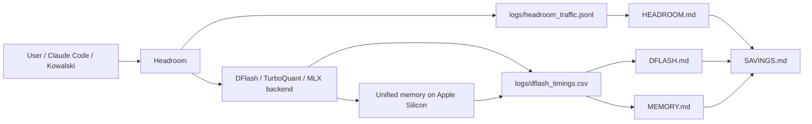
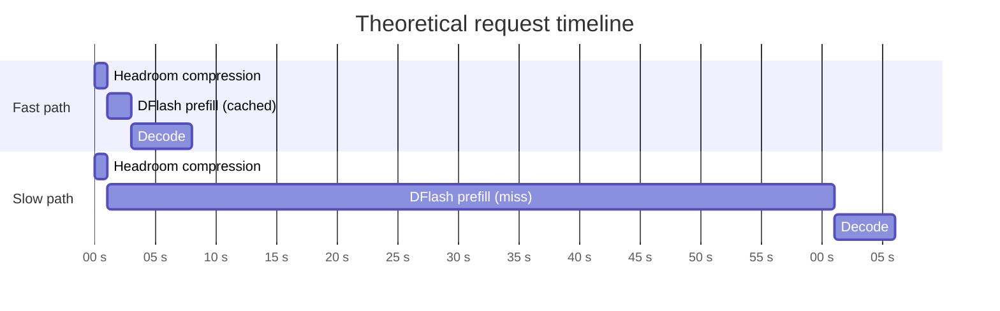
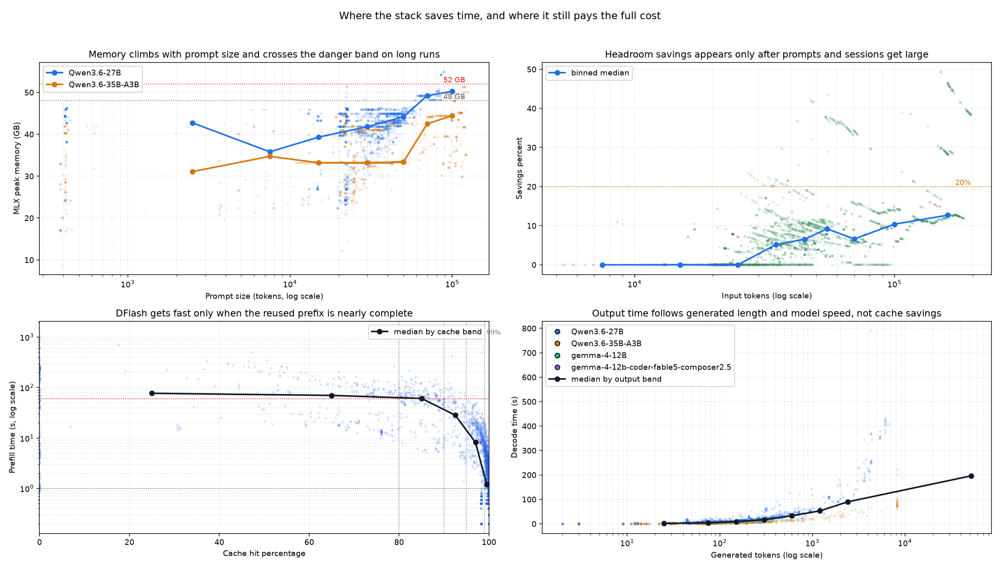

# SAVINGS.md — Where Time and Memory Actually Get Saved

This page connects the three efficiency layers in the stack:

- [MEMORY.md](MEMORY.md) — when RAM becomes the bottleneck and why peak memory matters.
- [HEADROOM.md](HEADROOM.md) — when prompt compression starts paying off.
- [DFLASH.md](DFLASH.md) — when cache reuse makes prefill collapse from minutes to seconds.

It is a synthesis page, not a replacement for the three detailed reports.

---

## 1. Component map



Reading the map:

1. Headroom saves tokens before the request reaches the backend.
2. DFlash saves time when the prefix is already cached.
3. Memory is the ceiling that decides how large the saved context can grow before the system becomes unstable.

---

## 2. Theoretical timing diagram

The timings below are conceptual. They show the order of phases and the typical shape of the latency budget, not a single measured request.



Interpretation:

1. Headroom is usually the smallest phase, but it only matters when the prompt is large enough for compression to be meaningful.
2. DFlash prefill is the dominant variable cost. If reuse is shallow, the request pays the full prefix price.
3. Decode is comparatively stable, so most variability comes from prefill and prompt preparation.

---

## 3. Summary chart



The chart combines the three reports into one view:

1. Memory pressure rises with prompt size and crosses the practical danger band during long sessions.
2. Headroom savings grows with prompt size, but the useful tail starts late.
3. DFlash becomes truly fast only when cache reuse is almost complete.

Run the utility that generated it:

```bash
cd ~/local-llm-workspace
env/bin/python llmstack/tools/plot_savings.py
```

---

## 4. What the data says

### 4.1 Memory is the ceiling, not the optimization

The memory report shows that 4-bit weight size and runtime peak are not the same thing. On this machine the observed median peaks were different enough that model choice alone does not predict safety: prompt growth, cache state, and session length matter too.

What matters in practice:

1. 27B is lighter than 35B-A3B in total footprint, but runtime peaks depend on the request history.
2. Long runs push the peak toward the 48-52 GB danger band.
3. Once memory is near the ceiling, even a good cache hit can still fail if the session keeps growing.

See the detailed model and RAM table in [MEMORY.md](MEMORY.md).

### 4.2 Headroom saves late, not immediately

The Headroom analysis shows that the average savings is modest, while the meaningful tail appears only in larger prompts and later turns in the session.

Observed pattern:

1. Early or short sessions often sit near zero savings.
2. The useful region starts around the 20% savings mark.
3. The strongest gains show up when the session has already accumulated substantial context.

See the full threshold analysis in [HEADROOM.md](HEADROOM.md).

### 4.3 DFlash saves mostly through prefix reuse

The DFlash analysis shows that cache hit percentage is the key predictor, but the cliff is sharper than the raw percentage suggests.

Observed pattern:

1. 80-90% cache reuse is better than nothing, but it is still not the fast path.
2. The turning point is the 95-99% band.
3. The clearly fast regime is 99%+ reuse or an uncached suffix small enough to keep prefill near the low-second range.

See the detailed cache-band analysis in [DFLASH.md](DFLASH.md).

### 4.4 Output time is mostly orthogonal to the savings layers

The missing piece is decode time, which is the actual output phase after prefill finishes. Here the data behaves very differently from the savings layers:

1. Decode time correlates strongly with generated length. In the clean dflash set, `decode_time_s` and `decode_tokens` move together much more than any other variable.
2. Decode time has almost no direct relationship with `cache_hit_pct`, `prefill_time_s`, or `mlx_peak_gb`. In the same clean set, the observed correlations are weak enough that they do not change the operational story.
3. The real driver of output time is therefore `decode_tokens / decode_tps`, where `decode_tps` depends mainly on the served model/backend, not on Headroom or DFlash.

Observed correlations on the clean dflash dataset:

1. `corr(decode_time_s, decode_tokens) ≈ 0.73`.
2. `corr(decode_time_s, cache_hit_pct) ≈ -0.07`.
3. `corr(decode_time_s, prefill_time_s) ≈ 0.03`.
4. `corr(decode_time_s, mlx_peak_gb) ≈ 0.03`.

That means the time-saving components mainly reduce the *waiting before output starts*; they do not materially change the *speed of output itself*. The output phase is a different control loop.

Practical model:

1. `prefill_time_s ≈ f(prompt_tokens, cache_hit_pct, uncached_tokens)`.
2. `decode_time_s ≈ decode_tokens / model_decode_tps`.
3. `total_time_s ≈ prefill_time_s + decode_time_s + overhead`.

The useful conclusion is simple: Headroom and DFlash buy you faster time-to-first-token and lower total latency, but if the task emits a long answer, decode time will still dominate the tail. In other words, the savings layers compress the front of the request; they do not compress the answer length.

---

## 5. Cross-layer conclusions

The three layers work together, but they do not pay off at the same time.

1. Headroom is the first lever that reduces the prompt before the backend sees it.
2. DFlash is the second lever that avoids recomputing the reused prefix.
3. Memory is the hard limit that determines how far the session can grow before the system becomes unstable.

This leads to a practical rule:

1. Use Headroom when the prompt is large enough that compression meaningfully changes the request.
2. Use DFlash when the session has enough reuse to reach the 95-99% cache band.
3. Watch memory peak continuously, because a saved prompt can still become a dangerous prompt if the session keeps accumulating context.

In short: the best savings do not come from one layer alone. They come from the combination of prompt reduction, prefix reuse, and a memory budget that still leaves room for the next iteration.
