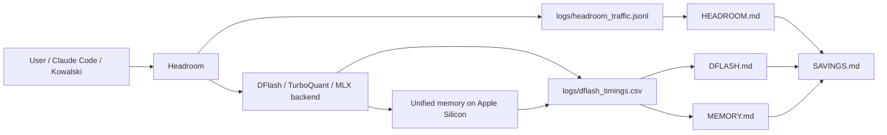
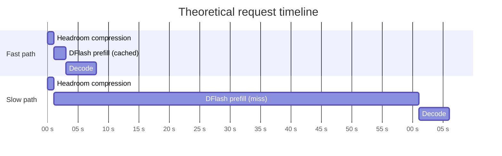
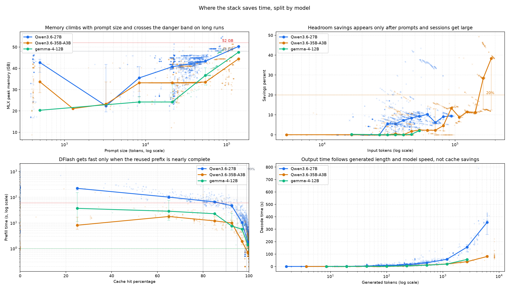

# SAVINGS.md — Where Time and Memory Actually Get Saved

This page connects the three efficiency layers in the stack:

- [MEMORY.md](MEMORY.md) — when RAM becomes the bottleneck and why peak memory matters.
- [HEADROOM.md](HEADROOM.md) — when prompt compression starts paying off.
- [DFLASH.md](DFLASH.md) — when cache reuse makes prefill collapse from minutes to seconds.

It is a synthesis page, not a replacement for the three detailed reports.

---

## 1. Component map



Reading the map:

1. Headroom trims tokens before the backend sees them.
2. DFlash removes prefill work when the prefix is already cached.
3. Memory sets the ceiling for how far the session can grow.

---

## 2. Theoretical timing diagram

The timings below are conceptual. They show the order of phases and the typical shape of the latency budget, not a single measured request.



Interpretation:

1. Headroom is small, but it matters once prompts are large enough to compress well.
2. DFlash prefill is the dominant variable cost; shallow reuse still pays the full prefix price.
3. Decode is comparatively stable, so most variability comes from prefill and prompt preparation.

---

## 3. Figures and settings

The charts use a median binned line and bootstrap confidence intervals by default. Use `--no-show-ci` to hide the whiskers.

| View | File | Default statistic | Confidence intervals | What to look for |
| --- | --- | --- | --- | --- |
| Overall | [savings_landscape.png](docs/img/savings/savings_landscape.png) | median | on | one center line for each layer, showing the overall trend across all samples |
| Per model | [savings_landscape_by_model.png](docs/img/savings/savings_landscape_by_model.png) | median | on | separate colored trend lines for Qwen3.6-27B, Qwen3.6-35B-A3B, and Gemma-4-12B |

Run the utility that generated them:

```bash
cd ~/local-llm-workspace
env/bin/python llmstack/tools/plot_savings.py
```

Optional settings:

```bash
cd ~/local-llm-workspace
env/bin/python llmstack/tools/plot_savings.py --no-show-ci
```

Regenerate the metrics table from logs:

```bash
cd ~/local-llm-workspace
env/bin/python llmstack/tools/savings_metrics.py --update-savings-md
```

The metrics utility now reuses the same preprocessing logic as the plotting script, so table values and chart trends are computed on aligned data scopes.

---

## 4. Summary chart

### 4.1 Overall view


This version uses the overall binned median across all samples, without splitting by model.
It is the most conservative summary of the stack: one central line per layer, with CI whiskers showing how stable that center is inside each bin.

### 4.2 By-model view



This version colors the samples by their original model and uses the same median-plus-CI treatment per model.
It shows Qwen3.6-27B, Qwen3.6-35B-A3B, and Gemma-4-12B as separate traces, which makes model-specific slope differences visible inside the same prompt or decode bands.

---

## 5. Results table

The table below summarizes the main values observed in the current logs.
Model-specific values now include Qwen3.6-27B, Qwen3.6-35B-A3B, and Gemma-4-12B.
Headroom values are now computed per model using the `model` field in `headroom_traffic.jsonl`.

<!-- SAVINGS_TABLE_START -->

| Metric | Qwen3.6-27B | Qwen3.6-35B-A3B | Gemma-4-12B | Notes |
| --- | ---: | ---: | ---: | --- |
| Samples (dflash rows) | 2094 | 1079 | 113 | rows with valid prefill/decode/tokens |
| Samples (headroom rows) | 1616 | 1336 | 11 | rows with valid headroom savings and input_tokens_original >= 5000 |
| Memory peak, median | 42.81 GB | 34.96 GB | 40.33 GB | median mlx peak per model |
| Memory peak, p90 | 46.17 GB | 44.45 GB | 47.59 GB | tail mlx peak per model |
| Headroom savings, median | 5.75% | 2.06% | 0.00% | computed from headroom model field on the same >=5000-token scope as the chart |
| Headroom savings, p90 | 12.12% | 18.19% | 0.43% | late-session tail by model |
| Headroom savings >= 20% | 6.1% | 9.3% | 0.0% | share of strong-compression turns |
| DFlash prefill, median | 3.60 s | 1.10 s | 2.10 s | lower is better |
| DFlash prefill, p90 | 88.47 s | 16.72 s | 13.98 s | long-tail prefill latency |
| Output decode, median | 7.30 s | 1.90 s | 2.60 s | center decode latency |
| Output decode, p90 | 34.72 s | 11.12 s | 10.56 s | decode long tail |
| Decode tokens, median | 86 | 76 | 105 | output length center |
| Decode tokens, p90 | 453 | 371 | 446 | output length tail |
| DFlash share <= 2 s | 36.9% | 65.3% | 49.6% | fraction of fast-prefill requests |
| DFlash share > 99% cache | 57.7% | 64.7% | 65.5% | fraction in high-reuse regime |

<!-- SAVINGS_TABLE_END -->

---

## 6. Explanation

### 6.1 Memory is the ceiling, not the optimization

The memory report shows that 4-bit weight size and runtime peak are not the same thing. On this machine, model choice alone does not predict safety: prompt growth, cache state, and session length matter too.

What matters in practice:

1. 27B is lighter than 35B-A3B in total footprint, but runtime peaks depend on the request history.
2. Long runs push the peak toward the 48-52 GB danger band.
3. Once memory is near the ceiling, even a good cache hit can fail if the session keeps growing.

See the detailed model and RAM table in [MEMORY.md](MEMORY.md).

### 6.2 Headroom saves late, not immediately

The Headroom analysis is now computed per model directly from `headroom_traffic.jsonl`.
To match the chart exactly, the metrics use the same Headroom scope: only calls with `input_tokens_original >= 5000`.
In this sample, Qwen3.6-27B has higher median savings (5.75%) than Qwen3.6-35B-A3B (2.06%), while 35B-A3B has the stronger p90 tail (18.19%).
Gemma shows near-zero headroom savings in this slice, but the sample is small (`n=11`) and should be interpreted cautiously.

What the median curve is telling you:

1. Early or short sessions often sit near zero savings.
2. The useful region starts around the 20% savings mark.
3. The strongest gains show up once the session has already accumulated substantial context.

See the full threshold analysis in [HEADROOM.md](HEADROOM.md).

### 6.3 DFlash saves mostly through prefix reuse

The DFlash analysis shows that cache hit percentage is the key predictor, but the cliff is sharper than the raw percentage suggests.

Observed pattern:

1. 80-90% cache reuse is better than nothing, but it is still not the fast path.
2. The turning point is the 95-99% band.
3. The clearly fast regime is 99%+ reuse or an uncached suffix small enough to keep prefill near the low-second range.

See the detailed cache-band analysis in [DFLASH.md](DFLASH.md).

### 6.4 Output time is mostly orthogonal to the savings layers

The missing piece is decode time, which is the actual output phase after prefill finishes. Here the data behaves differently from the savings layers:

1. Decode time correlates strongly with generated length. In the clean dflash set, `decode_time_s` and `decode_tokens` move together much more than any other variable.
2. Decode time has almost no direct relationship with `cache_hit_pct`, `prefill_time_s`, or `mlx_peak_gb`.
3. The real driver of output time is `decode_tokens / decode_tps`, where `decode_tps` depends mainly on the served model/backend, not on Headroom or DFlash.

Observed correlations on the clean dflash dataset:

1. `corr(decode_time_s, decode_tokens) ≈ 0.73`.
2. `corr(decode_time_s, cache_hit_pct) ≈ -0.07`.
3. `corr(decode_time_s, prefill_time_s) ≈ 0.03`.
4. `corr(decode_time_s, mlx_peak_gb) ≈ 0.03`.

That means the time-saving components mainly reduce the wait before output starts; they do not materially change the speed of output itself.

Practical model:

1. `prefill_time_s ≈ f(prompt_tokens, cache_hit_pct, uncached_tokens)`.
2. `decode_time_s ≈ decode_tokens / model_decode_tps`.
3. `total_time_s ≈ prefill_time_s + decode_time_s + overhead`.

The useful conclusion is simple: Headroom and DFlash buy you faster time-to-first-token and lower total latency, but long answers still dominate the tail. In the current by-model chart, Qwen3.6-27B sits above Qwen3.6-35B-A3B as token count grows, so the 27B trace is the slower decode path for long generations. Gemma-4-12B is generally between those two on decode time in this dataset, but with fewer samples. The savings layers compress the front of the request; they do not compress the answer length.

---

## 7. Cross-layer conclusions

The three layers work together, but they do not pay off at the same time.

1. Headroom is the first lever that reduces the prompt before the backend sees it.
2. DFlash is the second lever that avoids recomputing the reused prefix.
3. Memory is the hard limit that determines how far the session can grow before the system becomes unstable.

This leads to a practical rule:

1. Use Headroom when the prompt is large enough that compression meaningfully changes the request.
2. Use DFlash when the session has enough reuse to reach the 95-99% cache band.
3. Watch memory peak continuously, because a saved prompt can still become a dangerous prompt if the session keeps accumulating context.

In short: the best savings do not come from one layer alone. They come from prompt reduction, prefix reuse, and a memory budget that still leaves room for the next iteration.

---

## 8. Appendix: Metric glossary

This appendix defines each metric in the results table and how to read it.

| Metric | Meaning | How to read it |
| --- | --- | --- |
| Samples (dflash rows) | Number of dflash rows with valid `prefill_time_s`, `decode_time_s`, and `decode_tokens` for that model. | Bigger sample means more stable percentile estimates. |
| Samples (headroom rows) | Number of headroom rows with valid `savings_percent` and `input_tokens_original >= 5000` for that model. | This is the exact scope used by the Headroom chart trend line. |
| Memory peak, median | Median of `mlx_peak_gb` for the model. | Typical runtime memory pressure. Lower is safer. |
| Memory peak, p90 | 90th percentile of `mlx_peak_gb`. | Tail memory risk; high values indicate occasional dangerous peaks. |
| Headroom savings, median | Median of `savings_percent` in the headroom scope. | Typical compression benefit on larger prompts. |
| Headroom savings, p90 | 90th percentile of `savings_percent` in the headroom scope. | Best-case tail of prompt compression gains. |
| Headroom savings >= 20% | Share of headroom rows where `savings_percent >= 20`. | Frequency of strong compression events. Higher is better. |
| DFlash prefill, median | Median of `prefill_time_s`. | Typical time before decode starts. Lower is better. |
| DFlash prefill, p90 | 90th percentile of `prefill_time_s`. | Slow-prefill tail; indicates miss-path pain. Lower is better. |
| Output decode, median | Median of `decode_time_s`. | Typical generation latency after prefill. Lower is better. |
| Output decode, p90 | 90th percentile of `decode_time_s`. | Long-answer latency tail. Lower is better. |
| Decode tokens, median | Median of `decode_tokens`. | Typical answer length. |
| Decode tokens, p90 | 90th percentile of `decode_tokens`. | Long-answer tail length. |
| DFlash share <= 2 s | Share of dflash rows with `prefill_time_s <= 2`. | Fraction of requests already in fast prefill regime. Higher is better. |
| DFlash share > 99% cache | Share of dflash rows with `cache_hit_pct >= 99`. | Fraction of requests in very-high prefix reuse regime. Higher is better. |
