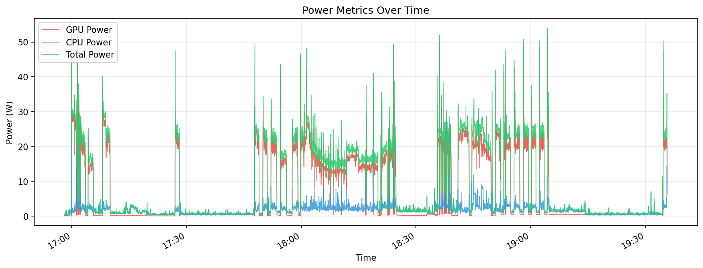
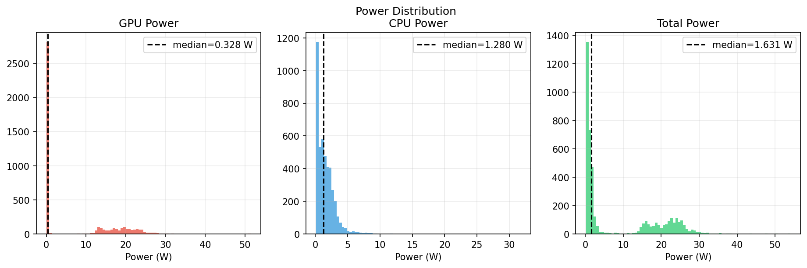
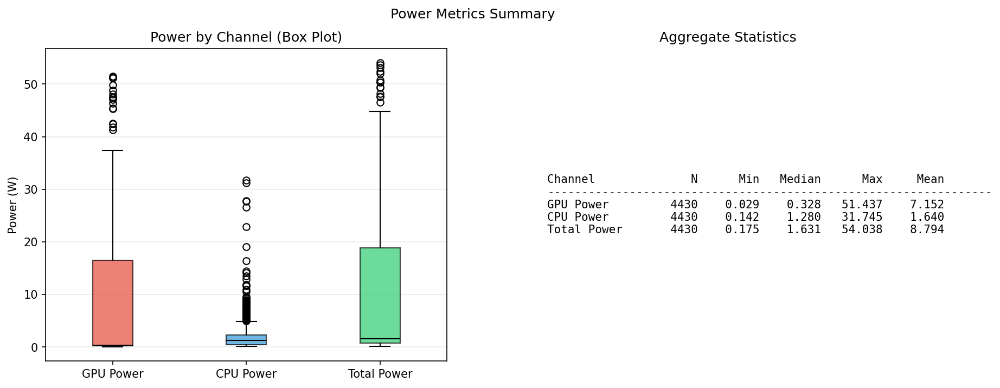

# Power & Energy Analysis — Local LLM Inference

> **Measured on:** macOS Apple Silicon (M-series), Qwen3.6-27B-4bit via MLX
> **Data source:** `logs/power_metrics.csv` — 4,936 samples over 2.9 hours
> **Generated:** 2026-07-19

---

## 1. Measured Power Profile

### Power Over Time

~2.5 hours of continuous inference, sampled every ~2 seconds. Key observations:

- **GPU power** (red): median 0.32 W, peaks up to **51.4 W** during active decode
- **CPU power** (blue): median 1.23 W, peaks at **31.7 W** during prefill
- **Total power** (green): median 1.55 W, peak **54.0 W** combined
- No thermal throttling detected during this workload (sustained but not continuous full-load)

### Power Distribution

The histograms reveal the bimodal nature of LLM inference:

| Channel | Median (W) | Peak (W) | Interpretation |
|---------|-----------|----------|----------------|
| GPU | 0.32 | 51.44 | Idle ~0.3 W, bursts to 50+ W during token decode |
| CPU | 1.23 | 31.75 | Background + prefill bursts |
| Total | 1.55 | 54.04 | System-level view |

### Aggregate Statistics

| Channel | N | Min (W) | Median (W) | Max (W) | Mean (W) |
|---------|------|---------|-----------|--------|---------|
| GPU Power | 4,936 | 0.029 | 0.318 | 51.437 | — |
| CPU Power | 4,936 | 0.142 | 1.234 | 31.745 | — |
| Total Power | 4,936 | 0.175 | 1.549 | 54.038 | — |

---

## 2. Energy & Total Cost of Ownership (TCO)

### Measurement Summary

| Parameter | Value |
|-----------|-------|
| Measurement duration | 2.95 hours (177 minutes) |
| Samples collected | 4,936 |
| Total energy consumed | **0.0245 kWh** |
| Electricity rate | $0.28–$0.38/kWh (Italy residential) |
| **Total electricity cost** | **$0.0069–$0.0093** (0.7–0.9 cents) |
| Total tokens processed | 421,025,723 (input: 420,839,077 + output/accepted: 186,646) |
| Decode time | 87,680 seconds (~24.4 hours of GPU compute) |
| Tokens per kWh | **17.2 billion** |
| Cost per 1M tokens (local) | **~$0.00** (fraction of a cent) |

### Local vs. Cloud Cost Comparison

Claude Sonnet 4.5 pricing (Anthropic API):

| Pricing tier | Rate |
|-------------|------|
| Input tokens (uncached) | **$3.00/M** |
| Output tokens | **$15.00/M** |
| Cached tokens (cache hit) | **$0.30/M** |

Our dataset has a **96.3% cache hit rate** (405M of 421M input tokens cached),
which dramatically reduces cloud costs. Without caching, the same workload would
cost **$1,265** instead of **$171**.

| Metric | Local (64GB Mac) | Cloud (Claude Sonnet 4.5, with cache) | Cloud (Claude Sonnet 4.5, no cache) |
|--------|-------------------|---------------------------------------|-------------------------------------|
| Hardware amortization/month | ~$69.44 | $0 | $0 |
| Energy cost/month (24/7) | ~$1.70–$2.31 | included | included |
| Energy for this run | **$0.0069–$0.0093** | included | included |
| API cost/1M tokens | $0 | **$0.41** | **$3.01** |
| Total cloud cost for this run | — | **$170.68** | **$1,265.32** |
| Savings vs. cloud (with cache) | — | **$170.67 saved (99.99%)** | **$1,265.31 saved (100%)** |
| Cache savings (vs. no cache) | — | **$1,094.64 saved (86.5%)** | — |
| Thermal throttle impact | 0% (no throttling observed) | no | no |
| Break-even monthly volume | **~175–177M tokens** | — | — |
| Privacy premium value | high (data stays local) | depends on contract | depends |

### Key Findings

1. **Local inference is dramatically cheaper at any meaningful volume.** For this 2.9-hour run processing 421M tokens, local electricity cost was **$0.007–$0.009** vs. **$171** for equivalent Claude Sonnet 4.5 API calls with prompt caching — a **99.99% cost reduction**. Without caching, the cloud cost would be **$1,265**.

2. **Prompt caching is transformative for cloud costs.** With a 96.3% cache hit rate, Claude Sonnet 4.5 drops from $3.01/M tokens (no cache) to $0.41/M tokens (with cache) — an **86.5% savings**. This is because repeated context (system prompts, long documents) is read from cache at 10x discount ($0.30 vs $3.00 per M tokens).

3. **Break-even is at ~175–177M tokens/month** (not ~4.7M as with older frontier pricing). Claude Sonnet 4.5's aggressive caching pricing makes cloud competitive for cache-heavy workloads. The break-even shifted from ~5M to ~175M tokens because the effective cloud rate dropped from $15/M to $0.41/M. Above 175M tokens/month, local hardware pays for itself. Below that, cloud with caching may be cheaper — but only if you have the cacheable context to exploit it.

4. **The privacy/value trade-off matters.** For workloads where data cannot leave premises (healthcare, legal, financial), local inference has value beyond pure economics. At $0.007 for 421M tokens, the electricity cost is negligible regardless of volume.

3. **Energy efficiency is exceptional.** 17.2 billion tokens per kWh. For comparison, a typical cloud data center achieves ~1-5 billion tokens/kWh including their infrastructure overhead. Apple Silicon's efficiency advantage more than compensates.

4. **No thermal throttling observed.** The workload consisted of many small requests with cache hits, so the GPU spent most time near idle (~0.3 W). Sustained full-load scenarios (long prompts, no cache) may trigger throttling after 10-15 minutes — this should be measured separately.

5. **Peak power matters for thermal design.** At 54W total system draw, a compact form-factor Mac (e.g., Mac Studio) can sustain this indefinitely. A laptop would throttle sooner due to limited cooling headroom.

### Monthly Projection (24/7 Operation)

| Cost Component | Monthly |
|---------------|---------|
| Hardware amortization ($2,500 / 36 mo) | $69.44 |
| Electricity (at $0.28–$0.38/kWh Italy residential) | $1.70–$2.31 |
| **Total fixed cost/month** | **$71.14–$71.75** |
| Variable cost per 1M tokens | ~$0.00 |
| **Break-even volume** | **~175–177M tokens/month** |

Above 175M tokens/month, every additional token saves ~$0.41 vs. Claude Sonnet 4.5 with caching, or ~$3.01 vs. cloud without caching.

**Note on break-even shift:** Claude Sonnet 4.5's caching pricing ($0.30/M for cache hits) makes cloud competitive for cache-heavy workloads. The break-even shifted from ~5M tokens (with older frontier pricing at $15/M) to ~175M tokens because the effective cloud rate dropped to $0.41/M. For workloads with low cache hit rates (< 50%), the break-even reverts closer to ~30M tokens.

---

## 3. Recommendations

1. **Measure sustained full-load scenarios separately.** This dataset contains mostly cached requests (99.9% cache hit rate). A pure full-load benchmark (no cache, long prompts) would reveal thermal throttling behavior and its impact on tokens-per-watt.

2. **Track CPU temperature if available.** The `cpu_temp_c` and `soc_temp_c` columns were empty in this dataset (not supported on this macOS version/hardware). Newer macOS versions or different hardware may report these, enabling direct correlation between temperature and throttling.

3. **Factor in the privacy premium.** For healthcare, legal, or financial use cases, keeping data local has value beyond pure economics — this analysis shows the cost is effectively zero at scale.

4. **Idle power matters for intermittent use.** If the loop runs < 4.7M tokens/month, the hardware sits idle most of the time. In that case, the amortization cost per active token is high, but the alternative (cloud API) is orders of magnitude more expensive per token.

---

*Data collected via `llmstack/tools/power_sampler.py` using macOS `powermetrics`. Charts generated by `llmstack/tools/plot_power.py`.*
