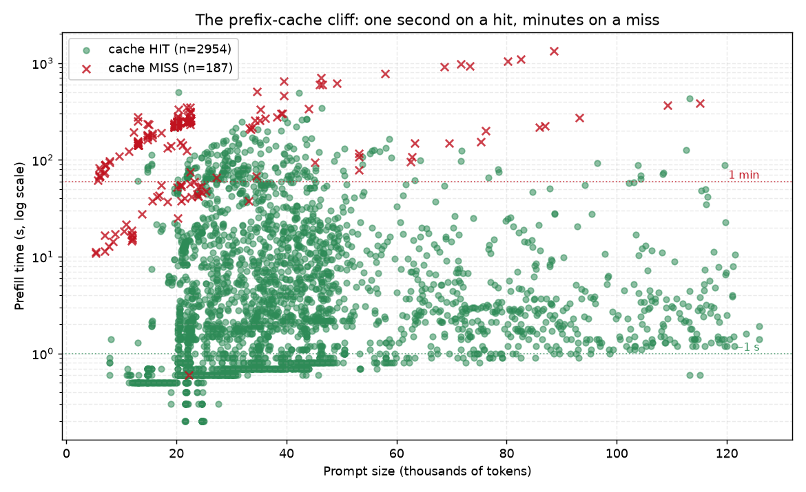
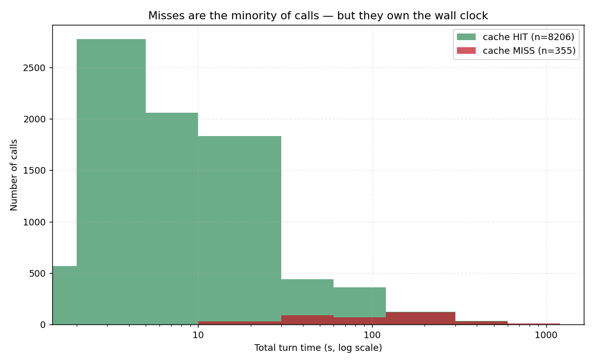
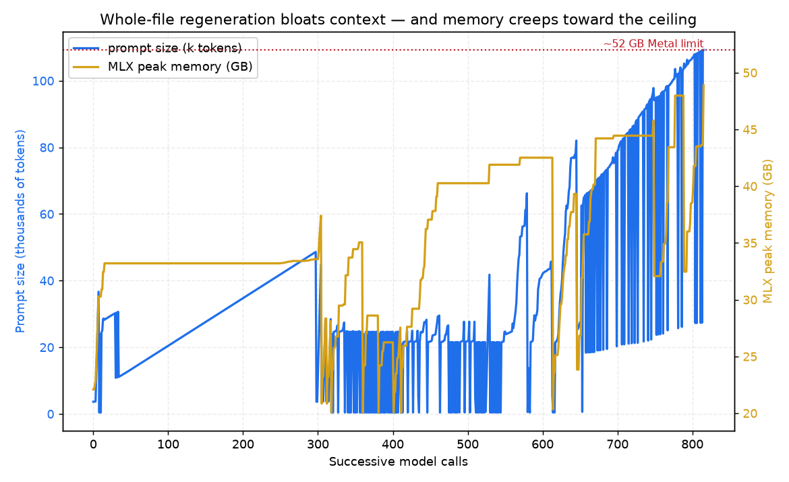

# From "It Runs" to "It Builds While You Sleep": Adding an Autonomous Agentic Loop to Your Local Claude Code

In Part 1 — *The Ultimate Local AI Setup Guide for Apple Silicon using DFlash* — we got Claude Code running entirely offline against a local Qwen3.6-27B, with DFlash speculative decoding for speed and the Claude Code Router bridging the API. By the end you had an interactive `ccr code` session driven by a model on your own Mac.

That setup is great for *interactive* work — you in the driver's seat, reading every diff. This follow-up is about the next step: making the local model build things **unattended**, without babysitting every turn, without committing broken code, and without losing an hour of work to a single timeout.

We'll add two pieces on top of the Part 1 stack:

1. **Headroom** — a code-aware compression proxy that shrinks the prompt before it ever reaches the model.
2. **Kowalski** — a Python supervisor that boots the whole stack, decomposes a goal into atomic tasks, runs each one, and puts every change through six verification gates before it's allowed near a git commit.

By the end, you'll be able to write a build plan, run one command, and walk away. And to prove it isn't theory, the last chapter dissects a real multi-day run where this system built a playable Pac-Man clone — including every place it face-planted and what fixed it.

---

## The problem this solves

Part 1 ended on a high note. Then you ask the local model to do something real and you hit the wall every local-agent builder hits:

> **A local 27B is good enough to write the code. It is not good enough to be *trusted*.**

It drifts. It narrates when it should act. It writes a `ghost.js` that nothing imports. It "finishes" a task by producing a truncated file that doesn't parse. It times out mid-edit and leaves you with half a function.

In interactive mode *you* are the verification layer — you catch the orphan file, you hit `/clear` when the context balloons. The moment you want the loop to run **unattended**, you have to replace yourself with code. That's exactly what we're building.

> **Prerequisite:** This guide assumes you completed Part 1 — Homebrew, the `~/local-llm-workspace/env` virtualenv, `dflash-mlx`, the Claude Code CLI, and `claude-code-router`, all working. If `ccr code` already talks to your local model, you're ready.

---

## The architecture, after this guide

Part 1's chain gains one box (Headroom) and one brain (Kowalski):

```
Claude Code  →  ccr (router)  →  Headroom proxy :8789  →  DFlash server :8787  →  MLX / Apple GPU
                                  └── compresses the prompt        └── runs the model
        ▲
   Kowalski supervisor (boots all of the above, warms the cache, runs the plan)
```

| Component | Job |
|---|---|
| **DFlash server** | The OpenAI-compatible endpoint from Part 1, running the 4-bit Qwen3.6-27B + 2B draft. |
| **Headroom proxy** | New. Sits in front of DFlash and compresses the context before forwarding. |
| **ccr** | The Part 1 bridge — now pointed at Headroom (`:8789`) instead of DFlash directly. |
| **Kowalski** | New. Lifecycle, planning, execution, verification, checkpoints, resume. |

A key detail that matters for the case study later: Kowalski's **direct** executor talks to DFlash *directly* on `:8787` (no router, no Headroom), while the **agentic** executor goes the full Claude Code → ccr → Headroom → DFlash route. Two paths, two cost profiles.

---

## Phase 1: Add Headroom, the compression proxy

The hardest lesson of local agentic coding is that it's **prefill-bound** — you pay to re-read an 18,000–25,000-token prompt on *every single turn*, and speculative decoding doesn't touch that cost. The most direct lever is simple: **send fewer tokens.** Headroom is a proxy that rewrites the context in a code-aware way before it reaches the model.

### Step 1 — Create Headroom's own virtualenv

Headroom needs its **own** Python environment, separate from the Part 1 project venv. On my machine the project venv is Python 3.14, and Headroom runs cleanly on 3.13:

```bash
brew install python@3.13
python3.13 -m venv ~/headroom-env
```

### Step 2 — Install Headroom

The pip package is **`headroom-ai`** (not `headroom` — that one's unrelated, and getting this wrong cost me an evening):

```bash
~/headroom-env/bin/pip install -U pip headroom-ai
~/headroom-env/bin/headroom --version   # confirm it installed
```

### Step 3 — Launch it in front of DFlash

The one critical gotcha: Headroom **must** be launched with the project venv's environment variables unset, or it inherits the wrong Python interpreter and dies in confusing ways. Scrub the environment, point it upstream at DFlash on `:8787` via `OPENAI_TARGET_API_URL`, and have it listen on `:8789`:

```bash
pkill -f "headroom proxy" 2>/dev/null || true

(
  unset VIRTUAL_ENV PYTHONPATH PYTHONHOME
  export OPENAI_TARGET_API_URL="http://127.0.0.1:8787"   # dflash ORIGIN; Headroom appends /v1/chat/completions
  export OPENAI_API_KEY="dflash-local"
  export HEADROOM_TELEMETRY=off
  exec ~/headroom-env/bin/headroom proxy --port 8789 --code-aware --no-telemetry \
       --log-file headroom_traffic.jsonl
) >> headroom.log 2>&1 &
```

### Step 4 — Verify it's alive and pointed the right way

```bash
sleep 6
curl -s http://127.0.0.1:8789/health && echo "  ✅ Headroom up"
grep -q "127.0.0.1:8787" headroom.log && echo "✅ upstream = dflash"
```

The launcher actually treats this as a *hard pre-flight*: if Headroom isn't answering on `:8789` or its log doesn't show the dflash upstream, it aborts the whole run rather than silently routing the agent to nothing. Every request Headroom handles is appended to `headroom_traffic.jsonl` with how many tokens it saved — we'll watch that live on the dashboard later.

### Step 5 — Point the router at Headroom instead of DFlash

Edit `~/.claude-code-router/config.json` from Part 1 and change the provider's `api_base_url` so requests flow *through* Headroom:

```json
"api_base_url": "http://127.0.0.1:8789/v1/chat/completions",
```

Then reload it:

```bash
ccr restart
```

That's the entire compression layer. Stacked on top of DFlash's prefix cache and aggressive `/clear` hygiene, it's a third independent attack on the prefill bottleneck.

---

## Phase 2: Meet Kowalski, the supervisor that doesn't trust the model

Kowalski's design philosophy is one sentence:

> **Assume the model will fail every task, and make failure cheap and reversible.**

Here's how it earns that — and how to set it up.

### Step 1 — Write a config

Kowalski reads a single `llmstack_config.json` at the workspace root. It's the one source of truth for timeouts, permissions, and which project to build:

```json
{
  "dev_root": "./pacman_clone",
  "plan_file": "./pacman_clone/.claude/plans/pacman_plan.json",
  "permission_mode": "acceptEdits",
  "max_turns": 150,
  "timeout_seconds": 3600,
  "max_retries": 3,
  "max_resumes": 8,
  "size_threshold_bytes": 12000
}
```

One important detail learned the hard way: **every timeout must come from one knob.** Claude Code, the router, and the model each have their own idea of "too slow," and if they disagree you get phantom failures where one layer kills a request another was happily processing. Kowalski derives all of them from `timeout_seconds` and pushes the value into the environment and the router config on boot.

### Step 2 — Generate a plan (don't hand it a vague goal)

You don't give Kowalski "build a Pac-Man clone" and hope. `build-plan.py` asks the local model to decompose the goal into a JSON array of **atomic, ordered, verifiable tasks** — each touching a single file, with explicit dependencies and a shell command that proves it worked:

```bash
source env/bin/activate
python build-plan.py "Build a Pac-Man clone in HTML/CSS/JS"
```

A generated task looks like this:

```json
{ "id": "9", "mode": "direct", "file": "ghosts.js", "context": ["map.js"],
  "prompt": "Create ghosts.js: define four ghosts with grid positions and a draw(ctx) method...",
  "verify": "test -f ghosts.js && node --check ghosts.js" }
```

The generator is also smart about *which* tasks become agentic: anything whose prompt smells like integration ("integrate", "wire", "connect", "test", "run", "across files") is marked `mode: "agent"` with `Read/Edit/Write/Bash` tools, while self-contained file creation stays `direct`. This is Part 1's "Golden Rule" — *force atomic steps* — turned into infrastructure. Small tasks mean small prompts mean cheap prefill mean the model actually succeeds.

### Step 3 — Understand the two execution modes

The trick that made the whole thing stable is that Kowalski picks an executor **per task**:

- **Direct mode** — for self-contained file creation, Kowalski bypasses the agent loop and sends *one* request straight to DFlash: "write this file." No 33k-token agent context, no tool-call dance, no OOM. If the model hits the token cap mid-file, Kowalski asks it to *continue from exactly where it stopped* and stitches the pieces together.
- **Agentic mode** — for tasks that genuinely need to read across files and make targeted edits, it falls back to `ccr code` with a strict system prompt and a tight tool allowlist.

Most file-creation tasks run *direct*, and that single decision eliminated the majority of crashes and timeouts. You use the expensive agent loop only when you actually need it. Kowalski even chooses automatically: a *create* task is direct, but a *modify* of a file that has grown past `size_threshold_bytes` (12 KB) is auto-promoted to the agent's targeted-`Edit` path, because regenerating a big file from scratch invites truncation. You can also force the decision per task with `"strategy": "edit"` or `"strategy": "rewrite"`.

### Step 4 — Know the six gates a task must survive

A task isn't "done" because the model said so. It's done when it clears every applicable gate:

1. **Syntax / shell verify** — `node --check`, `py_compile`, whatever the task declared.
2. **Feature markers** — an optional `expect` list of strings that must actually be present in the output, so a *valid-but-incomplete* file can't false-pass the syntax check (e.g. `["setFrightened","isFrightened"]` for the frightened-mode task).
3. **Change gate** — the declared file must *actually* have been modified. No no-ops, no wrong-file edits.
4. **Wiring check** — every `*.js` must be referenced by `index.html`, and every reference must resolve. This catches the orphan `ghost.js` the app never loads.
5. **Behavioral smoke test** — runs the task's runtime assertion via `node -e`, in the repo, without writing anything into it.
6. **Optional LLM review** — a soft second opinion (off by default; it's the same weak model grading its own homework).

Only a change that clears all applicable gates reaches a commit. Everything else is rolled back.

### Step 5 — Checkpoints, resume, and crash recovery (free)

Every verified task becomes a git commit. Three behaviors make interruptions cheap:

- **Restore-before-retry.** Before each attempt Kowalski runs `git reset --hard HEAD` + `git clean -fd`, so a botched attempt can never feed a corrupt file into the next one as context. A `.gitignore` protects `.claude/`, `node_modules/`, and logs, so the plan's own state is never rolled back — a footgun I hit before adding it (a `reset --hard` once reverted the plan's completed-status because the plan lived under `.claude/`).
- **WIP resume.** If the model times out but left **valid, parseable** progress, Kowalski makes a `WIP (resumable)` commit and re-runs the task with a prompt that says *"this file already contains partial work — continue it, don't restart."* Progress-preserving resumes have their own budget (`max_resumes = 8`) separate from hard-failure retries (`max_retries = 3`), so making slow progress never burns your retry allowance.
- **Server-crash watchdog.** A health-check thread pings DFlash during every task; if the server dies mid-task, Kowalski restarts it and doesn't count it against any budget.

The payoff: you can `Ctrl-C` Kowalski and re-launch it, and it picks up from the last verified commit. A timeout costs you minutes, not your session.

---

## Phase 3: Run it

With Headroom up (Phase 1) and a plan generated (Phase 2), launch the whole thing with one command:

```bash
bash kowalski_launcher.bash
```

The launcher will:

1. Activate the venv and **clear cloud keys** (`unset ANTHROPIC_AUTH_TOKEN ANTHROPIC_API_KEY`) so Claude can't silently call the cloud.
2. Centralize the timeout into the environment and the router config.
3. **Pre-seed folder trust** in `~/.claude.json` so the unattended run doesn't block on the trust dialog.
4. Start (or confirm) Headroom with the hard pre-flight check, then restart the router.
5. Hand control to `kowalski_loop.py`, which boots DFlash, warms the prefix cache (only if an agentic task remains), and grinds through the plan — committing only verified work.

Then walk away. When you come back, `git log` shows you exactly which tasks passed.

---

## Phase 4: Watch it work (the dashboard)

Numbers you can't see, you can't fix. In a second terminal:

```bash
bash dashboard_launcher.bash
```

It tails both the DFlash log and the Headroom traffic log and shows you, live:

- **Phase** — IDLE / PREFILLING / DECODING, with progress bars. Watch the prefill bar crawl on a cold context, then snap to instant once the prefix cache warms — that's the prefill bottleneck made visible.
- **Cache hit %**, decode tok/s, acceptance %.
- **Headroom savings** — tokens stripped, per request and cumulative.
- **MLX active / cache / peak memory** — your early-warning system for the OOM cliff.

Every completed call is also appended to `dflash_timings.csv` for later analysis — which is exactly what we'll do in the case study below.

---

## The hard-won fixes (why Kowalski looks the way it does)

Every defensive feature above is a scar. The most instructive ones, in the order I hit them:

**The OOM cliff is about the cache, not the model.** My first config dedicated `--prefix-cache-max-bytes 24GB`. The model fits fine in 64 GB, but the cache plus a long agent context collided with the ~52 GB Metal wired limit and the server died with a Metal OOM. The fix was capping the cache at `12GB` and adding `--max-snapshot-tokens 16000` — and preferring direct mode so contexts stay small.

**Truncation needs continuation, not retries.** When `ghosts.js` grew past ~5–6k tokens it blew the original `max_tokens: 4096` output cap; the file came back cut off mid-function (`Unexpected end of input` / `missing )`), and each blind retry regenerated the *same* oversized file and truncated again. The fix was two-fold: raise the cap to 8192, and when a response comes back with `finish_reason == "length"`, feed the partial back with *"continue from exactly where you stopped"* and stitch the pieces. The continuation reuses the cached prefix, so it's fast.

**"Done" is the most dangerous word a local model says.** This one is subtle and it bit hard (you'll see it in the logs below). Claude Code can return `subtype: "success"` while *also* setting `is_error: true` with a body like `Request timed out`. My first `_evaluate` trusted the `success` subtype and marked the task complete — silently accepting a timed-out, half-finished edit. The fix: **any** dirty finish (`is_error` true, or subtype not exactly `success`) is treated as a timeout/resume, never as done.

**Never shrink the turn budget on retry.** An early retry path quietly dropped `max_turns` from 100 to 8, so the second attempt at a hard task ran out of turns in minutes and reported `error_max_turns`. Now `max_turns` is 150 and *never* shrinks; only the prompt changes between attempts.

---

## Case Study: building Pac-Man — the good, the bad, and the 18-minute stall

Theory is cheap. Here's what actually happened when I pointed this system at a 23-task plan to build a playable Pac-Man clone over several days (June 20–25). The plan (`pacman_plan.json`), the debug log (`kowalski_debug.log`), and the per-call metrics (`dflash_timings.csv`) together tell the whole story.

### The plan

The plan decomposes Pac-Man into six phases — Foundation, Rendering, Pac-Man, Ghosts, Game Mechanics, Polish — across 23 single-file tasks. The first eight (HTML skeleton, CSS, `map.js`, the game loop, Pac-Man movement/animation/eating) are vanilla *create* tasks. The interesting ones start at task 9, where ghosts and game mechanics force the same files (`ghosts.js`, `game.js`) to be rewritten or edited repeatedly — which is exactly where a local model's weaknesses surface:

| Phase | Tasks | What stresses the system |
|---|---|---|
| 1–3 Foundation/Render/Pac-Man | 1–8 | Clean creates; easy wins |
| 4 Ghosts | 9–14, 18 | `ghosts.js` rewritten/edited 7× , growing each time |
| 5 Mechanics | 15–17 | `game.js` rewritten with collisions, lives, levels |
| 6 Polish | 19–23 | Audio, screens, a bug-fix task, final polish |

Notice task 22 in the final plan: *"Fix ghost behaviour… only the red ghost leaves the house and it can't follow the maze; the other three should leave and follow the maze too."* That task was added **by hand** after watching the result — a reminder that the loop produces something you still review, not a finished product you blindly ship.

### The good: when the prefix cache sings

When the context is warm, the numbers from `dflash_timings.csv` are genuinely delightful. A representative direct-mode generation against a ~22k-token prompt restored its prefix cache and prefilled in **~0.8 seconds** before decoding — total turn ~10s. Scan the `cache_hit_pct` column during a healthy stretch and it's a wall of `100.0`. This is the Part 1 prefix cache doing its job: the 22k-token preamble is paid once, and every subsequent turn only prefills the handful of new tokens.

Tasks 15, 16, and 17 (the `game.js` mechanics) each came back `finish=stop` in a single shot in the debug log, generating a complete, syntactically valid file. Direct mode, when the file fits, is the workhorse — fast, deterministic, no agent loop.

### The bad #1: the cache-miss cliff is brutal

The same CSV shows the dark side. Every time the prefix diverged or got evicted, the cost was catastrophic. Cold re-prefills in the log (the rows where `cached_tokens` drops to 0):

| What happened | Prompt tokens | Prefill time |
|---|---|---|
| Warm restore (typical) | 22,000–58,000 | **~0.6–1.3 s** |
| Cold miss, mid-build | 21,876 | **242 s** |
| Cold miss, bigger context | 39,513 | **654 s** |
| Cold miss, late build | 68,612 | **910 s** |
| Cold miss, near the end | 82,582 | **1,104 s** |

That last one is an **eighteen-minute** wait to produce the *first token* of a single turn — pure prefill, memory never the issue. Plotting every agentic-scale call (≥5k tokens) in the whole multi-day log makes the cliff impossible to miss:



*Each point is one model call. Green dots (cache hit) sit near the 1-second line no matter how big the prompt is — a 50k-token turn still prefills in seconds. Red ×'s (cache miss) live in the minutes, decoupled from size. Across 1,039 big calls, a **hit prefills in ~2s median, a miss in ~242s median** — a 100× penalty for diverging from the cache.*

And the cruelty of it is the asymmetry: misses are *rare* but they dominate the wall clock.



*Only **56 of 1,039** big calls (~5%) were true misses — but they're the entire right-hand tail. The median miss turn (254s) is ~17× the median hit turn (15s). A handful of cache misses can eat more wall-clock than hundreds of clean turns combined.*

This is the prefill-bound reality from Part 1, in hard numbers: when the cache hits you wait one second; when it misses you wait minutes. The lesson the data screams: **keep context small and stable.** Direct mode, atomic tasks, and Headroom compression all exist to keep you on the green side of that chart.

### The bad #2: whole-file regeneration bloats context

There's a slow-motion failure visible across the run. Because direct mode regenerates an *entire* file each task, `game.js` and the conversation around it kept growing — and as it grew, peak memory climbed with it:



*One continuous run (115 calls). The prompt climbs from ~22k to ~86k tokens as files are regenerated whole (the dip near call 27 is a fresh-context restart). MLX peak memory tracks it upward — 17 → 54 GB — pressing toward the ~52 GB Metal wired limit that caused the original OOM. Bigger files mean bigger prompts mean bigger, more expensive cache misses (those 900s+ stalls all live in the right third of this run).*

This is precisely why the `size_threshold_bytes` auto-switch exists: once a file crosses 12 KB, Kowalski stops regenerating it wholesale and routes the task to the agent's targeted `Edit` path instead — which keeps both the context and the memory ceiling in check.

### The ugly: the task-14 and task-22 sagas

The debug log is where the "trust" problem becomes concrete.

**Task 14 (ghost eye-return)** is the textbook case of the *"done is dangerous"* bug. On June 22 the agent returned, twice in a row:

```
RESULT subtype=success is_error=True:
Request timed out
```

The old code saw `subtype=success` and would have marked it complete — shipping a half-written file. After the dirty-finish fix it correctly routed to resume. But then a *second* bug surfaced the next day: the retry path had shrunk `max_turns` to 25, and the task immediately died with `error_max_turns`. Only after raising and freezing the budget at 100+ turns did task 14 finally land on June 23 — and when it did, the agent produced a clean, detailed summary of exactly what it changed (`drawEyesOnly`, dead-ghost tunnel wrapping, reviving at the ghost house, plus wiring collision handling into `game.js`). Two bugs, one task, both now fixed in the loop's logic.

**Task 22 (visual polish)** is the case for *fallback*. On the agent path it failed **nine consecutive times** with:

```
RESULT subtype=success is_error=True:
API Error: Content block is not a text block
```

— a translation-proxy formatting failure the agent could not escape, attempt after attempt, across two separate days. The rescue was switching that task to **direct mode**: a single clean generation (`finish=stop`) produced the file and passed `node --check`. The takeaway baked into Kowalski: when the agent path keeps producing dirty finishes on a self-contained file, regenerating it directly is often the way out.

### Memory: the slow climb

The memory curve in the chart above tells its own cautionary tale: peak `mlx_peak_gb` crept from ~17 GB at boot to **54 GB** by the end of the long run, as caches and ever-longer contexts accumulated. It never tipped into OOM after the 12 GB cache cap — but it brushed right up against the ~52 GB Metal wired limit, a reminder that an unattended loop running for days needs the memory *ceiling* respected, not just the average.

### What Pac-Man actually proved

By the end, all 23 tasks were committed and the game was playable — Pac-Man moves, ghosts chase and scatter and flee, dots score, lives count down, levels advance, sounds play, and there's a start/game-over screen. It is **not** flawless: the hand-added task 22 exists precisely because the ghosts misbehaved on first pass, and whole-file regeneration occasionally dropped a feature that a later task had to restore. But every line that landed had passed `node --check` and a git checkpoint, and not a single multi-minute stall or server crash cost me the session — Kowalski resumed from the last good commit every time.

That's the whole thesis in one build: a local 27B *can* assemble a real, multi-file application unattended — if something sits between it and your repo that assumes it will fail, makes failure cheap, and refuses to commit anything it can't verify.

---

## Honest status

**What works well:**
- The autonomous loop runs a multi-task plan end-to-end and commits only verified work.
- Direct mode is fast and reliable for file generation; the auto-switch keeps big files on the agent's `Edit` path.
- The six gates catch real failures — orphan files, no-ops, truncation, broken syntax, valid-but-incomplete files.
- Checkpoint/resume makes interruptions cheap; the dirty-finish fix stops silent corruption.
- The dashboard and CSV make the whole thing observable and analyzable after the fact.

**What's rough:**
- It's **hardcoded to one model** (the Part 1 DFlash setup) and **one project** (`pacman_clone`). Switching either means editing code.
- **Launch and logic are tangled** — the bash launchers duplicate setup and `kowalski_loop.py` does everything in one file.
- **Whole-file regeneration bloats context** over a long plan (the 22k → 85k climb above), which makes late-stage cache misses expensive.
- **No remote visibility** — if Kowalski is grinding overnight, you can't check on it from your phone.
- **The gates are JS-centric** — the wiring check assumes an `index.html` + `*.js` web app.

It's a genuinely useful tool currently shaped like *one person's setup for one project on one machine.*

---

## What's next

The roadmap writes itself from those caveats:

1. **Generalize the model layer** — a registry so you can declare DFlash *and* a sparse MoE in config and switch with one command.
2. **Modularize** — separate launch/control from logic so new features plug into stable seams.
3. **More loop modes** — continuous queue, file-watcher, supervised-with-approval.
4. **Remote control** — a Telegram bot for status, notifications, and injecting tasks from your phone.
5. **Pluggable gates** — `ruff`, `tsc`, `pytest`, `cargo check` — verification that adapts to the language.
6. **A real installer** — one script that replicates every hard-won manual step from Part 1 and this guide.

---

## Conclusion

Part 1 proved a local 27B can be *fast*. This part is about the unglamorous thing that actually makes a local agent useful: **trust**. A fast model that quietly commits broken code is worse than no model at all. Kowalski's six gates, dual execution modes, and checkpoint-and-resume discipline are what turn "Claude Code runs locally" into "Claude Code *builds* something locally, unattended, and I believe the result."

The Pac-Man run is the honest version of that promise: not magic, not flawless, but a real game assembled by a model on a laptop, every committed line verified, every stall survived. It's not Cloud Claude, and it won't be. But it's a free, private, offline coding agent that can grind through a plan while you're not watching — and hand you back only the work that passed every test.

*If you're building something similar, I'd love to hear how you're handling the trust problem. Deterministic gates? LLM-as-judge? Something smarter? Drop a comment.*
