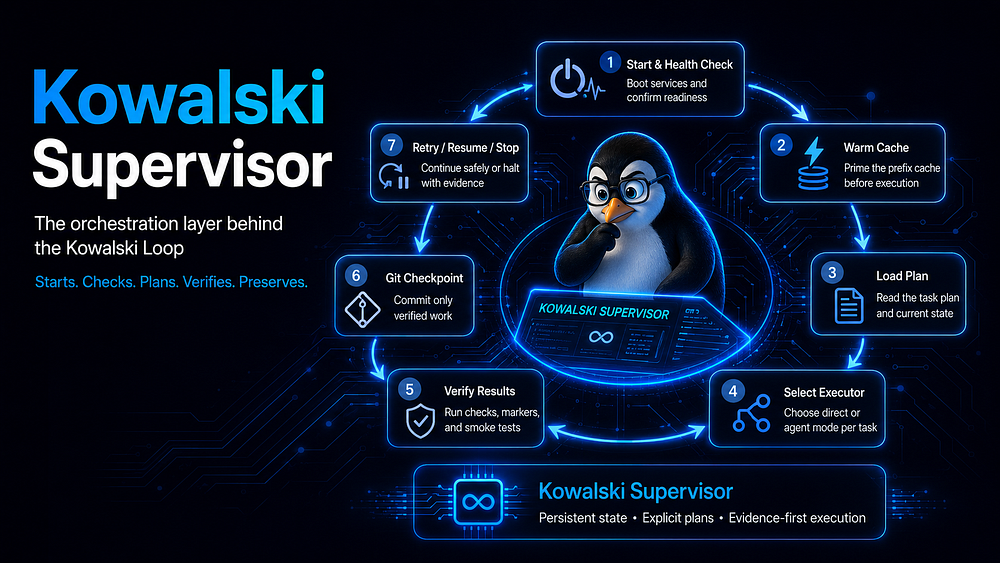
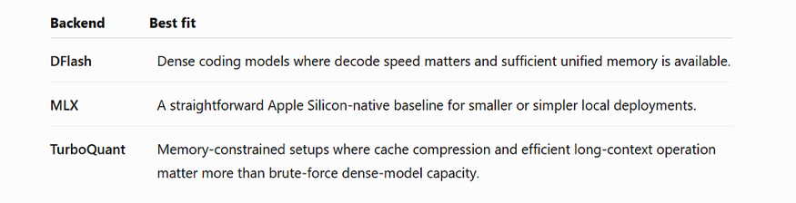
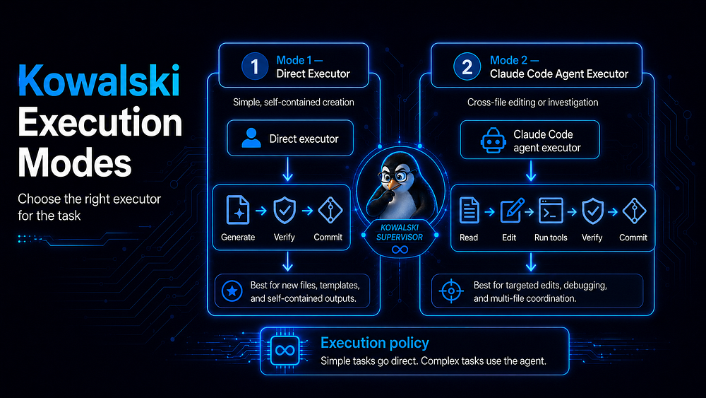
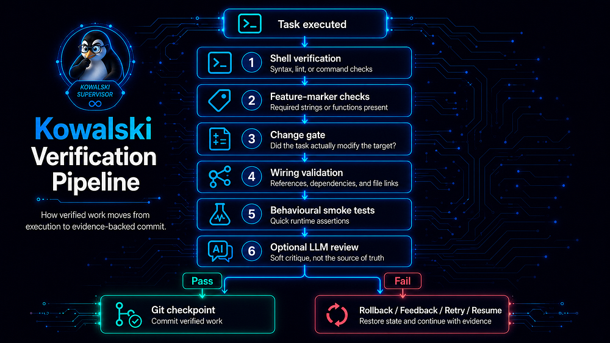
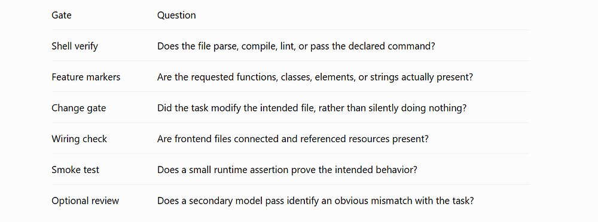
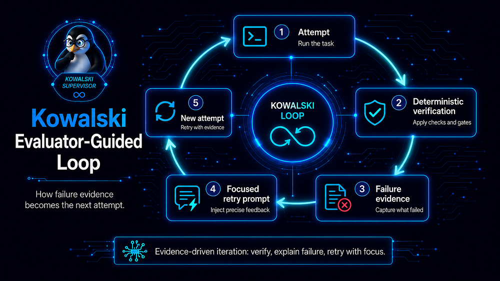
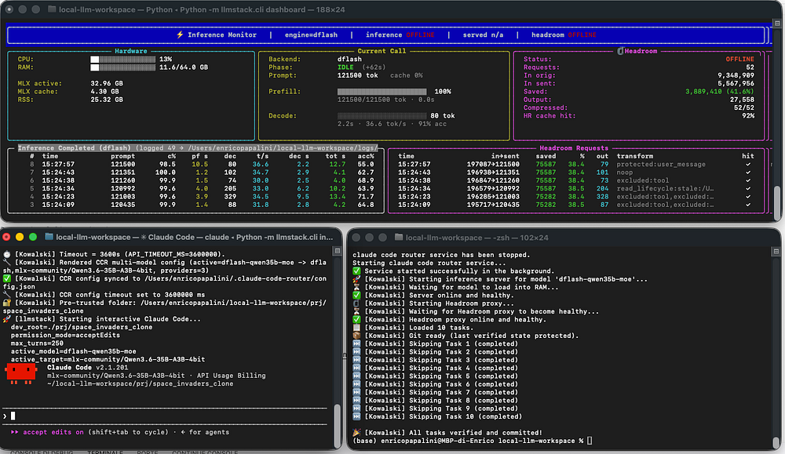
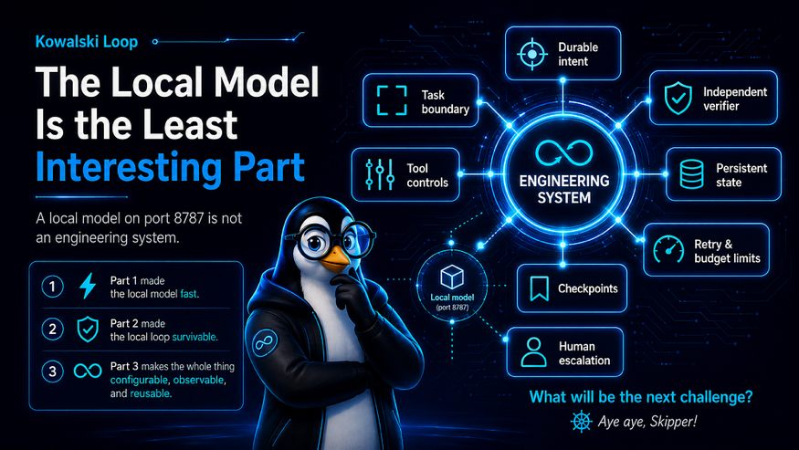

# The Kowalski Loop: Turning a Local Model into a Verified Coding System

Part 3 of **The Ultimate Local AI Setup Guide** — from a fast local inference stack to a reusable, model-agnostic, verified local engineering platform.

> “Kowalski, analysis!”

In [Part 1](https://medium.com/@enrico.papalini/the-ultimate-local-ai-setup-guide-for-apple-silicon-using-dflash-62b547f91dc0) we made Claude Code talk to a local model on Apple Silicon — fast.
In [Part 2](https://medium.com/@enrico.papalini/from-it-runs-to-it-builds-while-you-sleep-1a586dcf21be) we let it build unattended, with verification gates, retries, and git checkpoints.

Both were real achievements. Both were, honestly, still a prototype.

Part 3 is the moment the prototype grows up and becomes something you can actually **clone, configure, and operate**:

**→ <https://github.com/popoloni/kowalski_loop>** — open source, MIT licensed, release [`v0.1.0`](https://github.com/popoloni/kowalski_loop/releases/tag/v0.1.0).


---

## Why penguins, exactly?

The name is a tribute to Kowalski, the analytical penguin from *Madagascar*: the one who observes, calculates, proposes a plan — and recalculates when reality disagrees.

Penguins are the perfect mascot for local AI. They are a small, self-sufficient team in a hostile environment. No frontier-model cavalry coming to the rescue. Just coordination, persistence, bounded resources — and a plan.

> “Smile and wave, boys. Smile and wave.”

That is what a demo does. A *system* does more: it plans the work, executes it, demands evidence, preserves verified progress, and rolls back when the proof is missing.

**Analyze. Execute. Verify. Retry.** That is the whole loop. Everything else is engineering discipline around it.


---

## The real problem: scripts do not scale into systems

The first two parts solved genuine problems:

- [DFlash](https://github.com/z-lab/dflash) made local decoding dramatically faster ([paper](https://arxiv.org/abs/2602.06036)).
- [Headroom](https://github.com/headroomlabs-ai/headroom) shrank the context before it ever reached the model.
- [Claude Code Router](https://github.com/musistudio/claude-code-router) made a cloud-oriented coding interface usable with a local endpoint.
- The Kowalski supervisor made unattended runs survivable.

But the model was effectively hardcoded. The launchers knew too much about the backend. Switching models meant editing operational code.

This is the classic failure mode of early agent systems: the loop works once, so features get bolted directly into the loop — until the loop *becomes* the application and every small change threatens the whole stack.

> “Rico, kaboom?”
>
> Tempting. But the answer is not a bigger Bash script. It is a control plane.

---

## The architecture: one local endpoint, several execution paths

```text
Claude Code
  -> ccr (Claude Code Router)
  -> Headroom compression proxy :8789
  -> Local inference server :8787
  -> DFlash / MLX / TurboQuant
  -> Apple Silicon GPU
```

Kowalski sits **beside** that request path, not inside it. It starts and health-checks services, loads the plan, picks an executor per task, verifies results, checkpoints verified work in git, and retries, resumes, or stops — with evidence.



The fundamental idea fits in one sentence:

> **The model generates changes. The system decides whether those changes count.**

Under the hood, three backend families cover three hardware realities:

- **[DFlash](https://github.com/z-lab/dflash)** — block-diffusion speculative decoding: a lightweight drafter proposes tokens, the target model verifies them in parallel. Losslessly fast decode.
- **[MLX](https://github.com/ml-explore/mlx)** — Apple's native ML framework, the engine underneath all of this local inference.
- **[TurboQuant](https://github.com/matt-k-wong/turboquant-mlx-full)** — KV-cache quantization ([paper](https://arxiv.org/abs/2504.19874)) for long contexts on memory-constrained Macs.

---

## From "the model" to a model registry

The most important architectural change: model choice is no longer buried in launch scripts. Declare models once, then switch through a stable interface:

```bash
python -m llmstack.cli model list
python -m llmstack.cli model use dflash-qwen27b
python -m llmstack.cli model use turboquant-qwen35b-moe
python -m llmstack.cli model use mlx-gemma4-12b
```

Not sure which one fits your Mac and your workload? Ask the system:

```bash
python -m llmstack.cli model recommend --use agentic
python -m llmstack.cli model recommend --use decode --apply
```

And when stability matters more than raw speed, one knob tunes all backends:

```bash
python -m llmstack.cli model preset stable
python -m llmstack.cli model preset safest --restart
```

Why all this machinery? Because a local coding workflow juggles three competing constraints — coding quality, prefill latency, unified-memory pressure — and there is no universally best model. A 64 GB M2 Max and a 16 GB Mac mini should not be operated as though they share the same bottleneck.



> “Cute and cuddly, boys. Cute and cuddly.”
>
> Engineer translation: small tasks, explicit contracts, reversible choices.

---

## Two ways to use the workspace

### Mode 1: Interactive development (attended)

Still the right place for exploring unfamiliar code, debugging ambiguity, and decisions that require judgment:

```bash
bash bin/start_dflash_server.bash     # inference watchdog on :8787
bash bin/start_headroom_server.bash   # compression proxy on :8789
bash bin/launch_ccr.bash              # Claude Code, locally routed
```

Prefer another backend? Same endpoint, different engine:

```bash
bash bin/start_mlx_server.bash
bash bin/start_turboquant_server.bash
```

And from a second terminal, watch everything live — tokens per second, cache hits, memory, request timings, Headroom savings:

```bash
bash bin/launch_dashboard.bash
```

### Mode 2: Autonomous orchestration (the Kowalski loop)

For work that can be made explicit enough to verify:

```bash
bash bin/launch_kowalski.bash
```

Kowalski starts the required services, validates health, loads the plan, and processes tasks one by one.

The important condition:

> **Kowalski does not automate a vague intention. It automates a written, bounded, testable task plan.**

That distinction matters more than the model.

---

## The plan is the contract

A plan is not a prompt dump. It is a structured contract between a human, an executor, and a verifier:

```json
{
  "tasks": [
    {
      "id": "task_01",
      "prompt": "Create index.html with a 3x3 Tic-Tac-Toe board.",
      "file": "index.html",
      "mode": "direct",
      "expect": ["id=\"board\"", "tic-tac-toe"],
      "status": "pending"
    },
    {
      "id": "task_02",
      "prompt": "Implement X/O placement and win detection.",
      "file": "game.js",
      "mode": "agent",
      "context": ["index.html"],
      "verify": "node --check game.js",
      "expect": ["checkWin", "placeMarker"],
      "require_change": true,
      "status": "pending"
    }
  ]
}
```

The plan is persistent state. It survives a crash, a closed terminal, a bad model response, a full machine restart. This is the central principle of non-deterministic software engineering:

> **Intent must live outside the model's context window.**

The model can forget. The plan, the git history, and the verification output must not.

---

## Direct vs agent execution

Not every task deserves a multi-turn coding agent — that assumption is *expensive* on local hardware.

- **Direct mode**: one focused generation writes a known file, verification runs immediately. Lean and fast for self-contained work.
- **Agent mode**: full Claude Code session for cross-file changes, targeted edits, debugging, integration.



Whole-file regeneration is a hidden context-growth mechanism: every unnecessary rewrite inflates prompt size, prefill overhead, cache pressure, and truncation risk. A task-aware executor policy attacks all four at once.

---

## Verification is not a final step. It is the loop.

The most dangerous behaviour in an autonomous coding system is accepting the model's own declaration of success.

Kowalski does not do that. Every task passes through a deterministic verification pipeline:



The built-in gates ask different questions — does it parse, does it contain what was promised, did anything actually change, is it wired into the project, does it run:



And the gates are pluggable. Add your own evidence requirements per language, per file pattern, or at plan completion:

```json
{
  "verification_plugins": {
    "python_lint": {
      "command": "ruff check {file}",
      "when": "task",
      "languages": [".py"],
      "on_failure": "fail"
    },
    "suite": {
      "command": "pytest -x",
      "when": "plan_complete",
      "on_failure": "fail"
    }
  }
}
```

### Smart retries: failure output becomes new input

A retry that repeats the original prompt is a wasted retry. When a gate fails, Kowalski captures the failure output and feeds it into the next attempt. The task is not merely retried — it is retried **with a reason**:



> “Private, status report!”
>
> No evidence? Then the status is not “complete.” Sorry, Private.

---

## Four loop modes, one verification contract

The same task schema drives four kinds of operation — chosen by configuration, not by rewriting scripts:

| Mode | Best for | Stops when |
|---|---|---|
| `plan` | A finite implementation plan | All tasks resolved |
| `continuous` | A long-running local task worker | You stop it |
| `watch` | Auto-repair when Python files change | You stop it |
| `supervised` | Human-approved execution, task by task | Approved/skipped/halted |

```json
{ "loop_mode": "supervised", "supervised_approval_mode": "console" }
```

Supervised mode is the sweet spot for sensitive repositories: unattended is too broad, reviewing every diff interactively is too slow — approving task-by-task is just right.

---

## Permissions: cute and cuddly, but with rules

Local execution does not automatically mean safe execution. A local model can still delete files, run shell commands, or make an expensive mess.

```json
{
  "permission_mode": "acceptEdits",
  "thinking_mode": "off"
}
```

The house rules:

- default to the narrowest permission mode that completes the task
- let expensive reasoning (`thinking_mode: on`) be a **per-task opt-in**, not a default
- preserve git checkpoints, require evidence before commit
- keep cloud keys unset in local-only mode — [Claude Code](https://docs.anthropic.com/claude-code) will happily call the cloud if you let it

Privacy is an architecture, not a slogan.

---

## Try it: the 60-second on-ramp

This is the part where you stop reading and start cloning:

```bash
git clone https://github.com/popoloni/kowalski_loop.git
cd kowalski_loop
```

Bootstrap a workspace with the wizard — it asks for your project root, type, goal, and preferred model, then writes the config and (optionally) a starter plan:

```bash
python -m llmstack.cli init
```

Then the daily flow:

```bash
python -m llmstack.cli model list        # what can I run?
python -m llmstack.cli model use dflash-qwen27b
bash bin/launch_ccr.bash                 # attended session
bash bin/launch_kowalski.bash            # or: verified autonomous run
bash bin/launch_dashboard.bash           # watch it work
```



Full setup details (three servers, models, environments) live in the [install guide](https://github.com/popoloni/kowalski_loop/blob/main/INSTALL.md), and the [README](https://github.com/popoloni/kowalski_loop/blob/main/README.md) has a quick start for both modes.

> “Just smile and wave.”
>
> Then run `python -m llmstack.cli doctor` and let the health checks do the talking.

---

## What this framework is — and what it is not

It is **not** a claim that a 12B/27B/35B local model replaces a frontier cloud model everywhere. It cannot.
It is **not** a claim that verification gates prove software correctness. They do not.

It **is** a disciplined way to make weaker, cheaper, private, local models genuinely productive:

- atomic tasks with explicit boundaries
- the right executor for each task
- bounded context, bounded permissions
- deterministic evidence before “done”
- reversible failures, preserved verified state
- an explicit human escalation path

A local model does not need to be perfect to be useful. It needs to live inside a system that is stricter than the model.



---

## Conclusion: the local model is the least interesting part

The temptation in local AI is to obsess over parameter counts, quantization, tokens per second. Those matter — Part 1 was about making them work. But a model on port 8787 is not an engineering system.

The engineering system begins when you add a durable source of intent, explicit task boundaries, a controlled tool environment, an independent verifier, persistent state, retry budgets, checkpoints, and a human escalation path.

That is what the **Kowalski Loop** now is — and it is one `git clone` away.

Part 1 made the local model fast.
Part 2 made the local loop survivable.
Part 3 makes the whole thing yours: configurable, observable, reusable.

> “Well done, Kowalski.”
>
> What's the next challenge? Aye aye, Skipper!

---

## Links

**The project**

- Kowalski Loop repository: <https://github.com/popoloni/kowalski_loop>
- Install guide: <https://github.com/popoloni/kowalski_loop/blob/main/INSTALL.md>
- README + quick start: <https://github.com/popoloni/kowalski_loop/blob/main/README.md>
- Release `v0.1.0`: <https://github.com/popoloni/kowalski_loop/releases/tag/v0.1.0>

**The series**

- Part 1 — [The Ultimate Local AI Setup Guide for Apple Silicon using DFlash](https://medium.com/@enrico.papalini/the-ultimate-local-ai-setup-guide-for-apple-silicon-using-dflash-62b547f91dc0)
- Part 2 — [From “It Runs” to “It Builds While You Sleep”](https://medium.com/@enrico.papalini/from-it-runs-to-it-builds-while-you-sleep-1a586dcf21be)

**The building blocks**

- DFlash server: <https://github.com/z-lab/dflash> · [speculative decoding paper](https://arxiv.org/abs/2602.06036)
- MLX: <https://github.com/ml-explore/mlx>
- TurboQuant MLX: <https://github.com/arozanov/turboquant-mlx> · [full server](https://github.com/matt-k-wong/turboquant-mlx-full) · [quantization paper](https://arxiv.org/abs/2504.19874)
- Headroom compression proxy: <https://github.com/headroomlabs-ai/headroom>
- Claude Code: <https://docs.anthropic.com/claude-code>
- Claude Code Router: <https://github.com/musistudio/claude-code-router>

*Kowalski and the Madagascar penguins are trademarks of DreamWorks Animation — quoted here with affection, for parody and vibes only.*
